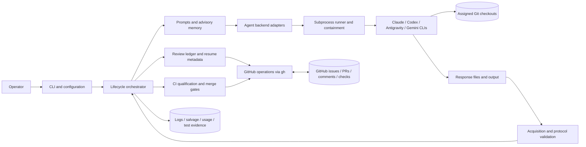
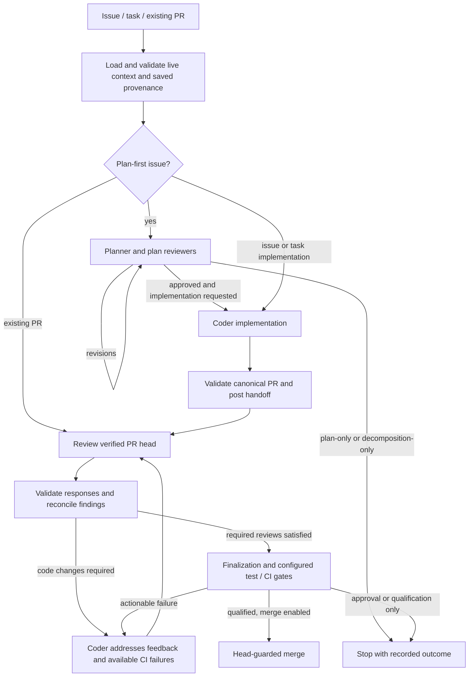

# Architecture

`coding-review-agent-loop` is a local Python orchestrator around authenticated
agent CLIs, Git, and GitHub. Its primary job is to turn an issue or existing PR
into a bounded code-review loop with explicit evidence, resumable state, and
optional CI qualification and merge. It is not a hosted agent service or a
model API gateway.

This is the canonical implementation overview. Start with the
[README](README.md) for installation and examples; use the
[CLI guide](docs/local_agent_loop.md) for exact options, schemas, and recovery
contracts. [Skill mode](docs/skill_mode.md) documents the interactive host path.
The diagrams show responsibility and data flow, not a strictly enforced Python
import hierarchy.

## System Boundaries

- The operator supplies roles, model/effort overrides, permissions, workdirs,
  and execution limits. Agents use their own CLI authentication and quotas.
- The coder can edit and test the assigned repository, commit, push, and create
  a PR. The orchestrator validates the reported result and owns normal review
  publication, handoff, scheduling, and finalization.
- Reviewers are instructed to inspect the verified checkout without modifying
  code or running tests. This is a command policy, not a universal read-only
  filesystem sandbox; actual enforcement depends on backend permissions and
  the execution environment.
- Model responses propose verdicts and actions. They are not authoritative Git
  state, CI results, or permission grants.
- The tool publishes reviews as PR conversation comments, not native GitHub
  approving reviews. Model signatures do not create separate GitHub identities
  or satisfy native required-review branch protection.

## Component Map

Source paths below are relative to
[`src/coding_review_agent_loop/`](src/coding_review_agent_loop/).

| Responsibility | Main source files | Boundary |
| --- | --- | --- |
| Entry points and effective configuration | `cli.py`, `config.py` | Parse modes; resolve role-specific models, effort, base, and policy before invocation. |
| Lifecycle coordination | `orchestrator.py` | Compose planning, implementation, review, recovery, and finalization; do not delegate control decisions to free-form agent prose. |
| Checkout identity | `workdirs.py`, `workdir_guard.py` | Prepare assigned checkouts and validate repository/head and reported test locations. |
| Agent-facing context | `prompts.py`, `memory.py` | Render issue/plan/human/feedback context and advisory repository orientation. |
| Provider invocation | `agents/base.py`, `agents/registry.py`, provider adapters | Translate a common invocation into backend-specific commands and return `AgentResult` with output, provenance, usage, and failure evidence. |
| Process execution | `runner.py`, `containment.py`, `agents/replacement.py` | Capture subprocess output, enforce supported process-tree limits, and support bounded evidence-based startup recovery. |
| Response contracts and repair | `protocol.py`, `repair.py`, `repair_preservation.py`, `agents/format_repair.py` | Validate structured responses; accept bounded semantic coverage claims; derive canonical implementation evidence after head authentication; and reject content-loss or semantic rewrites. |
| Finding identity and scheduling | `unresolved_items.py`, `review_scheduling.py` | Carry stable findings/dispositions and decide which reviewers must inspect a head. |
| Durable review transport | `round_state.py`, `round_transport.py`, `comment_rendering.py` | Reconstruct rounds, persist authenticated structured plan/matrix payloads in bounded sidecars, and render readable comments from semantic data. |
| GitHub and protocol trust | `github.py`, `protocol_markers.py` | Fetch live state and perform controlled writes; separate untrusted text from tool-owned protocol records. Trusted issue-created managed-CI authorization is PR-comment-only. |
| Issue/PR association | `issue_pr_handoff.py`, `issue_pr_provenance.py`, `pr_contract.py`, `expected_closure.py`, `managed_pr.py` | Bind the intended issue set, approved plan, and canonical PR; distinguish creation, recovery, and explicit adoption. |
| CI and repository gates | `checks.py`, `ci_health.py`, `managed_ci.py`, `migrations.py` | Interpret the check board, classify infrastructure stalls, qualify exact heads, and validate migration topology. |
| Optional workflow branches | `decomposition.py`, `child_topology.py`, `split_materialization.py`, `followups.py`, `semantic_dedupe.py`, `evidence_reconciliation.py` | Materialize typed child work, reconcile follow-ups, and support discussion evidence. |
| Local evidence and diagnostics | `test_runtime.py`, `local_test_evidence.py`, `salvage.py`, `usage.py`, `logging.py` | Record invocation-local test selectors and authoritative observations, preserve partial work, and account for calls without treating estimates or self-reports as verified success. |

`orchestrator.py` is still a large integration module. The table describes
existing ownership, not a completed decomposition into independently deployed
services. Shared data types live alongside their owning modules rather than in
one central model package.

## Main Lifecycle

Every stage can also stop for a clarification, invalid or unavailable required
response, exhausted budget, or failed prerequisite. The arrows describe the
normal path, not permission to retry indefinitely or ignore failed checks.

### Planning and Implementation

Plan-first mode records a canonical approved plan and its identity. The
issue-to-PR handoff binds that plan to the implementation PR independently of
bounded issue-comment text. Direct PR resumes recover that binding when it
exists; an ordinary PR without planning provenance does not invent a plan.

Planning, implementation, reviewer, and repair invocations have separately
resolved model/effort settings. An implementation override must not implicitly
change the reviewer or repair backend. Issue creation and PR resume converge
on the shared PR loop after provenance validation.

Stateful or multi-mode planning can add a generation-1 risk-based mode and
transition matrix. The matrix is a bounded structured contract with explicit
applicability, meaningful combinations, exclusions, stable matrix-local row IDs,
and execution ownership. Draft changes are auditable before approval; the
approved payload is immutable until a newly reviewed substantive replan. Round
metadata and its existing sidecar authenticate canonical structured bytes and a
payload-bound section boundary independently of rendered markdown. Prompts,
repair, skill mode, and PR resume consume the semantic payload first. Renderer
drift therefore does not invalidate authentic history; malformed, oversized, or
matrix-only hydration/rendering data closes only the matrix channel and leaves
an independently valid plan hash/subject available. Legacy records remain
resumable without fabricated obligations, and implementation evidence preserves
row-level incomplete and test-receipt caveats. During staged execution, the
approved topology assigns each applicable row to one owner: a generated child
enforces only its owned rows while retaining sibling, later, and final rows as
read-only pending obligations, and a separately planned child must link its
rows to inherited parent obligations or surface a provenance conflict.

The validated matrix wire schema is the canonical source for planner and
repair prompt key lists and minimal applicable/not-applicable examples. Repair
is bounded format recovery: it preserves a complete fresh matrix and rejects
missing or semantically inconsistent matrix content rather than inventing
scenarios. Fresh execution-recommendation integrity remains eligible for the
existing planner replay, while an unrecoverable absent or malformed fresh
matrix terminates after one planner response. That fail-fast path retains the
original validator diagnostic and candidate provenance and reuses the durable
planning-validation diagnostic handler; the rejected response is never stored
as canonical plan state.

Implementation and coder-follow-up responses own semantic facts only. Their
`risk_test_matrix_claims` name approved row IDs, invocation-local broker
`execution_ref` selectors, actual test identifiers and locations, workflow and
outcome assertions, forbidden-effect assertions, and bounded caveats. A
selector is an ephemeral lookup key, never a receipt citation; repeated
commands receive distinct keys and restored keys cannot be reused after a
restart.

The orchestrator owns canonical `risk_test_matrix_evidence`. After it
authenticates the reported PR and exact eventual tracked tree (and, for a
follow-up, reconciles the advanced PR head), one shared typed builder resolves
the closed current-turn catalog and complete local journal. It emits every
enforceable approved row exactly once in approved order, cites only
authoritative passing observations bound to the invocation and authenticated
head/tree, and retains failed, timed-out, stale, unbound, and restart-limited
observations as non-verified caveats. Missing or partial claims therefore
produce complete non-verified evidence rather than hiding the PR.

Format and selector defects receive bounded semantic-only correction. Repair
does not generate matrix identities, canonical rows, receipt IDs, mappings,
statuses, or evidence envelopes. Derived evidence and diagnostics are the
durable replay artifact; live execution selectors are not. Historical accepted
canonical evidence remains readable for resume, while a fresh response that
contains legacy canonical fields cannot make those fields authoritative.

Decomposition into child phases and materialization of split proposals are
distinct workflows, with typed topology and durable checkpoints. They are not
inferred by creating an issue for every sentence mentioning deferred work.
See [decomposition boundaries](docs/local_agent_loop.md#phased-decomposition-versus-split-materialization).

#### Deterministic planning-validation recovery

When a fresh plan or plan revision exhausts deterministic validation retries,
the orchestrator retains the final rejected candidate only in memory for its
digest and provenance. It writes one bounded planning-validation diagnostic
record to the issue only after resolving the authenticated actor and verifying
the returned comment body, numeric server comment identity, server creation
time, and producer identity. The immutable payload contains repository/issue
context, planning generation and target round, prior plan subject, contract
versions, expected producer identity, failure attempt, candidate digest,
deterministic category, and a sanitized diagnostic capped at 4096 characters.

Server-assigned identity and live body values are transport-wrapper metadata;
they are never encoded into or patched into the payload. On resume, live issue
comments are reauthenticated against the invocation actor and exact body,
then same-context records are ordered only by payload failure attempt. The
unique highest attempt is injected as trusted orchestration correction context
into initial, full, compact, and parallel planning prompts. Timestamps,
comment order, candidate-digest matching, issue prose, reviewer findings, and
human requirements do not select or authorize the diagnostic. A conflicting
highest attempt fails closed; stale, malformed, actor-mismatched, and legacy
records are ignored. A newly verified canonical coder plan comment semantically
supersedes matching diagnostics without deleting or rewriting history.

If actor lookup, posting, or wrapper verification fails, the original
validator diagnostic remains the terminal cause and the invalid candidate is
never accepted as canonical plan state. Provider, timeout, quota, marker-safety,
and containment failures are ineligible for this planning-only record.

#### Generation-1 reviewed execution strategy

Fresh planning and revision turns carry `execution_strategy_contract_version: 1`
and a complete `execution_recommendation`. The recommendation owns stable
scope-item IDs, coupling constraints, one-shot or enriched staged deliveries,
and independent retained-parent/final-integration allocations. Coverage is
exactly once; dependencies are earlier-only; automation is one of
`agent-pr`, `human-action`, or `manual-close`. Unversioned historical plans
remain legacy-undecided and are never upgraded by inference or repair.

The recommendation is canonicalized into a bounded sidecar and round metadata,
so its strategy, topology, allocations, compatibility constraints, and caveats
participate in plan subject/hash identity and restart validation. A compact
execution decision records the parent, approved-plan identity, contract version,
canonical strategy/source, and complete recommendation digest; the lossless
recommendation remains in the approved plan record and its existing sidecars.
Explicit policies are checked against that recommendation before closure,
follow-up, split, child, handoff, or dispatch effects. Fresh staged summaries,
phase identities, and handoffs use the canonical `staged` strategy and fixed
`approved-plan-v1` source, while legacy summaries and phase identities retain
their exact requested-mode/source lookup and historical serialization. Stable
string stage IDs accompany one-based ordinals. Plan-only keeps its existing
approved-follow-up, requested split, and unfiled-scope behavior but does not
create a fresh execution decision or topology. The opt-in `auto` policy is
resolved only after approval: a fresh one-shot recommendation becomes
`implement-one-shot`, and a fresh staged recommendation becomes
`implement-by-phase`. Legacy-undecided plans and incompatible explicit pairs
fail closed before mutation. A typed resolved action drives follow-ups,
topology, handoffs, and dispatch; dry-run reports that action without
persistence or GitHub writes. The durable decision is written before any
follow-up, child, handoff, coder, or PR mutation, and staged execution is
bounded to the first eligible `agent-pr` child while the parent remains open.
Repair may preserve a complete v1 source, but cannot synthesize missing
recommendation data.

Each fresh staged child also carries a reviewed execution disposition. The
planner chooses `direct-implementation`, `requires-child-planning`, or the
automation-bound `human-owned` stop, and plan reviewers approve that semantic
claim. The orchestrator's routing seam validates typed readiness fields and
approved-parent provenance, applies at most one topology-valid signed override,
and otherwise fails ambiguous legacy metadata closed to planning. Overrides
cannot provide readiness evidence. Direct children bind implementation and PR
provenance to the parent phase; planning children persist a planning handoff
before invoking a child plan/review cycle and later bind their PR to that
reviewed child plan.

The phase handoff is the durable no-switch boundary. Its effective disposition
and optional override-record digest are reconciled identically during parent
preflight, direct child entry, PR recovery, and skill-mode recovery. An
override-bound mismatch is accepted only while the exact signed record remains
discoverable and matches the parent, plan, stage, and disposition; edited,
deleted, post-handoff, conflicting, or superseding records stop for human
repair. Human-owned stages bypass handoff reconciliation and preserve their
existing stop. A planning child that recommends another staged topology stops
before decision persistence or decomposition because hierarchical execution is
owned by #720.

### Review and Feedback

All selected reviewers receive the same pre-round snapshot. Parallel execution
can publish a finished review before the other reviewers finish; durable
provisional records are settled through a reconciliation barrier before coder
follow-up. A peer's same-round comment is not automatically a carried item.

The default policy invokes all reviewers. Opt-in selective intermediate review
can pause already-approved reviewers for bounded fixes, but their old approvals
remain head-bound. Changed scope, incomplete state, and final qualification can
require a full review. The scheduler contract is immutable across a resume.
The opt-in `primary-then-panel` policy adds a phase-aware contract with one
primary reviewer and a non-empty secondary panel. It keeps the primary as the
only normal reviewer until exact-head approval, then dispatches an independent
complete-diff audit to all secondaries from one frozen snapshot. Scoped
remediation rechecks finding owners plus the primary before a mandatory exact-
head secondary sweep. Before the first exact-head primary approval the phase is
strictly primary-only: broad or ambiguous changes and every automatic recovery
reason re-invoke just the primary with full context (`strict pre-panel
fallback:`) and latch nothing. The panel opens only at a qualified panel
opening derived from comment order: a `secondary-audit` record preceded by the
primary's approval of the same head, or an operator-sourced force-full record.
Secondary approvals count only after that opening. After it, unsafe
scope/history, head changes, and the durable automatic latch use the complete
board (`post-panel fallback:`). A pre-panel state that cannot be made safe
without the panel stops with a diagnostic, and `--pr-review-force-full` (source
`operator`) is the explicit override. Phase,
owner, selection, approval-head, and scheduler-policy call-accounting metadata
are optional extensions to the legacy scheduler core, so old records remain
decodable and grant no staged phase authority.
See [selective and staged review](docs/local_agent_loop.md#selective-intermediate-pr-review).

Frozen policy evaluation is a local read-only boundary. `review-evaluation`
validates artifacts and deterministically reports severity-weighted marginal
coverage and process/cost/CI outcomes for all three policies. Every measurement
is `verified` only with trustworthy run/label provenance; otherwise it is
explicitly `unavailable`, findings are namespaced by run with unique per-policy
run identities, validated severity labels, and validated non-empty contributor
arrays (a valid finding is never silently dropped from coverage), and the
evaluator has no GitHub or reviewer-call dependency.

Findings have stable IDs, provenance, dispositions, and, where applicable,
resolution ownership. The coder reports addressed, remaining, and disputed
items; it does not silently redefine a finding or resolve another participant's
obligation. Human requirements and approved plans are separate from that ledger.
Original requirements, valid later human instructions, and safety constraints
outrank the plan; plan conflicts must be surfaced explicitly.

### CI and Merge

Ordinary CI observes the current-head check board. Known failures can join
review feedback without waiting for unfinished checks. Post-approval watching
and automatic merging use bounded gates, including infrastructure-failure
classification and fresh mergeability checks.

Managed CI is a repository-integrated alternative: intermediate runs may be
suppressed, then a reviewed candidate receives an authenticated final workflow
dispatch. Version-2 intent records track generation, nonce, run, and attempt.
Qualification requires correlated exact-head evidence and the complete check
board, not a model's statement that CI passed. Head changes invalidate the
proof. Automatic merge uses `--match-head-commit`; explicit managed CI can
qualify for manual merging instead.

The installed `CI` workflow is the hosted execution boundary for this
repository's managed route. Its literal v2 and unlabeled-recovery declarations
activate a four-event pull-request matrix: trusted same-repository managed
draft openings may be suppressed before the label race settles,
`synchronize`/`reopened` suppression requires the active managed label, and
`unlabeled` always restores ordinary Python 3.12 CI. Forks, malformed or
unavailable payloads, trust mismatches, non-drafts, and non-managed branches
fail open. Pushes to `main` and all-empty manual dispatches remain full-suite
paths; label-addition, readiness, and draft-conversion events are deliberately
not subscribed to.

Managed dispatch is authorized in base-workflow code. It resolves the
configured `AGENT_LOOP_MANAGED_ACTOR` to the live identity, requires both the
initiating and re-run actors to match, validates the live PR and current base
workflow revision, and accepts exactly one fresh generation-scoped handoff
record. Freshness is bounded to 15 minutes of age with a 5-minute future-skew
allowance, and a no-status retry must be the immediate next attempt of the same
run after its recorded terminal attempt. Only after validation does the
exact-head job receive the target SHA;
it verifies checkout, installs editable development dependencies, and runs the
complete pytest suite once. An always-evaluated publisher writes the
`final-ci/exact-head` status only for that validated SHA, correlating nonce,
run ID, attempt, and Actions URL. Authorization failures before target
establishment produce no status; downstream checkout/test failures cannot
produce success.

This adds no application persistence or public Python API: the handoff record,
workflow run metadata, and terminal status remain GitHub audit records, while
the local producer continues to own lifecycle creation and exact-head merge
guards. The workflow's read-only validation boundary and narrowly scoped
status-write permission are separate from the ordinary test job. Until the
sole-maintainer rollout is completed, the queue stays on ordinary CI; the
explicit unprotected waiver for `wwind123` is per invocation and is not a
default change, existing-PR adoption grant, or substitute for head-guarded
merge enforcement.

Machine-owned CI failures and reviewer-owned findings are different kinds of
obligation. Their reconciliation must preserve CI authority without preventing
fresh qualification of an approved correction. This boundary has a known
selective-policy integration gap tracked in [#776](https://github.com/wwind123/coding-review-agent-loop/issues/776).

The unprotected managed-CI waiver is a voluntary tool gate, not a replacement
for GitHub enforcement. Historical audit markers cannot grant fresh authority;
the live actor, repository, PR lifecycle, and provenance must be revalidated.
See [managed CI](docs/local_agent_loop.md#managed-exact-head-ci).

Issue-created managed-CI authorization is a durable orchestration protocol,
not coder evidence. Once a structurally accepted implementation response
exposes a PR number, the orchestrator authenticates the live repository, issue,
PR, actor, base, reserved branch, exact head, and managed-label event, then
persists a versioned authorization record only as an actor-authored PR comment
before validating reported test locations. Rejected test evidence remains
rejected and cannot produce handoff, approval, readiness, dispatch, or
qualification state. A response rejected before the PR number is accepted is
never parsed for authority; recovery on a voluntary or plan-limited base
requires the explicit fresh operator grant in issue or PR mode, with PR mode
naming the issue scope. A strictly protected base instead uses ordinary
same-PR issue/PR discovery and resume; a draft/unlabeled re-entry additionally
requires the authenticated strict PR tuple and an actor-owned historical
managed-label event before the suppression label is reapplied. It does not
mint or accept an unprotected grant merely because the waiver flag was supplied.
PR-mode recovery fetches that issue from GitHub, resolves any canonical
approved-plan identity from its durable comments, and requires a server-side
issue timeline association to the exact PR; candidate-authored closing text is
not the source of authorization. When no PR-side closing-contract record exists,
the authenticated issue/plan scope supplies the expected set, and the current
body is checked for unapproved same-repository closing references before managed
activation can write the suppression label.
Creation and fresh-authorization publication re-read the live tuple, managed
label event, and authorization-comment state immediately before writing, and
fresh grants bind the observed voluntary or plan-limited protection state.
Legacy PR discovery during explicit managed issue recovery does not synthesize
a canonical handoff from an implementation response that failed validation.
Fresh-authorization guidance is emitted only for an authenticated
issue-created missing/stale authorization with a known issue scope and explicit
unprotected waiver. Label-event, protection, tuple/publication, intent-ledger,
adoption, and source-managed failures retain their own prerequisite-specific
diagnostics rather than advertising an inapplicable grant.

Automatic authority across a coder repair head is a narrow execution/data-flow
transition: the orchestrator must have persisted the blocking round, invoked
the coder for that round, validated the response and assigned-checkout head
advance, re-read the exact live PR tuple, and persist one continuity comment
binding predecessor head, new head, predecessor authorization, and round
metadata identities. Those referenced comments are parsed again on resume and
must be newer than the predecessor authorization, with the blocking reviewer
record for the predecessor head ordered before the coder record for the
immediately following round and new head. Resume accepts only
one unique gap-free chain. Missing,
forked, stale, unsolicited, or raced links fail closed and direct an eligible
operator to fresh authorization. PR bodies, branches, labels, draft state,
commits, and coder-authored comments remain corroboration only; they are not
authority or a persistence substitute.

## State and Recovery

There is no application database or always-running server. State is split
between GitHub and local artifacts:

| State | Location and purpose |
| --- | --- |
| Source and candidate identity | Git commits/branches and live GitHub PR metadata. |
| Cross-invocation workflow history | GitHub comments with round metadata, canonical issue/PR handoffs, plan identities, and managed-CI intents; oversized payloads use sidecar comments. |
| Invocation results | Unique response files and external subprocess logs; validate the current attempt before accepting an artifact. |
| Work in progress | Tool-owned or explicitly supplied checkouts; tracked diffs can be preserved as salvage on supported failure paths. |
| Local evidence | Test observations/receipts, runtime recommendations, usage summaries, and containment evidence. |
| Orientation only | Repo-scoped memory, file inventories, and cached execution profiles; these may be stale. |

Resume reconstructs state from recorded evidence and then checks it against the
live PR, issue, plan, requirements, and policy. GitHub metadata is durable but
not a blanket authorization token. A lost local response or uncommitted patch
cannot necessarily be recovered from GitHub alone. Default checkouts can be
cleaned on rerun; inspect and preserve salvage before reusing them.

Salvage is partial implementation evidence, not approval or a guaranteed full
backup. Usage can be exact, partial, or estimated. Test receipts must retain
failure and scope caveats; a passing subset does not erase a broader failure.

## Context and Trust

The initial prompt does not contain the whole codebase. Agents receive a
verified checkout, task/PR identity, available plan and human requirements,
feedback, checks, and bounded advisory memory. Reviewers are told to inspect
the complete base-to-head diff and use read-only source exploration for related
code. There is no automatic semantic dependency-retrieval engine.

The generated memory architecture map is primarily a directory/file inventory,
not this document and not a semantic model of the repository. Prompts may embed
a bounded revision-bound snapshot of `ARCHITECTURE.md` as advisory context;
missing, unsafe, or opted-out context preserves the legacy path. `full` versus `compact` review
context controls review-history presentation, not whole-repository ingestion.

Architecture snapshots are acquired from regular blobs in committed Git
objects, with literal repository-relative lookup, bounded UTF-8 reads, and
immutable revision/blob/hash identity. PR reviews show established base and
candidate documents separately; candidate prose is a proposal and cannot
replace the baseline. The snapshot is untrusted orientation, never a remote
fetch permission, protocol authority, whole-codebase audit, or correctness
guarantee. Fresh review acquisitions revalidate the candidate, target,
merge-base, and document identity at qualification and merge gates; each
review prompt uses the immutable acquisition frozen for its current round.

Key contracts to preserve when changing the implementation:

- Validate acquisition, structured fields, footer state, IDs, and provenance
  before treating a response as an authoritative workflow result. Repair is
  bounded format correction and is revalidated, not a new substantive review.
- Keep untrusted issue/PR prose and model output separate from tool-owned
  protocol markers. A marker or model signature alone is not authentication.
- Re-check the live head and relevant qualification identities at finalization;
  old approvals and CI from another head must not authorize a new one.
- Do not equate missing required input, interrupted commands, or infrastructure
  failures with approval. Distinguish them from actionable code defects.
- Permissions and resource containment are different controls. Permission bypass
  flags do not make fetched content or agent commands trustworthy.

These are design contracts and validation responsibilities, not a claim that
every integration path is bug-free. Use source inspection and regression tests
to check them when a change crosses module boundaries.

## Execution and Concurrency

Use one active `agent-loop` invocation per repository per machine. Default
workdirs are shared by repo/backend, and there is no repository-wide process
lock enforcing this convention. Parallel reviewers within one invocation are
supported; the orchestrator verifies distinct reviewer workdirs. Coder and
reviewer turns are separate lifecycle stages even when they use the same CLI.

On supported Linux/systemd/cgroup-v2 hosts, containment bounds aggregate and
role-specific process trees. The portable process-group fallback can terminate
descendants but does not impose memory ceilings. Test-wrapper lane locks prevent
recognized duplicate commands, not all overlapping work in arbitrary shells.
Backend turn timeouts, whole-test-command watchdogs, and framework per-test
timeouts are independent limits. See [containment](docs/local_agent_loop.md#process-tree-containment).

## Other Entry Paths

- `discuss` coordinates non-implementation debate, with optional research,
  agenda/synthesis, and evidence reconciliation. It does not implicitly enter
  implementation or merge a PR.
- `managed-pr` prepares a managed PR from an existing branch before opening it;
  it is distinct from explicitly adopting an already-open PR.
- `managed-ci preflight`, `containment-preflight`, and `run-tests` expose
  supporting checks and execution helpers outside the full review loop.
- Claude Code skill mode uses an interactive host plus [`helpers/`](helpers/)
  for validation, external agents, GitHub operations, and local session state.
  It reuses library functionality but is not an identical CLI lifecycle and
  never auto-merges. Host-session work is outside the external-agent process
  boundary. See [skill architecture](docs/skill_mode.md#architecture).

## Tests and Document Maintenance

[`tests/`](tests/) contains focused tests for the orchestrator flows, protocol,
resume/transport, scheduling, CI contracts, backend adapters, process execution,
and skill helpers. Fake subprocess/GitHub runners let lifecycle tests run
without real provider turns or GitHub mutations. They cannot fully reproduce
provider behavior, GitHub eventual consistency, or every host capability.

When changing component ownership, cross-component flows, persistence, trust
boundaries, or execution topology, update this overview and the affected detailed
guide in the same PR. An internal refactor or ordinary bug fix need not change
the document if those contracts stay the same. Keep diagrams textual and paths
relative; avoid copying volatile CLI defaults or protocol schemas here.

Architecture-context injection is bounded and advisory on the supported prompt
paths, and fresh turns with an acquired architecture snapshot use the versioned
architecture-impact assessment. Legacy records remain decodable without
inventing a snapshot or assessment; source inspection remains required.

## Semantic planning foundation

Generation-1 planning remains the downstream wire contract. A semantic
`plan_revision_patch` v1 is an intent-only input: the model may replace an
approved field in the bounded allow-list or declare a complete matrix row
operation, but it cannot write kinds, contract versions, audit entries,
ordering, identities, sidecars, or protocol records.

`plan_assembly.py` is the deterministic boundary. It authenticates the base
round and aggregate identity, validates every operation before mutation, and
applies row edits, retirements, splits, merges, and additions simultaneously.
Split replacement is ordered, merge replacement uses the lowest source slot,
and additions occupy declared final positions. Audit rows are derived in the
fixed order add, change, retire, split, merge; row IDs are normalized
lexically. A metadata-only transition over an empty matrix uses `matrix` as
its complete-scope sentinel.

The assembled object is emitted as the existing validated
`StructuredPlanRevision`. Its canonical JSON sidecar and aggregate SHA-256
identity are the restart authority; raw semantic patches are provenance only.
The identity explicitly covers the full plan plus architecture, execution,
matrix, closing, human-disposition, and typed-category data. Rendered
Markdown remains a downstream presentation surface.

Publication now seeds that sidecar prospectively for fresh `plan_state` and
new validated full-state `plan_revision` records. A new unapproved round with
a complete authenticated matrix is pinned to `semantic-patch-v1`; its full,
compact, retry, and restart paths all hydrate the same sidecar and invoke the
same assembler. The response form is durable round metadata, so a legacy or
in-flight round cannot silently switch forms. Matrix-less and pre-rollout
records remain on the legacy path and are never backfilled.

Repair runs before assembly and is lossless for semantic patches: it may fix
only the response envelope and cannot add operations, change rationales, or
alter base bindings. A cross-form, approved, stale, incomplete, or identity-
mismatched response fails before publication. The assembled generation-1
Markdown and its existing subject/hash remain the downstream review and
implementation surface; the sidecar is the durable authority used for
hydration.
