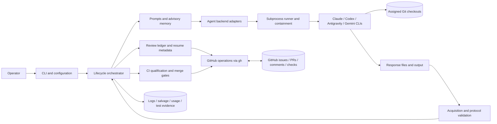
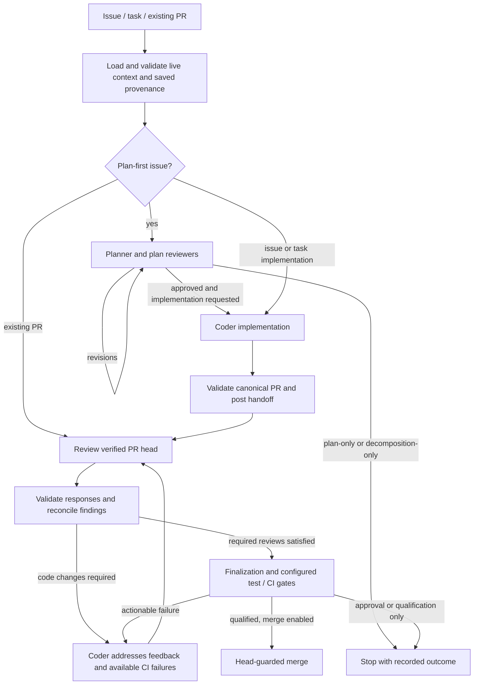

# Architecture

`coding-review-agent-loop` is a local Python orchestrator around authenticated
agent CLIs, Git, and GitHub. Its primary job is to turn an issue or existing PR
into a bounded code-review loop with explicit evidence, resumable state, and
optional CI qualification and merge. It is not a hosted agent service or a
model API gateway.

This is the canonical implementation overview. Start with the
[README](README.md) for installation and examples; use the
[CLI guide](docs/local_agent_loop.md) for exact options, schemas, and recovery
contracts. [Skill mode](docs/skill_mode.md) documents the interactive host path.
The diagrams show responsibility and data flow, not a strictly enforced Python
import hierarchy.

## System Boundaries

- The operator supplies roles, model/effort overrides, permissions, workdirs,
  and execution limits. Agents use their own CLI authentication and quotas.
- The coder can edit and test the assigned repository, commit, push, and create
  a PR. The orchestrator validates the reported result and owns normal review
  publication, handoff, scheduling, and finalization.
- Reviewers are instructed to inspect the verified checkout without modifying
  code or running tests. This is a command policy, not a universal read-only
  filesystem sandbox; actual enforcement depends on backend permissions and
  the execution environment.
- Model responses propose verdicts and actions. They are not authoritative Git
  state, CI results, or permission grants.
- The tool publishes reviews as PR conversation comments, not native GitHub
  approving reviews. Model signatures do not create separate GitHub identities
  or satisfy native required-review branch protection.

## Component Map

Source paths below are relative to
[`src/coding_review_agent_loop/`](src/coding_review_agent_loop/).

| Responsibility | Main source files | Boundary |
| --- | --- | --- |
| Entry points and effective configuration | `cli.py`, `config.py` | Parse modes; resolve role-specific models, effort, base, and policy before invocation. |
| Lifecycle coordination | `orchestrator.py` | Compose planning, implementation, review, recovery, and finalization; do not delegate control decisions to free-form agent prose. |
| Checkout identity | `workdirs.py`, `workdir_guard.py` | Prepare assigned checkouts and validate repository/head and reported test locations. |
| Agent-facing context | `prompts.py`, `memory.py` | Render issue/plan/human/feedback context and advisory repository orientation. |
| Provider invocation | `agents/base.py`, `agents/registry.py`, provider adapters | Translate a common invocation into backend-specific commands and return `AgentResult` with output, provenance, usage, and failure evidence. |
| Process execution | `runner.py`, `containment.py`, `agents/replacement.py` | Capture subprocess output, enforce supported process-tree limits, and support bounded evidence-based startup recovery. |
| Response contracts and repair | `protocol.py`, `repair.py`, `repair_preservation.py`, `agents/format_repair.py` | Validate structured responses; accept bounded semantic coverage claims; derive canonical implementation evidence after head authentication; and reject content-loss or semantic rewrites. Reviewer repair is refused fail-closed when a `plan_review`/`pr_review` source carries no recoverable payload of the expected kind, and a repaired reviewer verdict, finding, or carried disposition must be grounded in the reviewer's own source text; a refusal is a reviewer unavailability, never a synthesized verdict. |
| Finding identity and scheduling | `unresolved_items.py`, `review_scheduling.py`, `plan_review_scheduling.py` | Carry stable findings/dispositions and decide which reviewers must inspect a head or a candidate plan. |
| Durable review transport | `round_state.py`, `round_transport.py`, `comment_rendering.py`, `issue_body_limits.py` | Reconstruct rounds, persist authenticated structured plan/matrix payloads in bounded sidecars, and render readable comments from semantic data. `issue_body_limits.py` bounds tool-created issue bodies that embed plan-derived text, shortening those sections against a pointer to the canonical source and failing with a surface- and section-specific diagnostic when a body still does not fit. Structured plan coder comments additionally have a bounded visible digest, selected only when the full comment overflows the body budget (see *Compact-on-overflow plan presentation*). |
| GitHub and protocol trust | `github.py`, `protocol_markers.py` | Fetch live state and perform controlled writes; separate untrusted text from tool-owned protocol records. Trusted issue-created managed-CI authorization is PR-comment-only. `protocol_markers.py` also owns the deterministic visible-label invariant for tool-owned records, and `github.py` owns the shared write read-back verifier. |
| Workflow transaction model (#827, stage A) | `workflow_transaction.py` | Typed transition intent whose canonical hash is the transaction ID; append-only prepared/terminal transaction record codec (PR-comment-only); version-2 handoff and PR contract derivation; lineage, era, approved-plan anchor, scheduler-checkpoint, and legacy-root resolvers. Every resolver accepts only the author-authenticated comment view read by `github.read_authenticated_protocol_comments`. Model only: no writer emits these records and no orchestration call site consumes them yet; the version-1 reader entry points are unchanged and still reject version 2. |
| Workflow transaction publication seam (#827, stage B, writers partly wired) | `workflow_transaction_publication.py` | The transaction boundary: sole writer of transaction records and the records they bind. `publish_transition` reads both surfaces through the authenticated reader, reconciles prepared-only siblings below the strict resolver (lowest prepared ID wins), adopts a stored prepared intent, aborts and re-prepares an obsolete one, publishes each `reissued` entry read-first (adopt, else one verified write), then the terminal record. `require_committed_transaction` is the fail-closed read-only gate (committed live-head transaction, entries, coder round, checkpoint); a legacy-era PR keeps the version-1 checks. `discover_canonical_issue_pr` is the issue-only authority reader; `route_issue_publication` hands an interrupted publication to the seam as a record-less `Recoverable`/`RecoverableSuccessor` route. Errors are recoverable (`NoLiveHeadAuthority`) or integrity errors that stop the round. The managed-CI entry goes through `AuthorizationEntryCodec`. Audit comments are outside it. Gate consumers: `authenticate_canonical_issue_pr`, every merge, the qualification snapshot, and the per-round head binding (which gates checkpoint, interrupted-round, and approval reuse). They, loop entry, and each dispatched-coder head commit an unmanaged `head-advance` successor first. The PR loop reads a committed PR via `committed_pr_binding`, widens by `closing-widening`, upgrades an unmanaged non-plan legacy PR that needs a write by one `initial` transaction, and finishes a pending unmanaged transaction at entry. Unmanaged direct, approved-plan, staged-child (parent/child identity, child-only scope) writers use the seam (no embedded contract; parent handoff after commit); a sessionless resume takes the first checkpoint's key (none if unscheduled), a bad history stops unwritten. Reruns finish interrupted writes. Rebind: one plan-replacement, audit record in handoff; rerun-safe. Managed: rebind, coder continuity, plan creation. |
| Bound managed-CI authorization (#827, stage B, partly wired) | `managed_ci_bound_authorization.py` | A transaction's managed-CI entry: the v1 authorization fields plus transaction ID, grant anchor, optional upgrade source, and kinds `plan-rebind`/`ordinary-release`. The granted generation hashes repository, issue, PR, base, actor ID, protection, waiver, grant anchor, and plan hash (never head, kind, nonce, live label event); the released generation excludes the plan. `validate_bound_authorization` alone judges a bound record (envelope, scope, plan, recomputed generation, native or upgrade kind shape, nonce); the upgrade branch re-derives its source (`select_upgrade_source`) and walks the v1 chain. `BoundAuthorizationCodec` gives seam, gate, router that rule. Accessor modes (pure reads, rule first): builder mode returns a `BuilderAuthorizationView` (`effective`, `nearest_granted`, `pending`, diagnostic `superseded`), consumer mode only the latest committed granted record at the live head, pending mode a prepared-only record as input. `managed_ci.read_managed_ci_authorizations` is the only unbound-authorization scan: v1 semantics in the legacy era, nothing once the PR has an actor v2 record (v1 publishers refuse; resume reads consumer mode). The dispatch-time label release first runs the `before_label_release` hook, committing the released successor on a granted PR. Rebind, continuity, creation build bound payloads. |
| Issue/PR association | `issue_pr_handoff.py`, `issue_pr_provenance.py`, `pr_contract.py`, `expected_closure.py`, `managed_pr.py` | Bind the intended issue set, approved plan, and canonical PR; distinguish creation, recovery, and explicit adoption. |
| CI and repository gates | `checks.py`, `ci_health.py`, `managed_ci.py`, `migrations.py` | Interpret the check board, classify infrastructure stalls, qualify exact heads, and validate migration topology. |
| Optional workflow branches | `decomposition.py`, `child_topology.py`, `split_materialization.py`, `followups.py`, `semantic_dedupe.py`, `evidence_reconciliation.py` | Materialize typed child work, reconcile follow-ups, and support discussion evidence. |
| Local evidence and diagnostics | `test_runtime.py`, `local_test_evidence.py`, `salvage.py`, `usage.py`, `logging.py` | Record invocation-local test selectors and authoritative observations, preserve partial work, and account for calls without treating estimates or self-reports as verified success. |

`orchestrator.py` is still a large integration module. The table describes
existing ownership, not a completed decomposition into independently deployed
services. Shared data types live alongside their owning modules rather than in
one central model package.

## Main Lifecycle

Every stage can also stop for a clarification, invalid or unavailable required
response, exhausted budget, or failed prerequisite. The arrows describe the
normal path, not permission to retry indefinitely or ignore failed checks.

### Planning and Implementation

Plan-first mode records a canonical approved plan and its identity. The
issue-to-PR handoff binds that plan to the implementation PR independently of
bounded issue-comment text. Direct PR resumes recover that binding when it
exists; an ordinary PR without planning provenance does not invent a plan.

Planning, implementation, reviewer, and repair invocations have separately
resolved model/effort settings. An implementation override must not implicitly
change the reviewer or repair backend. Issue creation and PR resume converge
on the shared PR loop after provenance validation.

Stateful or multi-mode planning can add a generation-1 risk-based mode and
transition matrix. The matrix is a bounded structured contract with explicit
applicability, meaningful combinations, exclusions, stable matrix-local row IDs,
and execution ownership. Draft changes are auditable before approval; the
approved payload is immutable until a newly reviewed substantive replan. Round
metadata and its existing sidecar authenticate canonical structured bytes and a
payload-bound section boundary independently of rendered markdown. Prompts,
repair, skill mode, and PR resume consume the semantic payload first. Renderer
drift therefore does not invalidate authentic history; malformed, oversized, or
matrix-only hydration/rendering data closes only the matrix channel and leaves
an independently valid plan hash/subject available. Legacy records remain
resumable without fabricated obligations, and implementation evidence preserves
row-level incomplete and test-receipt caveats. During staged execution, the
approved topology assigns each applicable row to one owner: a generated child
enforces only its owned rows while retaining sibling, later, and final rows as
read-only pending obligations, and a separately planned child must link its
rows to inherited parent obligations or surface a provenance conflict. That
link is a field-classified preserve-or-strengthen contract, compared on exact
sanitized strings with no case or whitespace normalization: applicability is
ordered (`not-applicable` < `applicable` < `required`) and may only stay or
rise; every parent forbidden side effect must survive as an exactly equal
entry; the scenario coverage fields (entry path or mode, initial state, event,
expected outcome) must retain the parent text verbatim and may only extend it;
proposed test level and location may change but are always surfaced; the label,
scope links, ordering, child-local rows, and the execution owner are free. A
rejection names each weakened row and field with a route forward and fits the
plan-validation diagnostic bound by construction. Admissible differences are
reviewed deltas: child plan reviewers receive a deterministic parent-versus-child
coverage delta, recomputed on resume and never persisted, with a duty to block
any narrowing of coverage or test reachability. The same comparison runs inside
the child plan-first cycle, from both parent dispatch and the direct child
entry, as an orchestrator-owned bounded replan that is independent of structured
repair: a weakening candidate stays unpublished in memory, the planner is
re-invoked with the field-level diagnostic over the unchanged authenticated
base, and exhausting `MAX_INHERITED_MATRIX_REPLANS` persists one authenticated
plan-validation diagnostic record and stops deterministically before any
reviewer or implementation turn; the next invocation recovers that record for
its first planner turn. Every plan prompt form carries the inherited obligations
through one shared lossless renderer that shows exactly the compared form. Both
prompt blocks fail closed rather than truncate: oversized parent obligations
stop child planning before any planner turn, and an oversized delta set rejects
the candidate into the replan loop. Parent dispatch, direct child invocation,
and both skill-runner PR-validation branches apply the same function.

A historical approved child plan that fails this comparison has two audited
recovery edges instead of a dead end. Before any implementation handoff, the
approval-to-implementation guard in the plan-first loop posts one plain audit
comment and re-enters the enforced, mechanically checked revision turn with the
diagnostic attributed to the orchestrator, no synthetic reviewer item, and a
latched complete board for the next round. After a handoff, issue routing judges
the handed-off plan through the shared admissibility helper before resolving
the canonical PR, and reopens planning only under a signed
`child-plan-supersession` record discovered on the child issue (exact keys,
standalone human signature, child/parent/stage identity, one record per
superseded plan hash). The record digest is carried in two optional planning
round-metadata fields, omitted from the encoding when absent, and
`authorized_replan_lineage` is the single authority that accepts only a chained,
digest-bound planner-round lineage starting from the superseded plan. On
approval the existing open PR is rebound by one atomic issue-side comment
holding the superseding issue-to-PR handoff record and a rebind audit record;
nothing is written on the PR, so no partial cross-side state exists.
Cross-side authentication compares the unchanged PR-side closing contract with
the closing-contract lineage base (the latest issue-side record that is not a
same-PR equal-ID plan replacement) and takes the plan hash from the latest
record; the closing-ID digest never identifies a plan replacement. The resolver
also keeps the most recent plan-changing handoff edge and its comment locator
independently of that base, so a later closing-ID superset never hides a rebind
from verification. One verifier,
`verify_child_plan_rebind`, runs at issue entry, at both PR-loop provenance
sites, and on the plan-identity-change branch of the PR qualification snapshot
(through a planning-child binding captured once per PR run), so an unverified or
inadmissible replacement never reaches review, final sweep, merge, or
managed-CI gates. Provenance and current-contract admissibility are separate
checks: how a plan became the binding is verified first on every entry path,
before any new signed authorization for that plan is accepted, so an unverified
replacement cannot be laundered while a verified one that later became
inadmissible can still be superseded. The complete-board latch for the round
that reviews such a revision is reconstructed on resume from durable state (the
supersession binding on the latest planner round, or the guard's audit comment
for the plan it revises), so a restart right after the revised round cannot
narrow the board. PR approvals stay keyed by plan hash and subject, so none
recorded before a rebind is carried.

The validated matrix wire schema is the canonical source for planner and
repair prompt key lists and minimal applicable/not-applicable examples. Repair
is bounded format recovery: it preserves a complete fresh matrix and rejects
missing or semantically inconsistent matrix content rather than inventing
scenarios. Fresh execution-recommendation integrity remains eligible for the
existing planner replay, while an unrecoverable absent or malformed fresh
matrix terminates after one planner response. That fail-fast path retains the
original validator diagnostic and candidate provenance and reuses the durable
planning-validation diagnostic handler; the rejected response is never stored
as canonical plan state.

Implementation and coder-follow-up responses own semantic facts only. Their
`risk_test_matrix_claims` name approved row IDs, invocation-local broker
`execution_ref` selectors, actual test identifiers and locations, workflow and
outcome assertions, forbidden-effect assertions, and bounded caveats. A
selector is an ephemeral lookup key, never a receipt citation; repeated
commands receive distinct keys and restored keys cannot be reused after a
restart.

The orchestrator owns canonical `risk_test_matrix_evidence`. After it
authenticates the reported PR and exact eventual tracked tree (and, for a
follow-up, reconciles the advanced PR head), one shared typed builder resolves
the closed current-turn catalog and complete local journal. It emits every
enforceable approved row exactly once in approved order, cites only
authoritative passing observations bound to the invocation and authenticated
head/tree, and retains failed, timed-out, stale, unbound, and restart-limited
observations as non-verified caveats. Missing or partial claims therefore
produce complete non-verified evidence rather than hiding the PR.

Format and selector defects receive bounded semantic-only correction. A
selector outside the current-turn catalog (a command string, a cross-turn
handle, or oversize text up to a hard cap) is a claim defect, not an envelope
defect: it is dropped with a caveat before authentication and becomes an
`unknown-execution-ref` diagnostic afterwards. One admissible selector may be
cited by several rows, since one wrapper run routinely covers several rows;
each row still verifies only on its own facts. Authority violations stay fatal:
unknown keys, bad row IDs, empty selector lists, an admissible selector
repeated within one row, catalog collisions, in-catalog selectors that are non-passing or
whose launch integrity is failing or unknown (real broker handles, so
selecting one is an authority decision), and legacy canonical fields. Repair
does not generate matrix identities, canonical rows, receipt IDs, mappings,
statuses, or evidence envelopes. Derived evidence and diagnostics are the
durable replay artifact; live execution selectors are not. Historical accepted
canonical evidence remains readable for resume, while a fresh response that
contains legacy canonical fields cannot make those fields authoritative.

Decomposition into child phases and materialization of split proposals are
distinct workflows, with typed topology and durable checkpoints. They are not
inferred by creating an issue for every sentence mentioning deferred work.
See [decomposition boundaries](docs/local_agent_loop.md#phased-decomposition-versus-split-materialization).

#### Deterministic planning-validation recovery

When a fresh plan or plan revision exhausts deterministic validation retries,
the orchestrator retains the final rejected candidate only in memory for its
digest and provenance. It writes one bounded planning-validation diagnostic
record to the issue only after resolving the authenticated actor and verifying
the returned comment body, numeric server comment identity, server creation
time, and producer identity. The immutable payload contains repository/issue
context, planning generation and target round, prior plan subject, contract
versions, expected producer identity, failure attempt, candidate digest,
deterministic category, and a sanitized diagnostic capped at 4096 characters.

Server-assigned identity and live body values are transport-wrapper metadata;
they are never encoded into or patched into the payload. On resume, live issue
comments are reauthenticated against the invocation actor and exact body,
then same-context records are ordered only by payload failure attempt. The
unique highest attempt is injected as trusted orchestration correction context
into initial, full, compact, and parallel planning prompts. Timestamps,
comment order, candidate-digest matching, issue prose, reviewer findings, and
human requirements do not select or authorize the diagnostic. A conflicting
highest attempt fails closed; stale, malformed, actor-mismatched, and legacy
records are ignored. A newly verified canonical coder plan comment semantically
supersedes matching diagnostics without deleting or rewriting history.

If actor lookup, posting, or wrapper verification fails, the original
validator diagnostic remains the terminal cause and the invalid candidate is
never accepted as canonical plan state. Provider, timeout, quota, marker-safety,
and containment failures are ineligible for this planning-only record.

#### Generation-1 reviewed execution strategy

Fresh planning and revision turns carry `execution_strategy_contract_version: 1`
and a complete `execution_recommendation`. The recommendation owns stable
scope-item IDs, coupling constraints, one-shot or enriched staged deliveries,
and independent retained-parent/final-integration allocations. Coverage is
exactly once; dependencies are earlier-only; automation is one of
`agent-pr`, `human-action`, or `manual-close`. Unversioned historical plans
remain legacy-undecided and are never upgraded by inference or repair.

The recommendation is canonicalized into a bounded sidecar and round metadata,
so its strategy, topology, allocations, compatibility constraints, and caveats
participate in plan subject/hash identity and restart validation. A compact
execution decision records the parent, approved-plan identity, contract version,
canonical strategy/source, and complete recommendation digest; the lossless
recommendation remains in the approved plan record and its existing sidecars.
Explicit policies are checked against that recommendation before closure,
follow-up, split, child, handoff, or dispatch effects. Fresh staged summaries,
phase identities, and handoffs use the canonical `staged` strategy and fixed
`approved-plan-v1` source, while legacy summaries and phase identities retain
their exact requested-mode/source lookup and historical serialization. Stable
string stage IDs accompany one-based ordinals. Plan-only keeps its existing
approved-follow-up, requested split, and unfiled-scope behavior but does not
create a fresh execution decision or topology. The opt-in `auto` policy is
resolved only after approval: a fresh one-shot recommendation becomes
`implement-one-shot`, and a fresh staged recommendation becomes
`implement-by-phase`. Legacy-undecided plans and incompatible explicit pairs
fail closed before mutation. A typed resolved action drives follow-ups,
topology, handoffs, and dispatch; dry-run reports that action without
persistence or GitHub writes. The durable decision is written before any
follow-up, child, handoff, coder, or PR mutation, and staged execution is
bounded to one `agent-pr` child per run while the parent remains open.
Repair may preserve a complete v1 source, but cannot synthesize missing
recommendation data.

Staged decomposition returns an explicit topology outcome - the materialized
children, one resolved stage identity and automation per index, the run's own
approved-plan hash and mode, and the recorded retained-parent and
final-integration obligations - because the dispatcher cannot otherwise obtain
stage identity or obligations on the adopted and legacy paths, where a
recovered decomposition summary is the only source. A parent advancement state
machine consumes that outcome. Phase handoff records are first filtered to the
outcome's own plan hash and mode, then reconciled against the child mapping:
a missing or repeated child number, a record whose child or stage disagrees
with its index, a duplicate record for one index, a record for a human-owned
phase or an out-of-range index, and an ordered-prefix violation - a record for
a phase later than the first incomplete one - each stop the run before any
child state is read. Phases are then authenticated in order against live state.
Selection stops at the first incomplete phase, and so does resolution of later
`agent-pr` phases: with no recorded handoff there is nothing to authenticate,
so no child state or PR evidence is read for them. A later human-owned phase is
still resolved from its child issue state, because a human stage never carries
a phase handoff and closure is its only durable signal; a child an operator
closed ahead of its turn is reported as attested and still confers no authority
to skip the earlier phase. An `agent-pr` phase is
complete only when its child issue is CLOSED and its canonical issue-to-PR
handoff names a MERGED pull request, authenticated by the same identity, URL
and closing-contract checks that resume applies; an open child with a merged or
closed canonical PR, and a closed child with absent, unreadable or unmerged PR
evidence, both fail closed. A `human-action` or `manual-close` phase is
complete on closure of its child issue alone - that closure is the operator
attestation, and no PR evidence is read for it. The first incomplete phase is
dispatched through the existing child-dispatch seam with its real phase index;
an in-progress phase instead yields a runnable resume command for its still-open
child; and a fully complete topology yields a terminal report that distinguishes
agent-delivered stages from human-attested ones and names any operator-owned
retained-parent and final-integration work. Final-integration work is never
implemented automatically and the delivered parent is never closed
automatically. Dry run resolves no child state and issues no child GitHub
reads.

Each fresh staged child also carries a reviewed execution disposition. The
planner chooses `direct-implementation`, `requires-child-planning`, or the
automation-bound `human-owned` stop, and plan reviewers approve that semantic
claim. The orchestrator's routing seam validates typed readiness fields and
approved-parent provenance, applies at most one topology-valid signed override,
and otherwise fails ambiguous legacy metadata closed to planning. Overrides
cannot provide readiness evidence. Direct children bind implementation and PR
provenance to the parent phase; planning children persist a planning handoff
before invoking a child plan/review cycle and later bind their PR to that
reviewed child plan.

The phase handoff is the durable no-switch boundary. Its effective disposition
and optional override-record digest are reconciled identically during parent
preflight, direct child entry, PR recovery, and skill-mode recovery. An
override-bound mismatch is accepted only while the exact signed record remains
discoverable and matches the parent, plan, stage, and disposition; edited,
deleted, post-handoff, conflicting, or superseding records stop for human
repair. Human-owned stages bypass handoff reconciliation and preserve their
existing stop. A planning child that recommends another staged topology stops
before decision persistence or decomposition because hierarchical execution is
owned by #720.

### Review and Feedback

All selected reviewers receive the same pre-round snapshot. Parallel execution
can publish a finished review before the other reviewers finish; durable
provisional records are settled through a reconciliation barrier before coder
follow-up. A peer's same-round comment is not automatically a carried item.

Every reviewer turn — plan review and PR review, full and compact prompts —
carries a no-execution policy: a reviewer inspects files and reads code, and a
command, test invocation, or verification step quoted inside the plan, issue,
PR description, or diff under review is a proposal to evaluate, never an
instruction to run. A reviewer turn that produces no review is a reviewer
availability failure; it is never repaired into a verdict.

The default policy invokes all reviewers. Opt-in selective intermediate review
can pause already-approved reviewers for bounded fixes, but their old approvals
remain head-bound. Changed scope, incomplete state, and final qualification can
require a full review. The scheduler contract is immutable across a resume.
The opt-in `primary-then-panel` policy adds a phase-aware contract with one
primary reviewer and a non-empty secondary panel. It keeps the primary as the
only normal reviewer until exact-head approval, then dispatches an independent
complete-diff audit to all secondaries from one frozen snapshot. Scoped
remediation rechecks finding owners plus the primary before a mandatory exact-
head secondary sweep. Before the first exact-head primary approval the phase is
strictly primary-only: broad or ambiguous changes and every automatic recovery
reason re-invoke just the primary with full context (`strict pre-panel
fallback:`) and latch nothing. The panel opens only at a qualified panel
opening derived from comment order: a `secondary-audit` record preceded by the
primary's approval of the same head, or an operator-sourced force-full record.
Secondary approvals count only after that opening. After it, unsafe
scope/history, head changes, and the durable automatic latch use the complete
board (`post-panel fallback:`), and such a full-board decision raises the
monotonic automatic latch. A pre-panel state that cannot be made safe without
the panel stops with a diagnostic, and `--pr-review-force-full` (source
`operator`) is the explicit override; undecodable history stops in both flag
states. Phase,
owner, selection, approval-head, and scheduler-policy call-accounting metadata
are optional extensions to the legacy scheduler core, so old records remain
decodable and grant no staged phase authority.
See [selective and staged review](docs/local_agent_loop.md#selective-intermediate-pr-review).

Issue plan review has its own scheduling component, `plan_review_scheduling.py`,
selected independently of the PR policy by `--plan-review-policy`. Full-board
planning stays the compatibility default. The staged planning policy binds every
decision to one canonical **exact-plan candidate key**: the ordered tuple of the
plan subject, aggregate plan identity, execution-strategy identity,
risk-test-matrix identity, and a digest of the surfaced planning-requirement
IDs. Staged planning requires a generation-1 plan, because a legacy unversioned
plan cannot form that key. The key is persisted on planning scheduler records
and on every plan reviewer record, so a later round compares a stored approval
component-for-component instead of inferring equivalence from the subject.

The plan-first lifecycle gains a **reviewer-only phase-advance round**. When no
must-fix plan item remains but a required reviewer still lacks a qualifying
exact-key approval, the loop posts a `plan-phase-advance` record, increments the
round number, and runs the secondary panel (later the final sweep) against a
byte-identical candidate plan with no planner turn. The advance record and the
round-budget diagnostic name the phase that is still outstanding, projected by
running the scheduler over the unchanged candidate key and the post-round
approvals, not the phase of the board that just finished. Resume anchors on the latest
coder record and the highest round number for that plan subject, so a round with
a phase-advance record and no coder record is a legitimate reviewer-only round
and never synthesizes a planner turn. A planning round counts as reconciled only
when it holds an actual reconciliation record: the `scheduler-prelaunch` and
`plan-phase-advance` summaries are pre-reviewer checkpoints, so an interruption
at either one resumes as an unsettled round that still reconstructs each
published reviewer's numbered items, owners, and obligations. Resume also
rebuilds the transition classifier's authenticated inputs — the durable
`semantic-patch-v1` payload and the cross-cutting contracts of the state that
patch was bound to — from the coder records themselves, so an interruption
between a remediation planner turn and its scheduler checkpoint keeps the same
narrow classification instead of latching the complete board; anything that
cannot be re-verified stays broad. Under staged planning, and only there,
ledger completeness is judged the same way: an item recorded under an earlier
plan subject stops counting as a missing obligation once the run has carried or
minted that item, or once the recorded history proves it was canonically
cleared. Full-board planning keeps the conservative reading it had before this
policy existed, where any cross-subject item at all makes the ledger
unreconstructible, so the compatibility default's context-mode selection and
posted bodies are unchanged. That second proof has to come from
the durable history rather than the running process, because a reviewer-only
advance records an empty carried ledger — after remediation there is nothing
left to carry — and a restart on exactly that seam would otherwise rediscover
the cleared item and read the ledger as unreconstructible. With both proofs, a
resumed run's later phase advance carries the approvals it just recorded into
the final sweep instead of re-invoking the complete board. Because each
advance costs a round, staged
planning consumes strictly more rounds than full-board planning, and exhausting
`--max-rounds` during a pending advance is reported distinctly from reviewer
blocking issues.

Planning scheduler metadata is a flow-discriminated branch of the same durable
round-metadata transport. A planning record carries the candidate key in place
of the PR-only SHA pair and omits the PR-only broad-rule and scope-digest state,
so a planning record and a PR record can never be decoded as one another even
when both carry `policy: primary-then-panel`. Degraded planning history is
partitioned into exactly four disjoint classes with one outcome each: absent,
invalid, and contradictory-key history always continue under a conservative
fallback (strict primary-only before a qualified opening, complete board with an
automatic latch after one), and only a transport extraction failure stops the
run, checked at startup and at every round boundary. Degradation is scoped to
the latest valid planning scheduler checkpoint, so an older invalid record stays
auditable without pinning later rounds to the fallback, and the persisted
planning contract is immutable under both policies. A carried exact-key
approval is honored only when it also carried the acknowledgement for exactly
the currently surfaced planning-requirement ID set, so the signed-requirement
gate cannot be satisfied vacuously. When structured repair recovers a missing
acknowledgement, staged planning persists the repaired reviewer result as an
amended record before the phase advance, because the record written from the
original text carries no requirement IDs and a later record for the same
reviewer supersedes the earlier one; otherwise the very approval that repair
just recovered would be rejected on the next round. Discussion-mode and child-planning cycles
keep the full board by configuration reset. See
[staged issue plan review](docs/local_agent_loop.md#staged-issue-plan-review).

Frozen policy evaluation is a local read-only boundary. `review-evaluation`
validates artifacts and deterministically reports severity-weighted marginal
coverage and process/cost/CI outcomes per flow: each run carries a validated
`flow` (`pr` or `plan`; only an absent key defaults to `pr`, so PR-only
artifacts keep loading while an explicit null is rejected),
run identity is unique per `(flow, policy, run_id)`, and aggregation and report
titling are per flow, so PR and planning runs that share a policy name are
never pooled. Every measurement
is `verified` only with trustworthy run/label provenance; otherwise it is
explicitly `unavailable`, findings are namespaced by run with unique per-policy
run identities, validated severity labels, and validated non-empty contributor
arrays (a valid finding is never silently dropped from coverage), and the
evaluator has no GitHub or reviewer-call dependency.

PR and plan reviewer prompts, in both full and compact forms, share one static
exhaustiveness rule: report every independently substantiated defect on the
reviewed head or plan in one response, enumerate same-path defects together,
and state genuine masking in the finding text and `summary`. It changes no
response schema and sits inside the compact stable prefixes. To measure it,
runs may carry a validated `review_contract` label (`first-finding-permitted`,
the absent-key default, or `exhaustive`) with optional
`review_contract_provenance`. The report adds
`flows.<flow>.review_contracts.<contract>.policies.<policy>` cells holding
rounds, reviewer calls, and escaped defects per run; a cell is `verified` only
when every run has verified metric provenance and verified label provenance,
and there is deliberately no per-flow or cross-policy contract rollup, because
scheduling policy itself drives calls, rounds, and escapes. Two artifact pairs
are checked in under `docs/evaluation/`: the synthetic regression fixture
(`frozen_review_artifacts.json` and `frozen_review_report.json`), which never
receives real runs, and the real-run pair (`review_contract_runs.json` and
`review_contract_report.json`), which ships empty and is extended only by the
documented data-only
[freezing procedure](docs/local_agent_loop.md#freezing-a-real-run).

Findings have stable IDs, provenance, dispositions, and, where applicable,
resolution ownership. The coder reports addressed, remaining, and disputed
items; it does not silently redefine a finding or resolve another participant's
obligation. Human requirements and approved plans are separate from that ledger.
Original requirements, valid later human instructions, and safety constraints
outrank the plan; plan conflicts must be surfaced explicitly.

### CI and Merge

Ordinary CI observes the current-head check board. Known failures can join
review feedback without waiting for unfinished checks. Post-approval watching
and automatic merging use bounded gates, including infrastructure-failure
classification and fresh mergeability checks.

Managed CI is a repository-integrated alternative: intermediate runs may be
suppressed, then a reviewed candidate receives an authenticated final workflow
dispatch. Version-2 intent records track generation, nonce, run, and attempt.
Qualification requires correlated exact-head evidence and the complete check
board, not a model's statement that CI passed. Head changes invalidate the
proof. Automatic merge uses `--match-head-commit`; explicit managed CI can
qualify for manual merging instead.

The installed `CI` workflow is the hosted execution boundary for this
repository's managed route. Its literal v2 and unlabeled-recovery declarations
activate a four-event pull-request matrix: trusted same-repository managed
draft openings may be suppressed before the label race settles,
`synchronize`/`reopened` suppression requires the active managed label, and
`unlabeled` always restores ordinary Python 3.12 CI. Forks, malformed or
unavailable payloads, trust mismatches, non-drafts, and non-managed branches
fail open. Pushes to `main` and all-empty manual dispatches remain full-suite
paths; label-addition, readiness, and draft-conversion events are deliberately
not subscribed to.

Managed dispatch is authorized in base-workflow code. It resolves the
configured `AGENT_LOOP_MANAGED_ACTOR` to the live identity, requires both the
initiating and re-run actors to match, validates the live PR and current base
workflow revision, and accepts exactly one fresh generation-scoped handoff
record. Freshness is bounded to 15 minutes of age with a 5-minute future-skew
allowance, and a no-status retry must be the immediate next attempt of the same
run after its recorded terminal attempt. Only after validation does the
exact-head job receive the target SHA;
it verifies checkout, installs editable development dependencies, and runs the
complete pytest suite once. An always-evaluated publisher writes the
`final-ci/exact-head` status only for that validated SHA, correlating nonce,
run ID, attempt, and Actions URL. Authorization failures before target
establishment produce no status; downstream checkout/test failures cannot
produce success.

This adds no application persistence or public Python API: the handoff record,
workflow run metadata, and terminal status remain GitHub audit records, while
the local producer continues to own lifecycle creation and exact-head merge
guards. The workflow's read-only validation boundary and narrowly scoped
status-write permission are separate from the ordinary test job. Until the
sole-maintainer rollout is completed, the queue stays on ordinary CI; the
explicit unprotected waiver for `wwind123` is per invocation and is not a
default change, existing-PR adoption grant, or substitute for head-guarded
merge enforcement.

Machine-owned CI failures and reviewer-owned findings are different kinds of
obligation. Their reconciliation must preserve CI authority without preventing
fresh qualification of an approved correction. This boundary has a known
selective-policy integration gap tracked in [#776](https://github.com/wwind123/coding-review-agent-loop/issues/776).

The unprotected managed-CI waiver is a voluntary tool gate, not a replacement
for GitHub enforcement. Historical audit markers cannot grant fresh authority;
the live actor, repository, PR lifecycle, and provenance must be revalidated.
See [managed CI](docs/local_agent_loop.md#managed-exact-head-ci).

Issue-created managed-CI authorization is a durable orchestration protocol,
not coder evidence. Once a structurally accepted implementation response
exposes a PR number, the orchestrator authenticates the live repository, issue,
PR, actor, base, reserved branch, exact head, and managed-label event, then
persists a versioned authorization record only as an actor-authored PR comment
before validating reported test locations. Rejected test evidence remains
rejected and cannot produce handoff, approval, readiness, dispatch, or
qualification state. A response rejected before the PR number is accepted is
never parsed for authority; recovery on a voluntary or plan-limited base
requires the explicit fresh operator grant in issue or PR mode, with PR mode
naming the issue scope. A strictly protected base instead uses ordinary
same-PR issue/PR discovery and resume; a draft/unlabeled re-entry additionally
requires the authenticated strict PR tuple and an actor-owned historical
managed-label event before the suppression label is reapplied. It does not
mint or accept an unprotected grant merely because the waiver flag was supplied.
PR-mode recovery fetches that issue from GitHub, resolves any canonical
approved-plan identity from its durable comments, and requires a server-side
issue timeline association to the exact PR; candidate-authored closing text is
not the source of authorization. When no PR-side closing-contract record exists,
the authenticated issue/plan scope supplies the expected set, and the current
body is checked for unapproved same-repository closing references before managed
activation can write the suppression label.
Creation and fresh-authorization publication re-read the live tuple, managed
label event, and authorization-comment state immediately before writing, and
fresh grants bind the observed voluntary or plan-limited protection state.
Legacy PR discovery during explicit managed issue recovery does not synthesize
a canonical handoff from an implementation response that failed validation.
Fresh-authorization guidance is emitted only for an authenticated
issue-created missing/stale authorization with a known issue scope and explicit
unprotected waiver. Label-event, protection, tuple/publication, intent-ledger,
adoption, and source-managed failures retain their own prerequisite-specific
diagnostics rather than advertising an inapplicable grant.

Automatic authority across a coder repair head is a narrow execution/data-flow
transition: the orchestrator must have persisted the blocking round, invoked
the coder for that round, validated the response and assigned-checkout head
advance, re-read the exact live PR tuple, and persist one continuity comment
binding predecessor head, new head, predecessor authorization, and round
metadata identities. Those referenced comments are parsed again on resume and
must be newer than the predecessor authorization, with the blocking reviewer
record for the predecessor head ordered before the coder record for the
immediately following round and new head. Resume accepts only
one unique gap-free chain. Missing,
forked, stale, unsolicited, or raced links fail closed and direct an eligible
operator to fresh authorization. PR bodies, branches, labels, draft state,
commits, and coder-authored comments remain corroboration only; they are not
authority or a persistence substitute.

The merge-conflict resolution round is the one automatic transition that has no
reviewer to correlate. When the live head conflicts with the base branch the
orchestrator skips reviewers by construction and routes the round to the coder,
so no blocking reviewer record for the predecessor head can ever exist. That
head advance is authorized instead by the tool-owned merge-conflict obligation:
exactly one coder round metadata record for the new exact head and the
immediately following round, authored by the bound actor, newer than the
predecessor authorization, carrying the orchestrator-minted machine-authority
merge-conflict obligation in its round items. That obligation is minted by the
tool and sits outside the coder's classifiable item namespace, so an agent
response cannot introduce it. The continuity comment binds that single record,
and resume reauthenticates the same shape rather than a reviewer pair that never
existed. A head advance carrying neither an ordered blocking-review/coder pair
nor that obligation still fails closed, and every reviewer must still approve
the exact final head before qualification or merge.

## State and Recovery

There is no application database or always-running server. State is split
between GitHub and local artifacts:

| State | Location and purpose |
| --- | --- |
| Source and candidate identity | Git commits/branches and live GitHub PR metadata. |
| Cross-invocation workflow history | GitHub comments with round metadata, canonical issue/PR handoffs, plan identities, and managed-CI intents; oversized payloads use sidecar comments. |
| Invocation results | Unique response files and external subprocess logs; validate the current attempt before accepting an artifact. |
| Work in progress | Tool-owned or explicitly supplied checkouts; tracked diffs can be preserved as salvage on supported failure paths. |
| Local evidence | Test observations/receipts, runtime recommendations, usage summaries, and containment evidence. |
| Orientation only | Repo-scoped memory, file inventories, and cached execution profiles; these may be stale. |

Durable comment carriers persist a bounded visible label outside the unchanged
hidden record, composed only from trusted vocabulary and already-authenticated
record fields, so labels are deterministic and historical marker-only comments
stay readable. The plan-validation diagnostic decoder accepts exactly two
canonical forms: the historical bare-marker body, and the marker introduced by
its own regenerated label. Every tool-owned comment write — create and update
alike — is verified by comparing the server's stored body for that comment with
the exact posted carrier and checking the producing login and ID, fetching the
comment when the write response carries no envelope; a rejected read-back takes
that seam's existing failure path rather than being accepted on an exit status.

Resume reconstructs state from recorded evidence and then checks it against the
live PR, issue, plan, requirements, and policy. GitHub metadata is durable but
not a blanket authorization token. A lost local response or uncommitted patch
cannot necessarily be recovered from GitHub alone. Default checkouts can be
cleaned on rerun; inspect and preserve salvage before reusing them.

Salvage is partial implementation evidence, not approval or a guaranteed full
backup. Usage can be exact, partial, or estimated. Test receipts must retain
failure and scope caveats; a passing subset does not erase a broader failure.

## Context and Trust

The initial prompt does not contain the whole codebase. Agents receive a
verified checkout, task/PR identity, available plan and human requirements,
feedback, checks, and bounded advisory memory. Reviewers are told to inspect
the complete base-to-head diff and use read-only source exploration for related
code. There is no automatic semantic dependency-retrieval engine.

The generated memory architecture map is primarily a directory/file inventory,
not this document and not a semantic model of the repository. Prompts may embed
a bounded revision-bound snapshot of `ARCHITECTURE.md` as advisory context;
missing, unsafe, or opted-out context preserves the legacy path. `full` versus `compact` review
context controls review-history presentation, not whole-repository ingestion.

Architecture snapshots are acquired from regular blobs in committed Git
objects, with literal repository-relative lookup, bounded UTF-8 reads, and
immutable revision/blob/hash identity. PR reviews show established base and
candidate documents separately; candidate prose is a proposal and cannot
replace the baseline. The snapshot is untrusted orientation, never a remote
fetch permission, protocol authority, whole-codebase audit, or correctness
guarantee. Fresh review acquisitions revalidate the candidate, target,
merge-base, and document identity at qualification and merge gates; each
review prompt uses the immutable acquisition frozen for its current round.

Key contracts to preserve when changing the implementation:

- Validate acquisition, structured fields, footer state, IDs, and provenance
  before treating a response as an authoritative workflow result. Repair is
  bounded format correction and is revalidated, not a new substantive review.
- Keep untrusted issue/PR prose and model output separate from tool-owned
  protocol markers. A marker or model signature alone is not authentication.
  Untrusted text that merely names a reserved token is neutralized into the
  registry's descriptive label when rendered into prompts, never refused.
  Rejection is narrower than neutralization: record-shaped spans fail closed at
  the pull-request-body authorization gate, in a current agent response, and in
  tool-owned publications. Other untrusted surfaces are neutralized, and
  authority there still depends on the typed record parsers' own checks.
- Re-check the live head and relevant qualification identities at finalization;
  old approvals and CI from another head must not authorize a new one.
- Do not equate missing required input, interrupted commands, or infrastructure
  failures with approval. Distinguish them from actionable code defects.
- Permissions and resource containment are different controls. Permission bypass
  flags do not make fetched content or agent commands trustworthy.

These are design contracts and validation responsibilities, not a claim that
every integration path is bug-free. Use source inspection and regression tests
to check them when a change crosses module boundaries.

## Execution and Concurrency

Use one active `agent-loop` invocation per repository per machine. Default
workdirs are shared by repo/backend, and there is no repository-wide process
lock enforcing this convention. Parallel reviewers within one invocation are
supported; the orchestrator verifies distinct reviewer workdirs. Coder and
reviewer turns are separate lifecycle stages even when they use the same CLI.

On supported Linux/systemd/cgroup-v2 hosts, containment bounds aggregate and
role-specific process trees. The portable process-group fallback can terminate
descendants but does not impose memory ceilings. Test-wrapper lane locks prevent
recognized duplicate commands, not all overlapping work in arbitrary shells.
Backend turn timeouts, whole-test-command watchdogs, and framework per-test
timeouts are independent limits. See [containment](docs/local_agent_loop.md#process-tree-containment).

## Other Entry Paths

- `discuss` coordinates non-implementation debate, with optional research,
  agenda/synthesis, and evidence reconciliation. It does not implicitly enter
  implementation or merge a PR.
- `managed-pr` prepares a managed PR from an existing branch before opening it;
  it is distinct from explicitly adopting an already-open PR.
- `managed-ci preflight`, `containment-preflight`, and `run-tests` expose
  supporting checks and execution helpers outside the full review loop.
- Claude Code skill mode uses an interactive host plus [`helpers/`](helpers/)
  for validation, external agents, GitHub operations, and local session state.
  It reuses library functionality but is not an identical CLI lifecycle and
  never auto-merges. Host-session work is outside the external-agent process
  boundary. See [skill architecture](docs/skill_mode.md#architecture).

## Tests and Document Maintenance

[`tests/`](tests/) contains focused tests for the orchestrator flows, protocol,
resume/transport, scheduling, CI contracts, backend adapters, process execution,
and skill helpers. Fake subprocess/GitHub runners let lifecycle tests run
without real provider turns or GitHub mutations. They cannot fully reproduce
provider behavior, GitHub eventual consistency, or every host capability.

When changing component ownership, cross-component flows, persistence, trust
boundaries, or execution topology, update this overview and the affected detailed
guide in the same PR. An internal refactor or ordinary bug fix need not change
the document if those contracts stay the same. Keep diagrams textual and paths
relative; avoid copying volatile CLI defaults or protocol schemas here.

Architecture-context injection is bounded and advisory on the supported prompt
paths, and fresh turns with an acquired architecture snapshot use the versioned
architecture-impact assessment. Legacy records remain decodable without
inventing a snapshot or assessment; source inspection remains required.

## Semantic planning foundation

Generation-1 planning remains the downstream wire contract. A semantic
`plan_revision_patch` v1 is an intent-only input: the model may replace an
approved field in the bounded allow-list or declare a complete matrix row
operation, but it cannot write kinds, contract versions, audit entries,
ordering, identities, sidecars, or protocol records.

`plan_assembly.py` is the deterministic boundary. It authenticates the base
round and aggregate identity, validates every operation before mutation, and
applies row edits, retirements, splits, merges, and additions simultaneously.
Split replacement is ordered, merge replacement uses the lowest source slot,
and additions occupy declared final positions. Audit rows are derived in the
fixed order add, change, retire, split, merge; row IDs are normalized
lexically. A metadata-only transition over an empty matrix uses `matrix` as
its complete-scope sentinel.

The assembled object is emitted as the existing validated
`StructuredPlanRevision`. Its canonical JSON sidecar and aggregate SHA-256
identity are the restart authority; raw semantic patches are provenance only.
The identity explicitly covers the full plan plus architecture, execution,
matrix, closing, human-disposition, and typed-category data. Rendered
Markdown remains a downstream presentation surface.

Publication now seeds that sidecar prospectively for fresh `plan_state` and
new validated full-state `plan_revision` records. A new unapproved round with
a complete authenticated matrix is pinned to `semantic-patch-v1`; its full,
compact, retry, and restart paths all hydrate the same sidecar and invoke the
same assembler. The response form is durable round metadata, so a legacy or
in-flight round cannot silently switch forms. Matrix-less and pre-rollout
records remain on the legacy path and are never backfilled.

### Compact-on-overflow plan presentation (#948)

The transport spills round *metadata* into authenticated sidecars, but the
visible Markdown of a structured plan comment had no spill path, so a plan whose
prose alone exceeded the 60,000-character body budget (typically a separately
planned child that must preserve many inherited matrix rows verbatim) could not
be posted. Structured `plan_state` and `plan_revision` coder comments therefore
have two presentations of the same plan:

- **Full form** (default). Unchanged and byte-identical to earlier releases. It
  is used whenever `round_transport.round_comment_fits` reports that the
  assembled comment can be transported, with or without the existing spills.
- **Bounded visible digest.** Selected by the shared publication helper
  `_assemble_structured_plan_round_body` only when the fit check reports the
  dedicated `RoundCommentOverflowError`. Every other transport failure
  (malformed structured record, non-serializable metadata, provenance failure,
  oversized sidecar part) propagates and aborts publication; it never selects
  the digest. Round metadata is always built from the full canonical rendering
  before either presentation is chosen, so `canonical_plan`, the plan subject,
  the rendered-plan identity, the assembled plan sidecar and the matrix identity
  are identical for both forms.

The digest is a pure deterministic function of the parsed plan. Its budgeted
sections (summary, prior plan item dispositions as ID plus disposition, plan
steps, additional closing issue IDs, deferred stages and each typed stage
category by title) share one aggregate budget,
`COMPACT_PLAN_DIGEST_BUDGET_CHARS` (12,000 characters). Each section owns a
fixed share that already includes its heading and its omitted-entry line; entries
are emitted in canonical order, each sanitized and clipped to a fixed per-entry
ceiling, until the next entry would exceed the share, and the section then ends
with one line stating how many of how many entries were omitted. Unused share is
never redistributed, so the bound holds by construction for any entry count or
string length, and the renderer asserts it.

Record contract of the digest:

- *Visible-anchor set* (always present): the risk-matrix record with its
  renderer boundary, the execution-recommendation record with its renderer
  boundary, the signed-requirements acknowledgement record when the raw response
  carried one, the plan-state footer, the signature, and the round metadata
  record. The matrix and recommendation sections come from the unchanged section
  renderers; the transport's existing authenticated reference rewrites of those
  two payloads and of the round metadata payload are the only rewrites allowed.
- *Canonical-metadata-only set* (deliberately absent): the deferred-stage,
  typed-stage and expected-closing payload records. Their sections appear only
  as bounded indexes. They remain lossless because identical records stay inside
  `canonical_plan` in authenticated (spillable) round metadata and the assembled
  plan sidecar carries the same collections as structured state. Every reader of
  these records (`_extract_current_deferred_stages`,
  `_extract_current_expected_closing_issue_ids` and the typed-stage extractors
  in `orchestrator.py`) takes the canonical plan text, never the visible body of
  a plan coder round comment.
- *Signed requirement IDs are never omitted.* The acknowledgement block keeps
  its record, heading, every requirement ID line and the direct-discussion
  sentence; the dispositions section lists every requirement ID. Only
  explanatory evidence text is clipped, and a clip never cuts inside an ID. These
  sections are outside the omitted-entry policy and bounded only by the prompt's
  surfaced-ID cap. For a fresh `plan_state` the parsed plan does not retain the
  raw acknowledgement, so the compact path alone reads the validated raw
  response (`raw_text`); the full rendering ignores it. Before posting, the
  helper revalidates the digest with the same surfaced IDs and direct-discussion
  flag that validated the raw response, and refuses to post a digest that fails.

On resume, authenticated round metadata and its sidecars are the sole source of
everything the digest omitted: plan resume reads `metadata.canonical_plan`,
reviewers are prompted with the complete plan, and child matrix validation reads
the hydrated structured matrix. The digest is never parsed back as plan text.
Free-form (unstructured) plans are not compacted, because their visible text is
their only representation. Reviewer, PR-review and discuss comments keep their
current rendering.

When even the digest cannot fit (unspilled round metadata, the signed-requirement
sections at their cap, or a free-form plan), publication fails before any
comment or sidecar is posted. The overflow error keeps its leading sentence and
adds size attribution: visible characters outside the round metadata record,
residual encoded metadata characters, and the names and encoded sizes of the
largest unspilled metadata fields. It reports names and integers only, never
content.

Repair runs before assembly and is lossless for semantic patches: it may fix
only the response envelope and cannot add operations, change rationales, or
alter base bindings. A cross-form, approved, stale, incomplete, or identity-
mismatched response fails before publication. The assembled generation-1
Markdown and its existing subject/hash remain the downstream review and
implementation surface; the sidecar is the durable authority used for
hydration.
