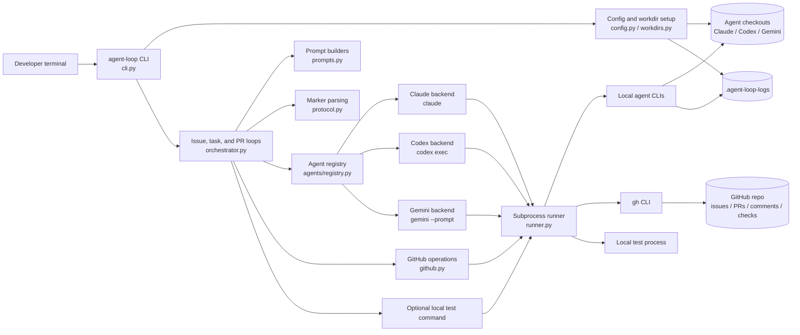
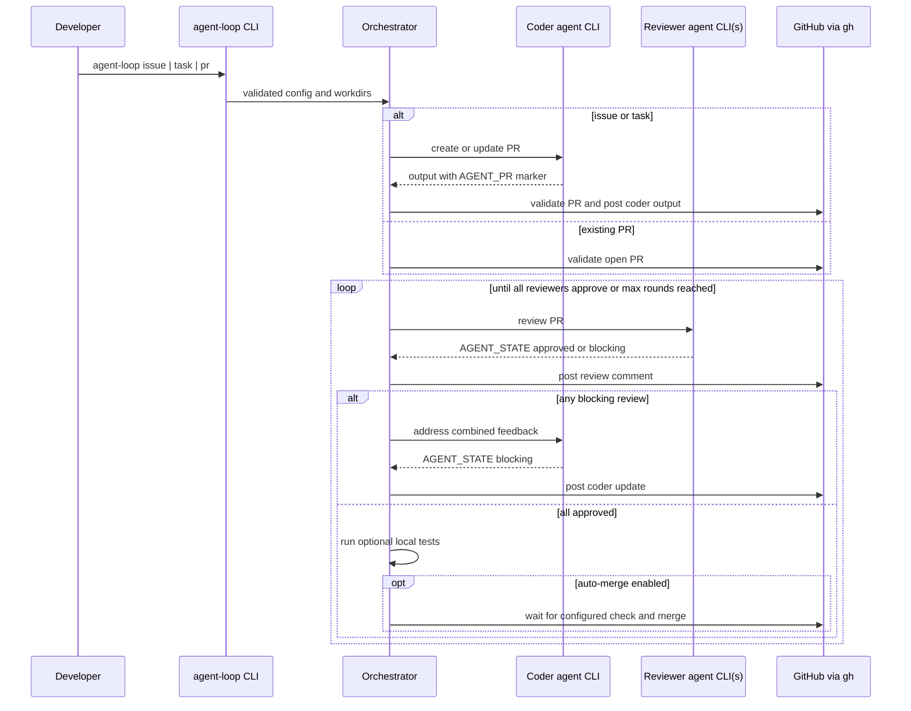

# Local Coding Review Agent Loop

`coding-review-agent-loop` is a local CLI that orchestrates coding agents through a GitHub pull request review loop. Its main advantage is cost and account reuse: it shells out to locally authenticated `claude`, `codex`, `gemini`, and `gh` CLIs instead of calling model APIs directly. If your local agent CLIs are backed by existing AI subscriptions or authenticated developer accounts, the review loop can use those existing entitlements rather than requiring separate model API keys and per-token API billing.

The default flow is:

1. A coder agent creates or updates a PR.
2. One or more reviewer agents review the PR.
3. If any reviewer finds blockers, the coder fixes the PR.
4. The loop repeats until every reviewer approves in the same round or `--max-rounds` is reached.

The default coder is Claude and the default reviewer is Codex. Reverse the direction with `--coder codex --reviewer claude`, or use Gemini with `--coder gemini` / `--reviewer gemini`. Repeat `--reviewer` to require multiple reviewer approvals.

## Architecture

The tool is a local orchestrator. It does not call model APIs directly; it shells
out to locally authenticated agent and GitHub CLIs from separate checkouts.



At runtime, the orchestrator drives one of three entrypoints:



## Agent Backends

Currently supported local agent CLIs:

- Claude Code via `claude`
- OpenAI Codex CLI via `codex`
- Gemini CLI via `gemini`

## Prerequisites

- `gh` is installed and authenticated for the target GitHub repository.
- `claude` is installed and authenticated if either side uses Claude.
- `codex` is installed and authenticated if either side uses Codex.
- `gemini` is installed and authenticated if either side uses Gemini.
- Use separate clones or worktrees for each active agent to avoid local file conflicts. If you omit `--claude-dir`, `--codex-dir`, or `--gemini-dir` for an active agent, the tool uses a repo-scoped temporary checkout under `/tmp/coding-review-agent-loop/OWNER-REPO/{agent}/repo`.

## Usage

Fix a GitHub issue:

```bash
agent-loop issue 56 --repo OWNER/REPO
```

Implement a free-form task:

```bash
agent-loop task "Add a /healthz endpoint that returns 200 OK." \
  --repo OWNER/REPO
```

Review an existing PR:

```bash
agent-loop pr 123 --repo OWNER/REPO
```

If `--repo` is omitted, the tool runs `gh repo view` from the current working
directory, or from `--codex-dir` when that flag is provided, and uses the
detected `OWNER/REPO`. Pass `--repo` explicitly when running outside the target
repository.

Reverse the direction so Codex creates/fixes and Claude reviews:

```bash
agent-loop task "Refactor the cache layer" \
  --repo OWNER/REPO \
  --coder codex \
  --reviewer claude
```

Use Gemini as the coder. Gemini is invoked in headless mode with `gemini --prompt`:

```bash
agent-loop task "Improve validation errors" \
  --repo OWNER/REPO \
  --coder gemini \
  --reviewer codex
```

Use Gemini as one reviewer:

```bash
agent-loop pr 123 \
  --repo OWNER/REPO \
  --reviewer codex \
  --reviewer gemini
```

Require both reviewers to approve. The coder may also be listed as a reviewer
when you want the same agent to work in separate coding and review passes:

```bash
agent-loop pr 123 \
  --repo OWNER/REPO \
  --reviewer codex \
  --reviewer claude
```

## Workdirs

Explicit `--claude-dir`, `--codex-dir`, and `--gemini-dir` values are used
exactly as provided. Missing explicit directories are still created for
backwards compatibility.

When an active agent directory is omitted, the default checkout path is scoped
by repo and agent:

```text
/tmp/coding-review-agent-loop/OWNER-REPO/claude/repo
/tmp/coding-review-agent-loop/OWNER-REPO/codex/repo
/tmp/coding-review-agent-loop/OWNER-REPO/gemini/repo
```

The tool prints the selected default workdirs. If a default checkout does not
exist, it runs `gh repo clone OWNER/REPO <path>`. If it already exists and is a
clean checkout for the requested repo, it fetches origin and fast-forwards the
configured base branch. If the checkout is dirty, points at another repo, or is
not a git checkout, the command fails clearly instead of overwriting local
work.

These temporary checkouts may disappear after reboot or `/tmp` cleanup. Large
projects and long-lived agent setups should use explicit persistent workdirs to
avoid repeated clone, dependency setup, and indexing costs.

## Agent Memory

Agent memory is enabled by default. Before an agent prompt is built, the loop
creates or refreshes advisory repo memory in a durable, repo-scoped user cache
directory. On Linux the default is:

```text
~/.cache/coding-review-agent-loop/repos/OWNER-REPO/memory
```

If `$XDG_CACHE_HOME` is set on Linux, the root is
`$XDG_CACHE_HOME/coding-review-agent-loop`. On macOS the default root is
`~/Library/Caches/coding-review-agent-loop`; on Windows it is
`%LOCALAPPDATA%/coding-review-agent-loop/Cache`.

The memory cache includes a repo summary, architecture map, module index,
execution/test profile, toolchain facts, and changed files since the previous
memory commit. This context is included in coder and reviewer prompts as
orientation only. The prompt explicitly tells agents that cached memory may be
stale and that correctness, security, and behavior claims must come from the
actual source files and PR diff. The cache is local-only, but it can contain
repo structure, local paths, test command notes, and advisory summaries.

Use these flags to control it:

```bash
agent-loop pr 123 --repo OWNER/REPO --no-agent-memory
agent-loop pr 123 --repo OWNER/REPO --refresh-agent-memory
agent-loop pr 123 --repo OWNER/REPO --refresh-test-profile
agent-loop pr 123 --repo OWNER/REPO --agent-memory-dir .cache/agent-loop-memory
```

Relative `--agent-memory-dir` values are resolved inside the active coder
checkout. Use `--no-agent-memory` or a custom short-lived
`--agent-memory-dir` for sensitive repositories where local cache retention is
undesirable. If a custom memory directory uses the repo-local `.agent-loop`
parent, that parent is ignored automatically so generated memory files are not
accidentally committed. If the previous memory commit cannot be diffed against
the current commit, the loop logs the git failure and treats all tracked files
as changed for that refresh.

## Real Example

This project uses `agent-loop` to improve itself. This command asked Codex to
review existing issue and PR feedback, with both Claude and Gemini reviewing
the result. The work became PR #13:
https://github.com/wwind123/coding-review-agent-loop/pull/13

```bash
~/tools/coding-review-agent-loop/.venv/bin/agent-loop task \
  "Please go over all the issue and pr reviews again and see if there's any non-blocking issues still worth addressing but have not been addressed." \
  --repo wwind123/coding-review-agent-loop \
  --coder codex \
  --reviewer claude \
  --reviewer gemini \
  --dangerous-agent-permissions
```

Read a task from a file or stdin:

```bash
agent-loop task --task-file task.md --repo OWNER/REPO
cat task.md | agent-loop task --task-file - --repo OWNER/REPO
```

## Clarification

Task mode is non-interactive by default. If the coder agent decides the task is too ambiguous and emits `<!-- AGENT_CLARIFY -->`, the command exits with the agent's questions. You can add detail and rerun.

To allow interactive clarification:

```bash
agent-loop task "Add caching to the recent-debates endpoint." \
  --repo OWNER/REPO \
  --interactive \
  --max-clarification-rounds 3
```

In interactive mode, answer the questions on stdin. Finish with a single `.` line or Ctrl+D.

## Auto-Merge

Auto-merge is disabled by default. Enable it explicitly:

```bash
agent-loop pr 123 \
  --repo OWNER/REPO \
  --auto-merge \
  --ci-check-name test
```

When enabled, the tool waits for the configured GitHub check-run to pass before merging. Local `--test-command` is an additional local gate, not a replacement for CI.

## Agent Permission Flags

By default, this standalone package does not pass permission-bypass flags to either agent. This is safer for open-source use, but some CLIs may prompt or fail in non-interactive mode unless you provide suitable flags.

For trusted local automation, opt into permission bypasses explicitly:

```bash
agent-loop issue 56 \
  --repo OWNER/REPO \
  --dangerous-agent-permissions
```

This applies:

| Agent | Flag |
|-------|------|
| `claude` | `--dangerously-skip-permissions` |
| `codex exec` | `--dangerously-bypass-approvals-and-sandbox` |
| `gemini` | `--yolo --skip-trust` |

You can also provide exact per-agent replacements. Repeat once per token:

```bash
agent-loop issue 56 \
  --repo OWNER/REPO \
  --claude-arg=--permission-mode --claude-arg=acceptEdits \
  --codex-arg=--sandbox --codex-arg=workspace-write --codex-arg=--ask-for-approval --codex-arg=never \
  --gemini-arg=--approval-mode --gemini-arg=auto_edit
```

Providing any `--claude-arg`, `--codex-arg`, or `--gemini-arg` replaces that agent's default entirely. Gemini's text output is used directly. If you pass `--gemini-arg=--output-format --gemini-arg=json`, the loop extracts the JSON `response` field before parsing markers.

## Protocol

Agent responses are parsed using HTML comment markers:

```text
<!-- AGENT_PR: 123 -->
<!-- AGENT_STATE: approved -->
<!-- AGENT_STATE: blocking -->
<!-- AGENT_CLARIFY -->
```

`AGENT_PR` is required after a coder creates a PR. Review/fix responses must include a final `AGENT_STATE` marker. If a response quotes older markers, the final marker is treated as authoritative.

Approved reviewer responses may also include optional cleanup items under a
dedicated heading:

```md
### Non-blocking follow-ups
- Add a follow-up test.
```

By default, these do not affect approval.

`--approved-followups` accepts:

- `ignore`: ignore non-blocking follow-up bullets from approved reviews. This is the default.
- `summarize`: post a grouped record on the PR instead of sending those items back to the coder as blocking work.
- `issue`: create GitHub issues for the follow-ups instead of delaying the PR, then comment with the created issue links.

Only bullets inside the `Non-blocking follow-ups` section are summarized; the
section ends at the next heading, HTML marker, or agent signature. The same
parsing is used when creating follow-up issues.

## Logs

Agent stdout/stderr is written to `.agent-loop-logs/` under the active coder
checkout by default. If that coder directory was omitted, the relative default
log path is also under the repo-scoped temporary checkout and may disappear
with `/tmp` cleanup. The CLI prints heartbeat messages with the log path while
agents run:

```text
[agent-loop 12:00:31] Claude still running (30s); log: /path/to/.agent-loop-logs/20260425-120001-claude.log
```

Use `tail -f` on the displayed path to see live output. The log directory gets its own `.gitignore` on first use.
