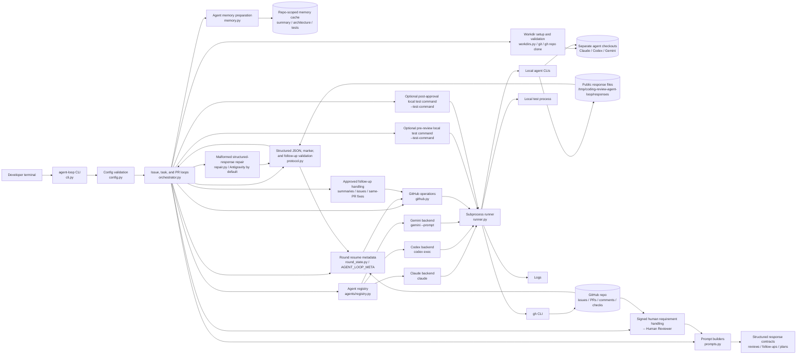
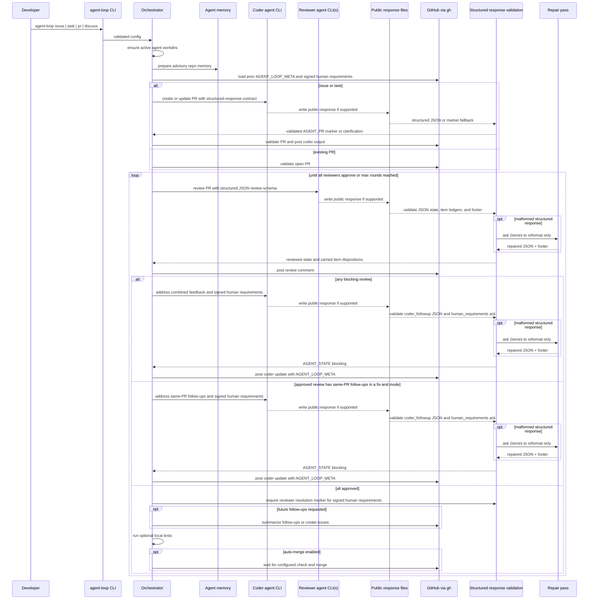

# Local Coding Review Agent Loop

`coding-review-agent-loop` is a local CLI that orchestrates coding agents through a GitHub pull request review loop. Its main advantage is account reuse: it shells out to locally authenticated `claude`, `codex`, `gemini`, and `gh` CLIs instead of calling model APIs directly. If your local agent CLIs are backed by existing AI subscriptions or authenticated developer accounts, the review loop can use those existing entitlements rather than requiring separate model API keys.

**Claude billing note:** Anthropic had announced that non-interactive `claude` usage — including `claude -p` as used by this tool — would move from your subscription's rate limits to a separate monthly Agent SDK credit. As of June 15, 2026 that change has been **postponed**: `claude -p` / Agent SDK usage continues to draw from your existing Claude subscription as before, with no separate credit, and Anthropic has said it will give advance notice before any future change. See [Anthropic's support article](https://support.claude.com/en/articles/15036540-use-the-claude-agent-sdk-with-your-claude-plan) for the latest.

The default flow is:

1. A coder agent creates or updates a PR.
2. One or more reviewer agents review the PR.
3. If any reviewer finds blockers, the coder fixes the PR.
4. The loop repeats until every reviewer approves in the same round or `--max-rounds` is reached (default: 10).

The default coder is Claude and the default reviewer is Codex. Reverse the direction with `--coder codex --reviewer claude`, or use Gemini with `--coder gemini` / `--reviewer gemini`. Repeat `--reviewer` to require multiple reviewer approvals.

Gemini CLI consumer access (free / Google AI Pro / Ultra) is retiring on June 18, 2026; personal-account `gemini` users should migrate to the Antigravity CLI (`agy`) with `--coder antigravity` / `--reviewer antigravity` (pick a single model via `--antigravity-model`, or an ordered fallback chain via `--antigravity-models`; default chain `Gemini 3.7 Flash (High)` → `Gemini 3.6 Flash (High)` → `Gemini 3.1 Pro (High)`). Enterprise / API-key Gemini CLI paths may remain available for organizations that still have access, so the `gemini` backend is retained for those users. Direct Gemini CLI support is best-effort: maintainers without enterprise Gemini CLI access need reporter-provided `.agent-loop-logs/*gemini.log` output, response-file contents, CLI version, and any sharable account/access context to debug live `gemini` failures. Antigravity turns are single-shot (no cross-round session resume) and report estimated usage.

Every `agy --print` call passes `--print-timeout` from
`--antigravity-print-timeout-seconds` (default `600`, i.e. ten minutes), which
overrides `agy`'s own five-minute print-mode default so long turns are not
cut short. Override it per run, e.g. `--antigravity-print-timeout-seconds
1800`.

## Architecture

The tool is a local orchestrator. It does not call model APIs directly; it shells
out to locally authenticated agent and GitHub CLIs from separate checkouts. The
only durable state it creates is local: agent logs in the active coder checkout
and optional advisory memory in a repo-scoped cache directory.


```mermaid
flowchart LR
    User[Developer terminal] --> CLI[agent-loop CLI<br/>cli.py]
    CLI --> Config[Config validation<br/>config.py]
    Config --> Orchestrator[Issue, task, and PR loops<br/>orchestrator.py]

    Orchestrator --> Workdirs[Workdir setup and validation<br/>workdirs.py / git / gh repo clone]
    Orchestrator --> Memory[Agent memory preparation<br/>memory.py]

    Workdirs --> AgentDirs[(Separate agent checkouts<br/>Claude / Codex / Gemini)]
    Memory --> MemoryCache[(Repo-scoped memory cache<br/>summary / architecture / tests)]

    Orchestrator --> Prompts[Prompt builders<br/>prompts.py]
    Orchestrator --> Protocol[Structured JSON, marker,<br/>and follow-up validation<br/>protocol.py]
    Orchestrator --> Repair[Malformed structured-response repair<br/>repair.py / Antigravity by default]
    Orchestrator --> RoundState[Round resume metadata<br/>round_state.py / AGENT_LOOP_META]
    Orchestrator --> Registry[Agent registry<br/>agents/registry.py]
    Orchestrator --> GitHubOps[GitHub operations<br/>github.py]
    Orchestrator --> HumanReqs[Signed human requirement handling<br/>-- Human Reviewer]
    Orchestrator --> PreReviewTests[Optional pre-review local test command<br/>--test-command]
    Orchestrator --> OptionalTests[Optional post-approval local test command<br/>--test-command]
    Orchestrator --> Followups[Approved follow-up handling<br/>summaries / issues / same-PR fixes]
    Prompts --> StructuredContracts[Structured response contracts<br/>reviews / follow-ups / plans]
    HumanReqs --> Prompts
    Protocol --> RoundState
    Repair --> Protocol

    %% The orchestrator owns repair invocation: it catches validation failures,
    %% calls repair.py, then re-runs Protocol validation on the repaired output.

    Registry --> Claude[Claude backend<br/>claude]
    Registry --> Codex[Codex backend<br/>codex exec]
    Registry --> Gemini[Gemini backend<br/>gemini --prompt]

    Claude --> Runner[Subprocess runner<br/>runner.py]
    Codex --> Runner
    Gemini --> Runner
    GitHubOps --> Runner
    PreReviewTests --> Runner
    OptionalTests --> Runner

    Runner --> AgentCLIs[Local agent CLIs]
    Runner --> GhCLI[gh CLI]
    Runner --> TestCmd[Local test process]
    Runner --> Logs

    AgentCLIs --> AgentDirs
    AgentCLIs --> ResponseFiles[(Public response files<br/>/tmp/coding-review-agent-loop/responses)]
    ResponseFiles --> Protocol
    Protocol --> Orchestrator
    RoundState --> GitHubOps
    GhCLI --> GitHub[(GitHub repo<br/>issues / PRs / comments / checks)]
    GitHub --> HumanReqs
    GitHub --> RoundState
    Followups --> GitHubOps
```

The orchestrator owns the repair pass: it catches structured-response validation failures, invokes `repair.py`, and then sends the repaired output back through protocol validation before anything is posted.

At runtime, the orchestrator drives one of three entrypoints:


```mermaid
sequenceDiagram
    participant User as Developer
    participant CLI as agent-loop CLI
    participant Orch as Orchestrator
    participant Memory as Agent memory
    participant Coder as Coder agent CLI
    participant Reviewer as Reviewer agent CLI(s)
    participant Resp as Public response files
    participant GH as GitHub via gh
    participant Protocol as Structured response validation
    participant Repair as Repair pass

    User->>CLI: agent-loop issue | task | pr | discuss
    CLI->>Orch: validated config
    Orch->>Orch: ensure active agent workdirs
    Orch->>Memory: prepare advisory repo memory
    Orch->>GH: load prior AGENT_LOOP_META and signed human requirements
    alt issue or task
        Orch->>Coder: create or update PR with structured-response contract
        Coder-->>Resp: write public response if supported
        Resp-->>Protocol: structured JSON or marker fallback
        Protocol-->>Orch: validated AGENT_PR marker or clarification
        Orch->>GH: validate PR and post coder output
    else existing PR
        Orch->>GH: validate open PR
    end

    loop until all reviewers approve or max rounds reached
        Orch->>Reviewer: review PR with structured JSON review schema
        Reviewer-->>Resp: write public response if supported
        Resp-->>Protocol: validate JSON state, item ledgers, and footer
        opt malformed structured response
            Protocol->>Repair: ask Gemini to reformat only
            Repair-->>Protocol: repaired JSON + footer
        end
        Protocol-->>Orch: reviewed state and carried item dispositions
        Orch->>GH: post review comment
        alt any blocking review
            Orch->>Coder: address combined feedback and signed human requirements
            Coder-->>Resp: write public response if supported
            Resp-->>Protocol: validate coder_followup JSON and human_requirements ack
            opt malformed structured response
                Protocol->>Repair: ask Gemini to reformat only
                Repair-->>Protocol: repaired JSON + footer
            end
            Protocol-->>Orch: AGENT_STATE blocking
            Orch->>GH: post coder update with AGENT_LOOP_META
        else approved review has same-PR follow-ups in a fix-and mode
            Orch->>Coder: address same-PR follow-ups and signed human requirements
            Coder-->>Resp: write public response if supported
            Resp-->>Protocol: validate coder_followup JSON and human_requirements ack
            opt malformed structured response
                Protocol->>Repair: ask Gemini to reformat only
                Repair-->>Protocol: repaired JSON + footer
            end
            Protocol-->>Orch: AGENT_STATE blocking
            Orch->>GH: post coder update with AGENT_LOOP_META
        else all approved
            Orch->>Protocol: require reviewer resolution marker for signed human requirements
            opt future follow-ups requested
                Orch->>GH: summarize follow-ups or create issues
            end
            Orch->>Orch: run optional local tests
            opt auto-merge enabled
                Orch->>GH: wait for configured check and merge
            end
        end
    end
```

## Agent Backends

Currently supported local agent CLIs:

- Claude Code via `claude`
- OpenAI Codex CLI via `codex`
- Gemini CLI via `gemini` (best-effort support for users whose organization or API-key setup still has access)
- Antigravity CLI via `agy` (first-class backend; also the Gemini CLI migration path)

### Startup replacement evidence and replay

The Gemini and Antigravity backends classify executable replacement only from
attempt-local evidence. The launcher identity must change between the pre-spawn
and post-exit observations, the exit must be an integer, capture must not report
an interruption, timeout, or PTY read failure, and no non-empty public response
file, public-response marker, structured payload, or ordinary narration may be
present. Gemini's residual output is limited to empty output and recognized
startup, Node-loader, or updater diagnostics. Antigravity additionally permits
recognized `agy` version/model startup chrome; unknown lines are treated as
progress and suppress replay. A valid response-file artifact is accepted before
this gate, even for a failed or timed-out command; a malformed artifact follows
normal validation/repair.

Gemini takes a read-only `HEAD` and exact `git status --porcelain` snapshot
immediately before `run_with_log`, then lazily takes the after snapshot only for
an otherwise eligible candidate. Antigravity takes the before snapshot after
acquiring both the settings lock and the exclusive `GEMINI.md` lock, before
tool-owned injection. It invokes the backend, removes the injected prefix in a
`finally` path, parses the candidate, and takes the after snapshot before
releasing either lock. Reviewer and coder paths therefore cannot observe a peer's
injected prompt as worktree activity. Isolated `role=repair` / `run_repair`
invocations skip Git probes, replacement metadata, and replay eligibility. The
snapshots are read-only evidence gates and cannot guarantee that a backend had no
other external side effects.

When the gate succeeds, Gemini and Antigravity wait for one bounded executable
stability window and may make one fresh full-timeout replay using the
`executable-replacement-attempt2` log suffix. Gemini allows
`agent_max_retries + 2` total slots; Antigravity allows
`len(antigravity_models) + agent_max_retries + 1`. The dedicated replay is outside
ordinary retry accounting. Antigravity replays the same singleton model without
advancing `retries_remaining`, `model_index`, or `attempts`; only a later ordinary
failure may retry or fall back. A failed stability wait keeps ordinary retry and
fallback eligibility, while changed or unavailable snapshots retain diagnostic
refusal metadata without triggering stability waiting.

## Prerequisites

- `gh` is installed and authenticated for the target GitHub repository.
- `claude` is installed and authenticated if either side uses Claude.
- `codex` is installed and authenticated if either side uses Codex.
- `gemini` is installed and authenticated if either side uses Gemini. For individual Google accounts after the consumer cutoff, prefer `agy`; direct Gemini CLI support is best-effort for enterprise/API-key users who can provide logs when issues are not locally reproducible.
- Use separate clones or worktrees for each active agent to avoid local file conflicts. If you omit `--claude-dir`, `--codex-dir`, or `--gemini-dir` for an active agent, the tool uses a repo-scoped temporary checkout under `/tmp/coding-review-agent-loop/OWNER-REPO/{agent}/repo`.

## Usage

### Process-tree containment

Every standalone CLI agent invocation and every `agent-loop run-tests` gate is
admitted through the same per-user aggregate policy. The default `auto` mode
preflights a systemd 253+ user manager with unified cgroup v2 and, when all
requested properties are accepted, launches a unique foreground scope under
`agent-loop.slice`. It uses the exact form
`systemd-run --user --scope --quiet` and intentionally omits `--wait`,
`--service`, and `--pipe`. `MemoryHigh`, `MemoryMax`, `MemorySwapMax`, and
`TasksMax` are applied to the aggregate and to the `coder`, `reviewer`,
`repair`, or `test-gate` child profile. A child profile is never above the
effective aggregate, including when another process holds a stricter lease.

Use `containment-preflight` before a live run to see the resolved policy,
systemd version, scope probe result, and supported cgroup counters. Values may
be bytes (`512MiB`), percentages of physical memory (`70%`), or `max` where a
finite limit is not requested. The defaults reserve 25% of physical memory
for the OS and unrelated services. Independent agent-loop processes coordinate
through crash-recoverable runtime leases keyed by boot ID and PID start
identity, so one process cannot weaken another's live slice ceiling.

`auto` visibly falls back to process-group TERM/KILL on macOS, non-systemd
Linux, unavailable user managers, non-unified cgroups, or failed property
probes. That fallback guarantees deterministic termination but makes no memory
ceiling claim. `required` fails closed instead. Optional files such as
`memory.peak`, PSI, and swap counters are capability-tracked and rendered as
`not collected on this host` when absent; only previously observed evidence
that disappears unexpectedly is indeterminate. OOM, hard memory/swap, and
`TasksMax` termination is `resource-exhausted`, while `MemoryHigh` and PSI are
pressure diagnostics and do not by themselves claim to have killed a process.

Each scope contains a target-start/target-exec-error shim. A missing shim
report means launcher or unit creation failure regardless of the numeric
systemd exit status. A target-start report binds numeric statuses, including 1
and 203, to the target. Timeouts retain the `returncode is None` wall-clock
convention, salvage a valid response file when available, terminate the full
scope, confirm emptiness, and only then permit a retry or replacement replay.

The managed test wrapper also locks a lane by canonical cwd, normalized argv,
and `AGENT_LOOP_INVOCATION_ID`, using a non-inherited advisory descriptor.
Same-lane duplicates are rejected before spawn with exit 125 and do not enter
runtime learning. Intentional parallel reviewer workers have distinct lanes.
An unwrapped command cannot be deduplicated from free-form logs when no
structured tool hook exists; it is still contained when it is a descendant of
an agent scope. In skill mode, the host's in-session Claude coder and arbitrary
descendants remain part of the host session and receive prompt guidance plus
the managed wrapper when used. The aggregate is per user manager, not a
cross-user host isolation boundary.

Fix a GitHub issue:

```bash
agent-loop issue 56 --repo OWNER/REPO
```

Issue mode includes the issue title, body, and comments in the coder prompt and
issue-origin review prompts. Comments are ordered oldest to newest so later
discussion can refine or supersede the original body.

The issue implementation coder uses the structured `issue_implementation`
contract. It reports a non-blank summary, a positive `pr_number` or `null`, an
exact signed-human-requirement disposition ledger, and optional `tests_run`
command strings. The orchestrator validates supplied commands inside the
assigned checkout. A null-PR result is posted as a readable issue-level
terminal comment and stops before PR operations. If a signed requirement is
blocked after a PR was opened, the coder must retain the real PR number or URL
in the summary or disposition evidence while setting `pr_number` to `null`;
the conflict is posted once without retrying or entering handoff, review, or
merge gates. Accepted created-PR results are rendered for GitHub and retain the
raw structured payload in round metadata so resume can restore the typed result.

Run issue mode as plan-first discussion before implementation:

```bash
agent-loop issue 56 --repo OWNER/REPO --plan-first
```

With `--plan-first`, the coder writes an implementation plan without editing
code, pushing a branch, or opening a PR. Reviewers critique that plan on the
issue using `AGENT_PLAN_STATE` markers until every reviewer approves in the
same planning round. Plan reviews use explicit sections:

```md
### Blocking plan issues
### Same-plan follow-ups
### Future follow-ups
```

If earlier blocking or same-plan items are still open, reviewers encode prior
item dispositions in the JSON `prior_plan_item_dispositions` array using
`"resolved"`, `"blocking"`, `"same-plan"`, or `"future"` (with a `"note"`).
The orchestrator renders a `### Prior unresolved plan item dispositions` section
in the public GitHub comment; reviewers do not add that section themselves. Use
`"same-plan"` for required current-plan refinements; `"future"` is accepted only
in approved plan reviews and the approved future follow-ups are reconciled with
the final approved plan instead of reopening planning. In `--approved-followups=issue` and `fix-and-issue` modes,
when implementation will continue after approval, plan-stage future follow-ups
are filed as separate issues before implementation starts. If implementation
continues but issue filing is disabled, they are summarized inline with a note
that they are not carried into PR review. Planning `item-*` IDs visible in issue
history are not PR prior review items unless they appear in the active PR
unresolved-item ledger. By default the loop posts an approved consensus summary
to the issue and stops without filing follow-up issues. Add
`--implement-after-approval` to continue into the normal
implementation and PR review loop using the approved plan:

```bash
agent-loop issue 56 --repo OWNER/REPO --plan-first --implement-after-approval
```

For larger plans, choose the post-approval behavior explicitly with
`--plan-execution-mode`:

```bash
agent-loop issue 56 --repo OWNER/REPO --plan-first --plan-execution-mode plan-only
agent-loop issue 56 --repo OWNER/REPO --plan-first --plan-execution-mode decompose-only
agent-loop issue 56 --repo OWNER/REPO --plan-first --plan-execution-mode implement-one-shot
agent-loop issue 56 --repo OWNER/REPO --plan-first --plan-execution-mode implement-by-phase
```

The modes are:

- `plan-only`: post the approved plan summary and stop. This is the default.
- `decompose-only`: use typed `child_stages` directly when present; otherwise
  ask the coder to decompose the approved plan. Create one child issue per
  selected phase, post a parent summary, and stop. Typed stages are the
  approved plan's remainder; its primary scope remains owned by the parent.
- `implement-one-shot`: keep the existing post-approval implementation handoff.
  This is also what `--implement-after-approval` selects for compatibility.
- `implement-by-phase`: create/link every phase issue, implement only the first
  `agent-pr` child issue, then stop after that PR review loop. The parent issue
  records a one-time handoff only after an accepted positive implementation PR;
  null-PR and rejected-conflict results stop without a handoff. Parent reruns
  after that handoff do not re-run the child and should be resumed directly with
  `agent-loop issue <child>`. Older decomposition summaries without this marker
  are treated as not yet handed off, so the first child handoff is recorded once.

`decompose-only` and `implement-by-phase` already select one detailed child
topology. The CLI rejects `--materialize-split-issues` with either mode before
any GitHub write.

Before invoking a coder for an issue — in direct `agent-loop issue <n>` mode or
approved-plan implementation alike — the orchestrator resolves the canonical
`AGENT_ISSUE_PR_HANDOFF` record: an authoritative, machine-readable comment
posted once an implementation PR passes validation, recording the PR number,
URL, head SHA, flow (`issue-implementation` or `approved-plan-implementation`),
and (for plan-first runs) the approved-plan hash. If a valid record names a
still-open PR, the rerun resumes PR review on that PR directly instead of
invoking the coder again. A record whose PR is closed, merged, or otherwise
unresolvable fails safely with an actionable message rather than falling back
to a fresh implementation; fix or select the correct PR and rerun
`agent-loop pr <number>` directly.

### Durable marker trust boundary

All durable protocol records are registered in
`src/coding_review_agent_loop/protocol_markers.py`. The registry owns each
record's outer grammar, canonical codec, safe historical label, strictness, and
allowed GitHub surfaces. Current untrusted responses are rejected if they
contain a registered occurrence; trusted producers compose immutable
`TrustedBody` segments, and writers verify a one-to-one match between every
visible occurrence and its authorized canonical segment before posting.

The loop distinguishes current prose from orchestrator-re-rendered history.
When a prior ledger item is projected into a later public comment, only
reserved spans are replaced with stable descriptive labels before the item is
normalized or truncated. Item IDs, reviewer, round, source status,
disposition, and disposition notes remain separate fields. The same
transformation is used during initial rendering and resume reconstruction.

Encoded or compressed payload values such as salvage patches and round-state
copies are opaque at their outer occurrence: codec, size, integrity,
decompression, secret/binary, and hydration checks still apply. If such a
value is later projected into visible current prose it goes through current
marker validation; if it becomes historical ledger prose it goes through the
deterministic sanitizer.

Surface policy is fail-closed. Issue comments carry issue-flow records, PR
comments carry PR contracts and managed-CI audits, child issue bodies carry
only the split-child record, and managed PR bodies carry only the managed
origin record plus the invocation-correlated override trailer. Missing,
duplicate, malformed, non-canonical, wrong-surface, stale, or uncorrelated
records are never inferred from finished-body text or payload equality.

Issues that predate this marker (or crashed before it could be posted) fall
back to the legacy check: searching GitHub directly for an already-open PR
that already references the target issue, independent of any handoff marker.
This closes the same crash window as before: if implementation created a PR
but the run aborted afterward — before any handoff comment could be posted —
a rerun still resumes PR review on that PR instead of invoking the coder again
and creating a duplicate, and backfills a canonical handoff record so later
reruns take the fast path. If more than one open PR references the issue, the
orchestrator raises an error instead of guessing which one to resume; close or
merge the extra PR and rerun `agent-loop pr <number>` directly.

`--implement-after-approval` is a compatibility shortcut for
`--plan-execution-mode implement-one-shot`. It requires `--plan-first` and is
not compatible with any other explicit `--plan-execution-mode` value.

Approved-plan implementation can switch to a different coder after planning:

```bash
agent-loop issue 56 --repo OWNER/REPO --plan-first --implement-after-approval \
  --coder claude \
  --implementation-coder codex \
  --implementation-coder-model gpt-5.5 \
  --implementation-codex-reasoning-effort high
```

Planning and plan revisions always use `--coder`; the `--implementation-*`
flags apply only after reviewers approve the plan and the run enters
implementation. `--implementation-coder` accepts the same values as `--coder`.
`--implementation-coder-model` sets that implementation coder's model only for
the approved-plan implementation. When `--implementation-coder-model` is set
without `--implementation-coder`, implementation keeps using `--coder` but with
the implementation-only model. `--implementation-codex-reasoning-effort` can
only be used when the implementation coder is Codex, either explicitly via
`--implementation-coder codex` or implicitly via `--coder codex`; it also
requires `--implementation-coder-model` or `--codex-model` so the Codex
implementation signature can name the model reliably.

If the plan narrows scope (via `deferred_stages` or a prior discuss `split`
consensus), see [Split issue materialization](#split-issue-materialization)
below for how those follow-up stages are filed (or warned about) and how
`implement-one-shot` targets the correct stage instead of the whole parent. If
you are deciding between that mechanism and `decompose-only` /
`implement-by-phase`, read [Phased decomposition versus split
materialization](#phased-decomposition-versus-split-materialization) first.

Generated child issues are self-contained: each body includes the parent issue
link, the relevant approved parent-plan slice, constraints/invariants,
dependency notes, scope and non-goals, rollout risk, validation/soak
requirements, automation classification, and explicit instructions for either
`agent-loop issue <N>` execution or human remark/closure. Dependency links are
filled in after earlier child issue numbers or URLs are known.

Automation classification is required for every phase. `agent-pr` means the
phase is expected to be implemented through a child issue and PR.
`human-action` and `manual-close` phases are still created as child issues, but
their titles, bodies, and parent summary call out that a human must perform the
work or checkpoint, add the required remark/update, and close the issue. If
`implement-by-phase` sees a human-only first phase, it stops instead of
recording an implementation handoff.

Flat child topology allows 15 children by default; override it with
`--flat-child-limit`. The count is shared by decomposition and split
materialization, preflighted before a checkpoint or create, and never silently
truncated. An over-limit result creates no children and returns a structured
human decision to consolidate or use the hierarchical design tracked in #720.
This limit is independent of `--approved-followups`, whose issue mode still
caps approved-review future follow-up issues separately. Decomposition also rejects
duplicate phase titles, invalid automation classes, unknown dependencies,
self-dependencies, and forward dependencies; `depends_on` may reference only
earlier phase titles. Parent decomposition metadata
(`AGENT_PLAN_DECOMPOSITION`) and phase handoff metadata
(`AGENT_PLAN_PHASE_IMPLEMENTATION`) make reruns idempotent. If a parent issue
has already handed off an `implement-by-phase` child, rerun the child issue
directly instead of expecting the parent to restart it.

Implement a free-form task:

```bash
agent-loop task "Add a /healthz endpoint that returns 200 OK." \
  --repo OWNER/REPO
```

Review an existing PR:

```bash
agent-loop pr 123 --repo OWNER/REPO
```

Evaluate a GitHub issue without writing any code:

```bash
agent-loop discuss 123 --repo OWNER/REPO
```

### Open-ended answer results

The legacy implementation-triage contract remains the default. For system and
design questions, use `--discuss-result-mode answer`:

```bash
agent-loop discuss 123 --repo OWNER/REPO \
  --reviewer codex --reviewer claude \
  --discuss-result-mode answer
```

Debaters return `kind: "discuss_answer"` with `position: "answer"` or
`"needs-human"`, plus `answer`, `rationale`, `confidence`, and
`unresolved_items`. Each item has exactly a non-empty `text` and a `status` of
`blocker`, `human-decision`, or `follow-up`. `position: "answer"` requires an
answer and may include any classification; for example, an otherwise useful
answer with a pricing `blocker` is valid but cannot conclude successfully.
`position: "needs-human"` omits `answer` and requires at least one
`human-decision` item.

The final complete round is authoritative: later rounds can clear or
reclassify earlier concerns. Final precedence is `human-decision` (Needs Human
Decision), then `blocker` (Deadlock), then answer convergence; follow-ups alone
remain non-blocking. Summaries list Blockers, Human decisions, and Non-blocking
follow-ups separately. Legacy persisted transcripts that use `open_questions`
are accepted only while resuming: old `needs-human` questions map to
`human-decision`, while old asserted-answer questions map conservatively to
`blocker`. New live responses must use `unresolved_items`.
Analyzer observations remain non-authoritative and cited research remains a
separate sourced-facts section. Repair and resume preserve the selected mode;
transcripts cannot mix answer and triage responses.

Answer-mode presentation is intentionally executive-first. When a configured
discuss analyzer returns the optional enriched agenda, each completed interim
comment leads with `Current consensus`, `Active disagreements`, `Changes this
round`, `Missing facts`, and `Next-round focus`; the final comment leads with
`Outcome`, `Agreed conclusions`, `Remaining disagreements`, and `Next action`.
The state is cumulative: a resolved item appears in the change record and does
not return to the active list unless a later response explicitly reopens it.
The raw table, analyzer audit, and bounded excerpts are collapsed below the
state, while each per-agent comment remains the complete authoritative audit.

Only the configured discuss analyzer can synthesize. A normal enriched agenda
adds no call, a valid legacy agenda permits one bounded same-analyzer fallback,
and exact-text, semantic-equivalent, or debater-confirmed final artifacts are
adapted directly without another synthesis call. Other complete or partial
final paths use at most one bounded final synthesis call; partial finalization
is always mechanically `material_deadlock`. The mechanical classification is
never changed by advisory text. Analyzer absence, malformed or unsupported
claims, failed fidelity checks, marker-like text, corrupt resume metadata, and
sidecar hydration problems fail closed to the existing rendering. Canonical
snapshots and visible synthesis text are bounded to 16,000 UTF-8 bytes; answer
excerpts are limited per responder and in aggregate, and large audit payloads
spill to transport sidecars. Resume consumes a stored snapshot only while a
discuss analyzer is configured, preserving analyzer gating when configuration
changes.

To enable semantic comparison for differently worded final answers, configure
an independent `--discuss-analyzer`. There is no reviewer fallback when it is
unset. The analyzer receives final-round answers only and is prohibited from
research or repository work; its output is advisory and recorded separately in
the summary. Equivalent answers may converge. Compatible answers receive one
bounded, budget-exempt confirmation phase: each original debater confirms the
canonical recommendation or supplies a refinement, and only exact normalized
agreement among those effective answers finalizes. Invalid comparator output,
comparison failure, failed confirmation, or material conflict safely remains a
deadlock. A successful debater-confirmed recommendation reuses the recorded
semantic comparison audit and does not invoke a second final-observations pass
over the same final answers; that advisory comparison remains distinct from the
authoritative debater confirmation. This makes resumed finalization idempotent
once a final summary is recorded.

Discuss mode sends the issue title, body, and comments to all configured
reviewers and asks each to return a `discuss_review` response with a single
outcome vote. Instead of collapsing a round into one orchestrator comment,
discuss mode posts a transcript to the issue, similar to how PR review mode
posts a comment per reviewer per round:

1. Each configured reviewer ("debater") posts its own issue comment with its
   structured vote and rationale, tagged with round metadata.
2. Once every reviewer has posted for the round, the orchestrator posts a
   separate round-summary comment identifying consensus or disagreement.
3. If the round is not the final one, the summary comment also lists the
   agenda for the next round (each reviewer's held position). Unresolved
   disagreement carries this agenda plus the prior round's comments into the
   next round's prompts, and requires each reviewer to include a non-empty
   `rebuttal` that engages the disagreement.
4. The final consensus/deadlock result is always its own round-summary
   comment, separate from the per-reviewer comments and from any interim
   round summaries.

A two-round debate transcript looks like:

```text
Round 1: Codex position
Round 1: Antigravity position
Round 1: Orchestrator summary (agenda for round 2)
Round 2: Codex rebuttal
Round 2: Antigravity rebuttal
Round 2: Orchestrator final consensus/deadlock
```

The four possible votes are:

| Vote | Meaning |
|------|---------|
| `implement` | Reviewer recommends proceeding with the issue as written. |
| `do-not-implement` | Reviewer recommends not implementing the issue. |
| `needs-human` | Reviewer cannot decide without more information from a human. |
| `split` | Reviewer recommends breaking the issue into smaller sub-issues and may include sub-issue proposals. |

After each round, the orchestrator checks for same-round unanimity. Agreement in
round 1 is marked `unanimous`; agreement after debate is marked `converged`.
By default, the orchestrator runs up to two debate rounds after round 1. Set
`--discuss-max-rounds 0` to post a human-needed deadlock immediately after an
initial disagreement, or increase the value to allow more debate.

If no consensus is reached after the configured debate rounds, the final
round-summary comment is a `deadlock` comment with the `needs-human` outcome,
each final reviewer position, and the core disagreement. `split` proposals
from multiple reviewers are merged in first-seen order only when all reviewers
in the same round agree on `split`. Discuss runs are idempotent and resumable:
the final round-summary comment includes an
`<!-- AGENT_DISCUSS_CONSENSUS: <subject-hash> -->` marker derived from the issue
title, body, and non-round comment bodies, and every posted comment carries an
`<!-- AGENT_LOOP_META: ... -->` marker the orchestrator decodes to reconstruct
completed rounds — including a round that only partially posted before a
crash — from the public comment thread on the next run, without relying on one
aggregate comment. A re-run on an unchanged issue with a final result posts no
second transcript; posting a new human comment on the issue invalidates the
cached result and triggers a fresh evaluation from round 1. If a resumed run's
next round would exceed a `--discuss-max-rounds` value that was lowered since
the prior run, the orchestrator immediately posts a final `deadlock` summary
from the last completed round instead of silently exiting without a result;
if no completed round exists to finalize from, it raises instead of exiting
silently.

`AGENT_LOOP_META` uses a `v1_` prefix followed by zlib-compressed URL-safe
base64 data (legacy plain-base64 markers remain readable). If metadata cannot
fit in one GitHub comment, the loop posts `AGENT_LOOP_SIDECAR` transport comments
before the metadata-bearing anchor. Keep those sidecars with the anchor: resume
fails loudly if one is missing or corrupt, at which point restore the sidecars
or remove the incomplete anchor and rerun.

Discuss mode accepts `--reviewer` the same way as PR mode — repeat the flag to
require multiple reviewers:

```bash
agent-loop discuss 123 --repo OWNER/REPO \
  --reviewer codex --reviewer antigravity \
  --discuss-max-rounds 2
```

### Optional analyzer-guided debate agenda

Pass `--discuss-analyzer <agent>` (`claude`, `codex`, `gemini`, or
`antigravity`; it may coincide with a `--reviewer`) to add an analyzer agent
borrowed from the analyzer/debater pattern:

```bash
agent-loop discuss 123 --repo OWNER/REPO \
  --reviewer codex --reviewer antigravity \
  --discuss-analyzer claude
```

After each non-final round, the analyzer receives the complete multi-round
vote history (every completed round's outcomes, rationales, rebuttals, and any
framing corrections, oldest first) plus its own previous agenda, and returns a
structured `discuss_agenda` response:

```json
{
  "schema_version": 1,
  "kind": "discuss_agenda",
  "consensus": ["The issue is well-motivated."],
  "disagreements": [
    {
      "topic": "Scope of the change",
      "positions": {"Codex": "Narrow enough.", "Antigravity": "Too broad; split it."},
      "question_for_next_round": "Would splitting the API boundary resolve the scope objection?"
    }
  ],
  "missing_facts": ["Whether the API boundary is already specified."]
}
```

In analyzer mode, the next debate round's prompt is agenda-focused: it renders
only the structured agenda plus the target debater's own prior position
verbatim. Other debaters' full rationales and rebuttals are omitted and reach
each debater only through the analyzer's summarized `positions`. Each debater
must concede, defend with evidence, refine its position, or set
`analyzer_framing: "misframed"` with a `framing_note` correcting the agenda;
framing corrections are rendered in the debater's public comment.

Guardrails — the analyzer is never authoritative:

- Consensus detection stays vote-only; the analyzer never decides the outcome.
  An agenda claiming consensus while the votes differ is forwarded, but the
  votes rule and the divergence stays visible in the summary.
- The agenda is rendered in the non-final round summary ("Agenda for round
  N+1 (analyzer: ...)"), so it is auditable on the issue.
- After the final debater responses arrive, the analyzer gets a separate
  best-effort pass over only those successful final-round responses. A valid
  result is rendered as "Final analyzer observations (not debater-confirmed)"
  after the authoritative debater vote table. It is rejected if it names a
  non-debater or asserts a position, topic, consensus, disagreement, or missing
  fact unsupported by the final-round text. The exception is a successful
  answer-mode compatible-answer confirmation: its semantic comparison already
  analyzed those final answers, so the recorded comparison is reused instead
  of making a duplicate advisory pass. Debater confirmation is still the
  authoritative finalization step.
- If an agenda from the preceding non-final round exists, the final summary
  renders it separately as "Agenda before final round." This is explicitly
  historical and is never presented as current disagreements. If final analysis
  fails validation, the observations are omitted while the answer/vote table
  and mechanical outcome remain available. For a partial round, any retained
  observations are grounded only in its successful final-round responses.
- If the analyzer invocation fails even after the malformed-response repair
  pass, the orchestrator logs a warning and falls back to the plain mechanical
  agenda for that round (and full prior positions in the next debate prompt)
  instead of aborting the run.

The raw agenda rides in the round summary's `AGENT_LOOP_META` metadata, so a
resumed run restores the structured agenda for the next debate round. Legacy
summaries without an analyzer payload resume in plain mode. With
`--discuss-max-rounds 0`, there is no non-final agenda pass, but a configured
analyzer still receives the final-only pass after the initial final round.
Omitting `--discuss-analyzer` keeps plain #465-style direct deliberation
unchanged.

### Discuss research policy

`--discuss-research none|required|auto` (default: `none`) controls whether
debaters may use current external facts:

```bash
agent-loop discuss 123 --repo OWNER/REPO \
  --reviewer codex --reviewer antigravity \
  --discuss-analyzer claude \
  --discuss-research auto
```

For design issues, round-one research focuses on the decision under debate
(solution design, prior art, cost/latency, feasibility, or guardrails), not just
verification of an illustrative incident. Example validation is appropriate
when the example is disputed or outcome-critical. Active research records a
target and concrete questions. Allowed targets are `example-validation`,
`solution-design`, `cost-latency`, `implementation-feasibility`, and
`policy/legal/current-facts`.
New active responses and research-required agendas should include these fields;
older transcripts may omit them and remain resumable as legacy, unclassified
research.

- `none`: prompts explicitly forbid online research; plain discuss mode and
  analyzer mode remain usable without network-dependent behavior. Best for
  internal design questions.
- `required`: every debater must research before answering. The structured
  `discuss_review` must include a `research` object; its `status` must be
  `sourced`, `unavailable`, or `inconclusive` (`not-needed` is rejected), and a
  `sourced` status requires non-empty `sourced_facts` of `{"fact", "source"}`
  pairs. Validation enforces this (with the malformed-response repair pass as
  fallback), so the user can force research instead of relying on automatic
  detection.
- `auto`: debaters self-decide using conservative triggers — current
  vendor/product behavior, pricing, quotas, model availability, laws/policies,
  dependency behavior, or market/tool comparisons — and report
  `status: "not-needed"` when no trigger applies.

With an analyzer and a non-`none` policy, the analyzer's `discuss_agenda` may
add a shared research brief:

```json
{
  "research_required": true,
  "research_questions": ["Is Gemini CLI still available for enterprise users?"],
  "research_question_targets": ["policy/legal/current-facts"]
}
```

The orchestrator forwards those questions and their aligned classifications to the next round's debater prompts
("Shared research brief") so parallel or repeated debater turns do not
duplicate work, and carries unresolved questions forward between rounds. In
`auto` mode the analyzer is told to set `research_required: true` only when a
conservative trigger applies, so it can decide research is unnecessary.

Rendering keeps sourced facts distinct from judgment:

- Each debater comment shows a `Research:` status line and a "Sourced facts"
  list (`fact — source`).
- The final summary adds a "Research" section with the policy, each debater's
  research status, and all cited sourced facts. Gap cases are explicit: it
  states when all debaters deemed research unnecessary, when a debater
  reported research `unavailable`/`inconclusive`, and when a debater reported
  no research status — in each case telling the reader to treat the related
  claims as judgment, not sourced fact.
- The research policy in effect also rides in each posted comment's
  `AGENT_LOOP_META` metadata. Resume decoding of already-posted votes is
  lenient, so rerunning a transcript that was started under a different
  research policy never fails on old comments; enforcement applies only to
  newly invoked debaters.

### Reconciled final evidence

New discuss responses include an `evidence` object with `claims` and `updates`
(both arrays may be empty). Claims use `verified`, `reported-but-unverified`,
or `missing`. A verified claim requires an agent attestation that it inspected
the exact supporting source: `external-source-inspected` with a non-empty
reference, or `checkout-inspected` with repository-relative `path:line`.
`missing` cannot carry a citation. Legacy `research.sourced_facts` are retained
as reported-but-unverified; citations alone never promote a claim.

For later rounds, prompts show stable observation IDs. Debaters retract or
replace an earlier claim only through `updates`, for example
`{"action":"supersede","target_observation_id":"issue-123-r1-Codex-c0","reason":"direct inspection disproved it","replacement_claim_index":0}`.
This works without `--discuss-analyzer`; exact normalized fact/source matches
combine attribution deterministically. Paraphrase grouping is optional
evidence-reconciler behavior and never changes a status, invents an unknown, or
revives an agenda. The existing #529 rule still applies: the final analyzer
gets final-round debater text only.

Final comments render separate Verified evidence, Reported but unverified,
Missing facts, and Retracted or superseded history sections. Reconciliation
input is bounded to 64 observations / 24,000 UTF-8 bytes (fact/reason fields
clip to 512 bytes and sources to 256); the final ledger is bounded to 50
entries / 16,000 bytes. Selection is newest-first within updates/targets,
final-round claims, verified, reported, missing, and old history. Omitted
counts and a digest point to the complete per-round comments and replay
metadata, which remain the audit trail.

A `checkout-inspected` claim's `path:line` is mechanically cross-checked
against the reviewer's assigned checkout: the path must resolve inside that
checkout (no absolute paths, `..` traversal, or symlink escapes), exist as a
file, and the line number must fall within its current line count, or the
loop raises and fails the turn/resume/recovery outright. This is a bounded,
structural guarantee only — it confirms the referenced line exists, not that
it actually supports the claimed fact. The check always runs against
whatever is on disk in the assigned checkout *right now*, at live, repair,
resume, and legacy split-proposal-recovery time alike; there is no persisted
historical snapshot to compare against, so a claim can stop resolving later
if the checkout's contents have since changed. A default (tool-managed)
reviewer checkout is kept at the current base-branch tip by the same
`ensure_agent_workdirs` sync used everywhere else, so it can drift past a
debater's persisted claim as the base branch advances. An explicit reviewer
checkout (e.g. `--codex-dir`) is only checked for cleanliness and remote by
`validate_explicit_workdir` when it happens to already be a Git work tree —
a non-Git explicit directory receives no such check and is used exactly as
the user left it — but its contents are still validated live against the
persisted claim like any other checkout.

### Parallel debater execution

`--discuss-parallel` runs same-round debaters concurrently instead of one
after another:

```bash
agent-loop discuss 123 --repo OWNER/REPO \
  --reviewer codex --reviewer antigravity --reviewer claude \
  --discuss-analyzer claude \
  --discuss-parallel \
  --discuss-debater-timeout 1800 \
  --discuss-on-debater-failure partial
```

Execution model:

- Every pending debater's prompt is built up front from shared pre-round state
  (issue context, prior-round votes, the analyzer agenda), then all pending
  turns are submitted to a thread pool. Debater comments are posted only after
  every turn settles — from the main thread, in configured `--reviewer`
  order — so same-round debaters never see each other's in-progress output.
- The analyzer, consensus detection, and the round summary run only after that
  debater synchronization point.
- Resume works unchanged: already-posted round votes are reused without
  re-invoking their debaters, and when every configured debater's vote resumes
  from comments, no thread pool is constructed at all.
- Log files are isolated per turn: debater logs end in
  `-<agent>-discuss-r<N>.log` and analyzer logs in
  `-<agent>-discuss-analyzer-r<N>.log`. Claude logs additionally include an
  attempt suffix such as `-attempt1` or `-self-update-attempt2`; response
  files already use a per-invocation UUID.
- Parallel mode requires a distinct workdir per debater and rejects the run
  otherwise — deliberately not bypassed by `--allow-shared-dir`, because
  concurrent git/tool activity in a single worktree can corrupt it. The
  analyzer (or the coder) may still share a debater's directory since it runs
  only after the synchronization point.
- Ctrl-C kills all in-flight debater process groups, waits for the workers to
  settle, and re-raises, so no agent subprocesses are orphaned.
- Sequential execution remains the default; prefer it when concurrent
  quota/API pressure across providers is a concern.

Two companion flags apply in both sequential and parallel discuss runs:

- `--discuss-debater-timeout SECONDS` (default: none) bounds each debater
  turn's wall-clock time. On expiry the agent's whole process group is killed
  (SIGTERM, then SIGKILL after a short grace); the turn is classified with
  failure category `timeout` and is never retried as transient, since a kill
  deadline is not a provider hiccup.
- `--discuss-on-debater-failure fail|partial` (default: `fail`) is the
  failure/timeout policy:
  - `fail` aborts the run after in-flight debaters settle. Successful votes
    are posted first so a rerun resumes them instead of re-invoking.
  - `partial` continues the round when at least two debaters produced votes
    (otherwise the run aborts as with `fail`). The failed debater appears in
    the round summary under "Debater failures" with its failure category, is
    recorded in the summary's `AGENT_LOOP_META` metadata (so resume treats the
    missing comment as accounted for and reconstructs an internal `failed`
    placeholder in the round history), and gets a fresh turn in the next
    round. A partial round never declares final consensus — the placeholder
    vote can never match real outcomes — so a partial final round ends in a
    `needs-human` deadlock, with the failures noted in the summary.

### Parallel plan/PR reviewer execution

`--review-parallel` (#594) runs same-round plan or PR reviewers concurrently
instead of one after another. It is accepted by `issue`, `pr`, and `task`
only — `discuss` rejects it with a usage error since it has its own
`--discuss-parallel`, which this flag does not change:

```bash
agent-loop pr 456 --repo OWNER/REPO \
  --reviewer codex --reviewer antigravity \
  --review-parallel
```

Execution model:

- Every pending reviewer's prompt is built up front from the same pre-round
  plan/PR state (current plan or PR diff, prior unresolved items, PR checks
  snapshot), then all pending turns are submitted to a thread pool. Same-round
  reviewers never see each other's in-progress output.
- A validated healthy review is posted by the main thread as soon as its worker
  completes. Its provisional publication checkpoint is durable, so resume
  avoids duplicate comments even if the next run is sequential.
- The orchestrator still waits for every reviewer to settle before shared state
  changes: it aggregates outcomes, numbers unresolved items, and may begin
  coder work only in configured `--reviewer` order. It then posts a neutral
  reconciliation checkpoint; this summary is not a reviewer verdict and is
  excluded from reviewer/approval selection.
- Only after every healthy outcome is applied does the orchestrator raise a
  fatal failure, if any: a quota-reset failure takes priority; otherwise the
  first failure in configured `--reviewer` order. Because healthy reviewers
  were already posted, a rerun resumes them instead of re-invoking them.
- Existing per-reviewer policies are unchanged and isolated per turn: retry,
  structured repair, the unavailable-reviewer / incomplete-review
  distinction, and the PR flow's single-reviewer-fatal rule. One reviewer's
  failure never cancels a healthy concurrent reviewer's turn.
- For PR review, a reviewer's pre-launch `sync_reviewer_pr_before_review` is
  attempted for every pending reviewer before any turn launches; a sync
  failure only removes that reviewer from the launch set and is classified
  (fatal or unavailable) alongside turn failures after the round settles, so
  the remaining reviewers still launch. A single shared PR-checks snapshot is
  used for every concurrently launched reviewer's prompt in the round,
  instead of one fetch per reviewer as sequential mode does.
- Resume works in either mode: already-posted parallel publication checkpoints
  are reused without re-invoking or reposting their reviewers, and when every configured reviewer's review
  resumes from comments (or a round is entirely skipped, e.g. head-advance
  recovery routing), no thread pool is constructed at all.
- Parallel mode requires a distinct workdir per reviewer and rejects the run
  otherwise — deliberately not bypassed by `--allow-shared-dir`, the same
  guardrail `--discuss-parallel` uses, because concurrent git/tool activity in
  a single worktree can corrupt it. The coder may still share a reviewer's
  directory since it only runs after the reviewer synchronization point.
- The coder is never parallelized with reviewers, and review rounds never
  overlap with each other.
- Sequential execution remains the default; prefer it when concurrent
  quota/API pressure across providers is a concern.

### Phased decomposition versus split materialization

Decomposition modes and split materialization select one child-issue path.
They share a parent-wide flat cap; decomposition modes reject the split flag
before any write. Pick the row that matches your situation:

| Situation | Correct mechanism |
| --- | --- |
| Approved detailed staged plan with phase contracts | `--plan-execution-mode decompose-only` |
| Same plan, but implement only the first phase now | `--plan-execution-mode implement-by-phase` |
| Approved plan you want implemented as a single PR, no phase breakdown | `--plan-execution-mode implement-one-shot` (or `--implement-after-approval`) |
| Plan review only, no implementation, no detailed child issues | `--plan-execution-mode plan-only` (the default) |
| Discuss `split` consensus, or plan-only deferred work with no detailed phase decomposition | `--materialize-split-issues` |

**Do not combine `--materialize-split-issues` with `--plan-execution-mode
decompose-only` or `implement-by-phase`.** The CLI rejects the combination
before a checkpoint or child create. `decompose-only` uses typed child stages
directly when present and otherwise invokes one model decomposition; it never
materializes a competing topology.

What each mechanism produces and where the run stops:

- **`plan-only`** (default): posts the approved-plan summary and stops. No
  implementation, no detailed child issues. One nuance: if
  `--materialize-split-issues` is also passed, generic split children are
  still filed even in `plan-only`, because that materialization step runs
  before the mode is dispatched — `plan-only` only skips decomposition and
  implementation, not split materialization.
- **`decompose-only`**: uses typed `child_stages` directly when present;
  otherwise it validates one model decomposition. The complete topology is
  checked against the shared default cap of 15 (override with
  `--flat-child-limit`) before any checkpoint or child create. An over-limit
  result creates nothing and returns a structured decision to consolidate or
  use hierarchical decomposition tracked in #720. Typed stages remain the
  parent-owned plan remainder and are represented in the parent summary.
- **`implement-by-phase`**: creates every phase child issue, records a
  one-time `AGENT_PLAN_PHASE_IMPLEMENTATION` handoff, then implements only the
  first `agent-pr` phase and stops after that phase's PR review loop. If the
  first phase is `human-action` or `manual-close`, it stops after creating the
  child issues without implementing anything. Resume the remaining phases with
  `agent-loop issue <child>`, not by rerunning the parent.
- **`--materialize-split-issues`**: files one linked child issue for discuss
  `split` proposals or plan-only/one-shot deferred work. Use
  `external_dependencies` for existing `#N`, issue URL, or
  `owner/repo#N` references; `deferred_work` and `plan_actions` are recorded
  only. Legacy `deferred_stages` are record-only and are never auto-filed.
  idempotent (tracked by the parent's `AGENT_DISCUSS_SPLIT` marker), capped by
  the same 15-child parent budget, and files nothing from free-form prose
  narrowing alone — only from the two structured signals above. It never
  truncates; over-limit materialization returns the same structured decision.

Copyable commands, one per workflow, each stopping where noted:

```bash
# Detailed staged plan: create phase children, stop (review/resume each child separately)
agent-loop issue 123 --repo OWNER/REPO --plan-first --plan-execution-mode decompose-only

# Same plan, but also implement phase 1 now; stops after phase 1's PR review loop
agent-loop issue 123 --repo OWNER/REPO --plan-first --plan-execution-mode implement-by-phase

# Discuss-mode split consensus: file generic linked children, stop (no implementation in discuss mode)
agent-loop discuss 123 --repo OWNER/REPO --materialize-split-issues

# Plan-only run whose deferred_stages should still be filed as generic children; stops after plan approval
agent-loop issue 123 --repo OWNER/REPO --plan-first --plan-execution-mode plan-only --materialize-split-issues

# Pick work back up on a child created by either path
agent-loop issue <child-issue-number> --repo OWNER/REPO
```

Anti-example — do not run this; it duplicates children:

```bash
# WRONG: decompose-only already creates one child per phase; --materialize-split-issues
# creates an unrelated, overlapping set of generic children for the same deferred work.
agent-loop issue 123 --repo OWNER/REPO --plan-first \
  --plan-execution-mode decompose-only --materialize-split-issues
```

Two worked examples:

1. **Plan-first staged master issue.** Run `--plan-first` with reviewers
   until the plan is approved, then run `--plan-execution-mode decompose-only`
   to create the phase children. Continue with
   `agent-loop issue <first-child>` per phase (or use `implement-by-phase`
   instead of `decompose-only` to have phase 1 implemented in the same run).
   `--materialize-split-issues` is not used anywhere in this flow — the phase
   children already are the detailed decomposition.
2. **Discuss-mode split consensus.** Run
   `agent-loop discuss 123 --repo OWNER/REPO --materialize-split-issues` to
   get a `split` consensus filed as generic linked child issues, then plan or
   implement each child separately with `agent-loop issue <child>`. A later
   `agent-loop issue 123 --repo OWNER/REPO --plan-first --implement-after-approval`
   run on the parent resolves which specific child the approved plan covers
   via a unique title match, or `--split-stage <child>` when the match is
   ambiguous or missing.

`--implement-after-approval` (the `implement-one-shot` alias) combined with
`--materialize-split-issues` is not the failure mode above — it is the
supported split-stage handoff flow described in [Split issue
materialization](#split-issue-materialization) below. The warning here is
scoped to `decompose-only` and `implement-by-phase` specifically, since only
those two modes already create detailed per-phase children.

Skill mode's `run-decompose` and `run-implement-by-phase` helper commands
(see [`docs/skill_mode.md`](skill_mode.md)) drive the same
`decompose-only` / `implement-by-phase` modes and are subject to the same
rule.

### Split issue materialization

By default, a discuss `split` consensus or a plan-first plan that narrows
scope leaves its proposed follow-up stages as text in issue comments — easy to
miss, especially when `--implement-after-approval` proceeds straight into
implementing one stage. Pass `--materialize-split-issues` (on `discuss` or
`issue`) to file each remaining stage as its own linked child GitHub issue
instead:

```bash
agent-loop discuss 467 --repo OWNER/REPO --materialize-split-issues
agent-loop issue 467 --repo OWNER/REPO --plan-first --implement-after-approval \
  --materialize-split-issues
```

Default is off. Whether or not the flag is set, the orchestrator always warns
explicitly when split follow-ups would otherwise go unfiled — in the discuss
final summary, the plan-approval summary, and the CLI log — so the gap can't
hide in a neutral listing.

Two structured signals drive materialization; free-form prose narrowing is
never enough to auto-create issues:

- **Discuss `split` proposals.** When every debater's final vote is `split`,
  the merged `split_proposals` from that round are the remaining stages (a
  discuss run implements nothing, so every proposal is unfiled/unimplemented).
- **Plan `deferred_stages`.** A coder's structured `plan_revision` or initial
  `plan_state` response may declare an optional `deferred_stages` array of
  `{"title", "summary"}` objects for scope the plan intentionally leaves out.
  Declared stages render into the canonical plan under a `### Deferred stages
  (not in this plan)` heading, so they carry into subject hashing, stored plan
  state, reviewer prompts, and resume. In `--plan-first` mode, the stage the
  approved plan actually covers is never filed as a child — only the
  `deferred_stages` (plus any not-yet-covered discuss split proposals from an
  earlier `discuss` run on the same issue) are remaining stages.
- If neither signal is present but the approved plan's text still looks like
  it narrows scope (mentions "stage 1 of", "first stage", "out of scope",
  "separate issue", or "follow-up issue"), the orchestrator posts a
  heuristic-only warning. It never files issues from this signal alone.

Each child issue is created with a deterministic title
(`[#<parent> stage] <proposal title>`), a `Part of #<parent>` first line, the
proposal text, the split rationale from the debaters who voted `split` (when
available), links to sibling stages already materialized, and execution
instructions to run `agent-loop issue <child>` and never use a closing keyword
against the parent. Every child body carries a durable
`AGENT_SPLIT_CHILD: parent=<N> key=<hash>` HTML-comment marker.

Materialization is idempotent and crash-safe:

- The parent issue accumulates a single `<!-- AGENT_DISCUSS_SPLIT: ... -->`
  marker recording every known child (title, key, issue number/URL, and
  whether it was `created` or `adopted`); a rerun that finds every current
  proposal already covered by that marker performs zero GitHub writes.
- If a prior run crashed after creating some child issues but before posting
  the marker, the next run searches existing issues
  (`gh issue list --search '"[#<parent> stage]" in:title'`) before creating
  anything, adopts any match into the metadata instead of duplicating it, and
  files only the remaining stages.
- Proposals are deduplicated by a normalized-title key across the whole
  parent, not just within one run, so subject-hash drift between a discuss
  consensus and a later plan-first run never refiles the same stage twice.
- Materialization uses the shared default cap of 15 child issues per parent;
  every desired stage is counted before mutation, and an over-limit request is
  returned without a checkpoint, issue, warning, or partial topology.
- Exact child identities and decomposition checkpoints make reruns adopt open
  or closed children after a create-before-summary failure. Weak cross-workflow
  title matches are open-only and require an explicit parent link; authorship
  alone never makes a protocol record canonical.
- `--dry-run` previews `gh issue create`/`gh issue list --search` commands
  without writing any state.

When a parent's proposals were already fully materialized into child issues
(from an earlier `discuss` run, or a prior `--plan-first` run on the same
issue), a later `issue --plan-first --implement-after-approval` run on that
parent must resolve which child stage the approved plan implements before
handing off implementation — it never implements the parent as a monolith in
that case. Resolution is a unique normalized-title match between the plan and
a child's title, or an explicit `--split-stage <child-issue-number>` flag when
the match is ambiguous or missing:

```bash
agent-loop issue 467 --repo OWNER/REPO --plan-first --implement-after-approval \
  --split-stage 480
```

The resolution is recorded in an `<!-- AGENT_SPLIT_STAGE_HANDOFF: ... -->`
parent comment marker so reruns reuse it instead of re-resolving. The staged
implementation prompt then instructs the coder to use `Closes #<child>` plus
`Refs #<parent>` in the PR body — never a closing keyword against the parent —
and `validate_pr_body_does_not_close_issue` rejects a PR body that uses
`Fixes`/`Closes`/`Resolves` against the parent while other stages remain
unfiled or unimplemented, with an actionable error to edit the PR body and
rerun `agent-loop pr <n>`.

### Issue-to-PR association and recovery

Issue mode first trusts a validated `AGENT_ISSUE_PR_HANDOFF` marker. Its schema,
issue, case-insensitive repository/PR URL, PR number, and current open state are
checked against GitHub; the recorded head SHA is historical handoff evidence
and may change after review commits. Canonical records resume across direct and
plan-first invocations, including `implement-by-phase` child PRs, regardless of
the producer flow stored in the marker.

Without canonical metadata, crash-window recovery scans all open PR pages and
accepts only one same-repository closing reference such as `Fixes #123`,
`Closes owner/repo#123`, or `Resolves https://github.com/owner/repo/issues/123`.
Bare `#123`, `Refs #123`, contextual URLs, discussion prose, titles, branch
names, and cross-repository references are not candidates. Pagination covers
the full open-PR list. Multiple strong candidates stop with their PR numbers
and matched closing evidence, plus cleanup and `agent-loop pr <number>`
guidance. A sole candidate must also carry one or more identical, complete
`Agent-Issue-Provenance` Git commit trailers for the exact repository, issue,
flow, and (for plan-first recovery) approved-plan hash. Missing, malformed,
conflicting, stale, or unstable commit history fails closed. This trailer is
an unauthenticated convention that reduces accidental adoption, not an
authentication boundary, because contributors can copy it.

New direct and approved-plan PRs must contain a closing phrase for their issue
before a handoff marker is posted. A staged child closes the child, includes
non-closing `Refs #<parent>`, and never closes the parent. Existing canonical or
plan-handoff PRs retain their validated provenance and do not need a closing
phrase added retroactively; staged-parent no-close safety still applies.

Plan-first reruns reconstruct persisted plan state from comments before memory
preparation or agent calls. A matching approved-plan hash resumes without
planning; a definite mismatch stops with the PR and both hashes and directs the
operator to `agent-loop pr <number>` or handoff cleanup. If no plan round can be
reconstructed, a valid canonical record resumes with a warning and its recorded
hash. A metadata-free legacy candidate is stopped rather than assigned invented
plan provenance, while direct mode can backfill only a matching trailer-backed
candidate. Metadata-free recovery is retired: pre-trailer PRs and
`agent-loop managed-pr --head` PRs without a trailer require direct resume with
`agent-loop pr <number>`. Squash or rebase removal of the trailer matters only
before a canonical handoff exists; newly created PRs receive an advisory
warning and still complete their authoritative handoff.

Logs identify canonical marker versus legacy closing-reference evidence. To
recover from a false handoff, edit or delete the latest canonical marker and,
only if present, remove the unrelated PR's accidental closing phrase or close
that PR. Removing a marker alone is sufficient when the PR has only an
incidental mention or contextual URL: that text cannot recreate the handoff.
`agent-loop pr <number>` remains the explicit operator path for a known PR.

### Expected closing issue contracts

Use the repeatable `--expected-closing-issue POSITIVE_ID` option when a single
PR intentionally completes multiple issues. Issue mode starts with the actual
implementation issue and unions CLI additions with the approved plan's
`additional_closing_issue_ids`; the plan field is optional, and an explicit
empty list is different from omission. Direct `pr` and `managed-pr` use the
explicit CLI IDs as the complete contract. Direct `pr` without a declaration or
recovered contract remains contract-unknown and does not infer expected issues
from linked-issue prose, `Refs`, or related URLs.

The normalized set is persisted in the schema-version-1 issue handoff and in a
canonical PR-side `AGENT_PR_EXPECTED_CLOSING_ISSUES` record. Recovery requires
the issue and PR records to agree, while a validated one-sided write or
supersession crash window can be completed idempotently. Omission on a rerun
reuses the recovered set. A changed explicit declaration must match exactly;
`--supersede-expected-closing-contract` is available only on `issue` and `pr`,
requires a full declaration, and permits only a proper superset. The new record
stores its contract hash and supersession hash, so narrowing or replacement is
not silently accepted.

After PR creation, and again after every body-edit round and immediately before
reviewer dispatch, qualification, or merge, the loop fetches the current body
and checks every expected ID. Each ID needs its own case-insensitive GitHub
closing keyword (`Close(s|d)`, `Fix(es|ed)`, or `Resolve(s|d)`) paired with a
same-repository `#N`, `OWNER/REPO#N`, or canonical issue URL. A keyword does not
carry over to later bare targets, so `Closes #847, #848` satisfies only #847.
`Refs`, cross-repository references, incidental links, comments, and code
examples are not affirmative closure evidence. Blockquotes and nested list
items remain active Markdown evidence because GitHub linkifies them.

Staged and materialized topology is single-PR scoped: a child contract may
include the child and child-scoped additions, but excludes the unfinished
parent. The body must close the child and use non-closing `Refs #<parent>`; any
parent closing keyword is rejected. Parent-scoped additions are rejected before
child creation, stage handoff, or coder invocation, and the operator must rerun
the actual child with its contract.

If validation reports missing IDs, edit the existing PR description so every
listed issue has its own closing keyword/reference pair, then resume with
`agent-loop pr <number>`. No second PR is created. The reserved marker names
may appear in ordinary coder or reviewer prose, but only an exactly well-formed
canonical marker is trusted; such a forged marker aborts before the first
durable write.

If `--repo` is omitted, the tool runs `gh repo view` from the current working
directory, or from `--codex-dir` when that flag is provided, and uses the
detected `OWNER/REPO`. Pass `--repo` explicitly when running outside the target
repository.

Reverse the direction so Codex creates/fixes and Claude reviews:

```bash
agent-loop task "Refactor the cache layer" \
  --repo OWNER/REPO \
  --coder codex \
  --reviewer claude
```

Use Gemini as the coder. Gemini is invoked in headless mode with `gemini --prompt`:

```bash
agent-loop task "Improve validation errors" \
  --repo OWNER/REPO \
  --coder gemini \
  --reviewer codex
```

Use Gemini as one reviewer:

```bash
agent-loop pr 123 \
  --repo OWNER/REPO \
  --reviewer codex \
  --reviewer gemini
```

Require both reviewers to approve. The coder may also be listed as a reviewer
when you want the same agent to work in separate coding and review passes:

```bash
agent-loop pr 123 \
  --repo OWNER/REPO \
  --reviewer codex \
  --reviewer claude
```

## Workdirs

Explicit `--claude-dir`, `--codex-dir`, and `--gemini-dir` values are used
exactly as provided. Missing explicit directories are still created for
backwards compatibility.

When an active agent directory is omitted, the default checkout path is scoped
by repo and agent:

```text
/tmp/coding-review-agent-loop/OWNER-REPO/claude/repo
/tmp/coding-review-agent-loop/OWNER-REPO/codex/repo
/tmp/coding-review-agent-loop/OWNER-REPO/gemini/repo
```

The tool prints the selected default workdirs. If a default checkout does not
exist, it runs `gh repo clone OWNER/REPO <path>`. If it already exists and is a
clean checkout for the requested repo, it fetches origin and fast-forwards the
resolved base branch. In `pr` mode the base defaults to the PR's base branch,
then the repository default branch; in `issue` and `task` modes it defaults to
the repository default branch. An explicit `--base` overrides these defaults.
Default checkouts are tool-owned and disposable; if one
is dirty, the tool logs the cleanup, runs `git reset --hard` and `git clean -fd`,
then syncs the configured base branch. If a default checkout points at another
repo or is not a git checkout, the command fails clearly instead of overwriting
local work.

Explicit workdirs remain conservative. A dirty explicit git checkout fails
clearly, and an explicit checkout whose origin does not match `--repo` is
rejected.

Coder prompts name the active assigned checkout as an absolute path and set
`AGENT_LOOP_WORKDIR` to that same path for the agent subprocess. Implementation,
inspection, tests, commits, and pushes are expected to stay in that checkout
unless the user explicitly authorizes another path. Coder prompts also ask the
agent to run `pwd` and `git status --branch --short` before tests or commits,
and to avoid sibling, home, deployment, or duplicate clones such as `~/REPO` or
`~/claude-code/REPO`.

The orchestrator validates coder-reported test commands before posting normal
coder progress. For `Tests:` reports and structured `tests_run` entries, it is
role-aware rather than pattern-only: an explicit working directory (`cd
<path>`, `-C <path>`, `--directory[=]<path>`, `--chdir[=]`, `--cwd[=]`,
`--rootdir[=]<path>`) is always validated, and so is any ordinary target,
checkout, or artifact path (a positional test path, a redirect target, an
`--rootdir` value, and so on). The values of the explicitly recognized report
flags `--output`, `--output-dir`, `--output-file`, `--report`, and
`--report-file` are the narrow exception: they are treated as report
destinations and may name paths outside the checkout. This exemption is
flag-gated only; a shell redirect to an outside path such as `pytest tests/ >
/tmp/out.log` is still rejected. An absolute interpreter, runner, or package-manager
executable in *program position* -- for example `/usr/bin/python3`, a venv's
`.venv/bin/pytest`, or a wrapper like `sudo`/`env` in front of one -- is not
treated as a test location, and neither is the value of a narrow set of
interpreter-valued flags/env-vars (`--python`, `PYTHONPATH=`, and similar).
The supported wrappers are parsed only far enough to locate their nested
program: `timeout`, `sudo`, `nohup`, `nice`, `time`, `stdbuf`, `command`,
`env`, and `xargs`. GNU `timeout` consumes one duration after its options
(including bare, suffixed, and fractional values); value-taking wrapper options
are likewise consumed only for their defined options such as `timeout -k`/`-s`,
`sudo -u`/`-g`, `nice -n`, `stdbuf -i`/`-o`/`-e`, `env -u`/`-C`, and
`xargs -n`/`-P`/`-I`. These exemptions
are gated on command position or on a specific interpreter-valued construct,
not on path components: wrapper operands, option values, workdirs,
test/script targets, unrecognized outputs, remote targets, malformed commands,
and arbitrary `/tmp` paths receive no blanket exemption, so a toolchain-shaped path
used as an ordinary argument (`pytest /outside/bin/tests/test_foo.py`) still
fails containment. In narrative execution phrases, the parser may skip one
optional determiner, leading `VAR=VALUE` assignments, and basename-normalized
wrapper paths before resolving the effective head; a direct HTTP(S) URL at that
head is treated as the target. If a recognized wrapper prefix is malformed,
recovery may promote a later command-shaped token only when it occurs before
the governing boundary, and never promotes an otherwise unattached URL.
Wrapper traversal stops only at the next execution verb. Malformed recovery in
both verb-adjacent and verbless narrative clauses, as well as prose
prepositional attachment, stops at governing negation or the next execution
verb. After a command head is successfully resolved or recovered, its target
span runs through the end of the clause. Package acquisition (`pip install ...`,
including the `python -m pip install ...` form) is exempted from the separate
live-target check described below, but never from path containment.
A URL is rejected as a live remote target when it appears in command syntax
(a structured entry, or backtick-quoted command text in a `Tests:` report) or
is reported as the target of an affirmative execution phrase in prose (`ran
curl https://...`, `hit https://...`, `ran the suite against https://...`).
The whole execution phrase is scanned for the attached URL, so an earlier
non-URL prepositional object does not hide the real target (`ran the suite
against the production environment at https://...` is still rejected); the
phrase ends at a negation word or at the next execution verb. A negated
execution phrase (`Did not run curl https://...`, `ran the suite against the
local stub and never against https://...`) and unattached URL-like prose
(deployment notes, session-cookie mentions) are accepted, and
this narrower prose latitude does not extend to command syntax.

The one exception, in command syntax as well as prose, is a URL whose host is
a loopback address: `localhost`, an IPv4 address in `127.0.0.0/8`, or the IPv6
loopback `::1` (for example `http://localhost:8765`, `http://127.0.0.1:8765`,
`http://127.42.0.9:8765`, `http://[::1]:8765`). Coders commonly need to stand
up a local server and drive an E2E client such as Playwright or Node against
it inside the assigned checkout; a loopback target reported as a test command
is accepted while every other host -- including non-loopback private/LAN
addresses such as `0.0.0.0` or `192.168.x.x` -- is still rejected. This
exemption is host-classification only, not a blanket exemption for the
clause: a loopback target reported alongside a live remote target in the same
command (`... && curl https://live.example`) still fails on the live target.
Authority syntax that a browser or Node client could parse differently than
the loop's own classifier -- for example a backslash inside the URL, which
WHATWG URL parsers treat as a path separator and could resolve to a different
host than a strict URL parse reports -- is never treated as loopback, even if
it superficially contains `localhost` or a loopback IP; it is rejected as an
unverifiable live target instead. If an explicit
test location is outside the assigned checkout, or a live remote target is
detected, the loop fails with an `AgentLoopError` naming the offending
command/URL and assigned checkout. When that failure happens after a PR was
already created or detected, the error also confirms the PR state and tells
the user to continue with `agent-loop pr <number>` instead of rerunning
implementation and creating a duplicate PR. For initial issue, task, and
approved-plan implementations, the loop also checks that the assigned checkout
`HEAD` advanced when the coder reports a PR; unchanged `HEAD` is rejected
before the coder PR comment is posted.

These temporary checkouts may disappear after reboot or `/tmp` cleanup. Large
projects and long-lived agent setups should use explicit persistent workdirs to
avoid repeated clone, dependency setup, and indexing costs.

## Agent Memory

Agent memory is enabled by default. Before an agent prompt is built, the loop
creates or refreshes advisory repo memory in a durable, repo-scoped user cache
directory. On Linux the default is:

```text
~/.cache/coding-review-agent-loop/repos/OWNER-REPO/memory
```

If `$XDG_CACHE_HOME` is set on Linux, the root is
`$XDG_CACHE_HOME/coding-review-agent-loop`. On macOS the default root is
`~/Library/Caches/coding-review-agent-loop`; on Windows it is
`%LOCALAPPDATA%/coding-review-agent-loop/Cache`.

The memory cache includes a repo summary, architecture map, module index,
execution/test profile, toolchain facts, and changed files since the previous
memory commit. This context is included in coder and reviewer prompts as
orientation only. The prompt explicitly tells agents that cached memory may be
stale and that correctness, security, and behavior claims must come from the
actual source files and PR diff. The cache is local-only, but it can contain
repo structure, local paths, test command notes, and advisory summaries.

Use these flags to control it:

```bash
agent-loop pr 123 --repo OWNER/REPO --no-agent-memory
agent-loop pr 123 --repo OWNER/REPO --refresh-agent-memory
agent-loop pr 123 --repo OWNER/REPO --refresh-test-profile
agent-loop pr 123 --repo OWNER/REPO --agent-memory-dir .cache/agent-loop-memory
```

Relative `--agent-memory-dir` values are resolved inside the active coder
checkout. Use `--no-agent-memory` or a custom short-lived
`--agent-memory-dir` for sensitive repositories where local cache retention is
undesirable. If a custom memory directory uses the repo-local `.agent-loop`
parent, that parent is ignored automatically so generated memory files are not
accidentally committed. If the previous memory commit cannot be diffed against
the current commit, the loop logs the git failure and treats all tracked files
as changed for that refresh.

## Real Example

This project uses `agent-loop` to improve itself. This command asked Codex to
review existing issue and PR feedback, with both Claude and Gemini reviewing
the result. The work became PR #13:
https://github.com/wwind123/coding-review-agent-loop/pull/13

```bash
~/tools/coding-review-agent-loop/.venv/bin/agent-loop task \
  "Please go over all issue and PR reviews again and see if any future follow-ups are still worth addressing but have not been addressed." \
  --repo wwind123/coding-review-agent-loop \
  --coder codex \
  --reviewer claude \
  --reviewer gemini \
  --dangerous-agent-permissions
```

Read a task from a file or stdin:

```bash
agent-loop task --task-file task.md --repo OWNER/REPO
cat task.md | agent-loop task --task-file - --repo OWNER/REPO
```

## Clarification

Task mode is non-interactive by default. If the coder agent decides the task is too ambiguous and emits `<!-- AGENT_CLARIFY -->`, the command exits with the agent's questions. You can add detail and rerun.

To allow interactive clarification:

```bash
agent-loop task "Add caching to the recent-debates endpoint." \
  --repo OWNER/REPO \
  --interactive \
  --max-clarification-rounds 3
```

In interactive mode, answer the questions on stdin. Finish with a single `.` line or Ctrl+D.

## Auto-Merge

Auto-merge is disabled by default. Enable it explicitly:

```bash
agent-loop pr 123 \
  --repo OWNER/REPO \
  --auto-merge
```

For repositories without the managed exact-head CI contract, auto-merge always
uses the full-board watcher. A merge permit requires a reliable, non-empty
current-head board: the check query and branch protection must be available,
there must be no pending or missing required checks, and all reported checks
must pass. Partial or unavailable snapshots remain fail-closed and are polled;
an otherwise reliable empty board is bounded startup, not success. The live
head is re-read immediately before an exact-head merge proof is sent to GitHub.

`--no-watch-pending-ci` remains parseable for compatibility, but does not
disable the ordinary auto-merge gate; an explicit use with auto-merge emits a
warning. One timeout and attempt budget is shared across watcher polls,
coder-failure rounds, and head-change rounds.
Auto-merge timeout, bounded-startup, and already-exhausted-budget stops retain
their resumable diagnostics and return a non-zero exit. An explicit manual
`--watch-pending-ci` run keeps the same watcher outcomes but stops cleanly
without merging.
Local `--test-command` is an additional local gate, not a replacement for CI.
By default, `--test-command` also runs after coder-created or coder-updated
changes before reviewer rounds, so reviewers are less likely to spend rounds
on code that already fails the configured local test command. Use
`--no-pre-review-tests` to keep `--test-command` as a post-approval gate only.

Failing GitHub checks always block approval and can route back to the coder. Pending or unavailable GitHub checks are treated as an external wait state rather than actionable coder feedback: if every reviewer approves the code and only GitHub checks are pending/unavailable, the loop posts a comment and stops with a clear message instead of erroring or starting another coder/reviewer round. If those checks later pass, manual merge is fine and rerunning is optional unless you want agent-loop to re-check or automate the final step. With `--auto-merge`, the loop instead keeps watching until checks resolve before merging. With active `--managed-ci`, the informational comment is retained but the loop falls through to dispatch the final exact-head workflow; ordinary pending/unavailable checks are not qualification.

### Managed exact-head CI

#### Read-only readiness preflight and unprotected override

Run this before starting agents or creating a PR:

```bash
agent-loop managed-ci preflight --repo OWNER/REPO --base main --trusted-actor LOGIN
```

The command only reads repository, identity, Actions-variable, workflow, branch
protection, and ruleset APIs. It reports visibility, the authenticated and
configured actors, workflow/recovery completeness, and whether GitHub can
independently enforce `final-ci/exact-head`. Its deterministic exit values are
`0` (strict-ready), `10` (known non-ready, ordinary fallback, invalid contract,
or override-eligible), and `11` (ambiguous API/probe failure). A private-GitHub
Free protection API response that says to upgrade or make the repository public
is reported as a plan limitation, not as a missing actor permission.

Strict means either classic required-status protection includes
`final-ci/exact-head` *and* enforces administrators, or an active applicable
ruleset requires that context without bypass actors. Context-only classic rules
with admin bypass, evaluate/disabled rulesets, and rulesets with bypass actors
are voluntary rather than strict. Existing-PR adoption always requires strict,
non-bypassable enforcement.

For an otherwise eligible authenticated plan-first issue-created or
pre-creation `managed-pr` v2 invocation, `--allow-unprotected-managed-ci` may
waive only that protection prerequisite.
It must be written on every invocation; an old label, audit trailer, or
`--dangerous-agent-permissions` never re-enables it. The coder records the
override nonce in the PR body and agent-loop warns locally. This is not suitable
for shared repositories or unattended automation: GitHub cannot prevent a
manual merge, another automation, a compromised credential, or an agent-loop
defect from bypassing the voluntary gate. The flag is rejected for adoption and
does not waive identity, workflow, nonce, exact-head qualification, or
`--match-head-commit` merge checks.

This intentionally tightens the issue-created v2 path for workflows that can
suppress `pull_request` CI. A repository that previously ran that v2 flow
without non-bypassable GitHub protection now uses ordinary CI unless the
operator supplies the explicit waiver for that invocation. If activation later
cannot prove readiness, a later waiver is omitted, or the override audit
comment cannot be written, agent-loop removes `agent-loop-managed` and waits
for the workflow's `unlabeled` recovery CI instead of treating a `no_checks`
board as mergeable.

To retry an interrupted issue-created managed draft on an unprotected
repository and preserve automatic merging, use the explicit per-invocation
PR-mode command:

```bash
agent-loop pr <number> --auto-merge \
  --managed-ci-trusted-actor <login> --allow-unprotected-managed-ci
```

For a manual-merge resume, replace `--auto-merge` with `--managed-ci`; that
mode publishes a fresh SHA-bound qualification and never calls the merge API.
This is supported resume, not retroactive adoption. The live PR must still be
open, a draft, same-repository, authored by the authenticated trusted actor
(login and immutable ID), on the reserved `agent-loop/managed-*` ref, with the
same live base/head and an active `agent-loop-managed` timeline event applied
by that actor. A prior actor-owned override audit is only provenance; its
editable body nonce never grants authority or gets reused. The audit's
repository/base fields must match, and missing, malformed, ambiguous, or raced
audit/timeline data fails closed to deliberate ordinary release.

The preferred recovery for a canonical issue handoff is to rerun the original
`agent-loop issue <number>` command. That preserves its planning and
implementation shape and reuses the authenticated issue-to-PR association;
`agent-loop pr <number>` is the direct fallback when the PR is already known.
An authenticated ready/unlabeled issue-created or `managed-pr` PR may be
reconstructed only when the new invocation has an explicit `--managed-ci`.
An implicit `--auto-merge` invocation leaves that state ready and unlabeled,
prints the exact flow-preserving retry, and performs no label, body, comment,
dispatch, or readiness write. Draft/labeled and ready/unlabeled are the normal
accepted lifecycle states; an explicit `--managed-ci` retry may also re-admit
the draft/unlabeled state left by a failed explicit managed run. Other mixed
states stop before agents run.

Base resolution records whether the value came from an explicit `--base`, the
repository default, or live PR metadata. This base provenance crosses the
issue-to-PR boundary unchanged. If an inherited repository default differs
from the live PR base, the run stops before workdir setup and prints a retry
with the live base explicitly supplied. An operator-provided `--base` remains
authoritative. Recovery commands replay parser-valid invocation tokens,
including repeated common options and shell metacharacters, and remove only
options that the target subcommand cannot accept. Historical audit records and
old qualification ledgers are provenance only: recovery mints fresh authority
and never asks the operator to delete durable records.

A successful resume records a fresh audit, nonce, and invocation intent
generation. Earlier ledger entries and attached workflow runs remain history:
even a queued, successful, failed, or rejected prior run is logged as the
previous invocation's outcome and is never adopted by the new dispatch. If
safe managed resume is unavailable, agent-loop selects ordinary recovery only
when the base workflow proves an unlabeled pull-request route. It baselines
current-head run IDs before label release, retains the draft, and observes
startup for at most `--ci-startup-timeout-seconds` (default 120). A missing,
queued-only, or jobless run is never success: the draft remains unmerged and
the local terminal prints a deterministic shell-quoted PR resume command. A
new post-`unlabeled` run must complete successfully and the exact head must
have a non-empty complete passing board. It does not accept pre-release green
checks, an empty rollup, or a different SHA. Only the invocation-owned fallback draft
can be made ready, and only an auto-merge invocation can take this
deliberate ordinary-recovery path; explicit managed manual mode fails closed
instead. Unrelated or intentional drafts remain drafts. Agent-loop checks the
exact head before and after `gh pr ready`, then performs one final live-head
read before merging with `--match-head-commit`; if that guarded merge fails,
the PR remains ready and unmerged for a safe retry.

Suppression-capable v2 workflows must additionally advertise
`AGENT_LOOP_MANAGED_CI_UNLABELED_RECOVERY_V1` and subscribe their
`pull_request` trigger to `unlabeled`; when a managed label is released,
ordinary CI must emit a new check on the current head. Agent-loop refuses to
merge a managed-labeled PR on a `no_checks` board.

#### v2 authenticated opening and exact-head provenance

V2 is an explicit opt-in migration that prevents the opening-event matrix race.
Set the base repository Actions variable `AGENT_LOOP_MANAGED_ACTOR` and pass
the same login with `--managed-ci-trusted-actor`. Agent-loop verifies both that
variable and the authenticated `gh api user` login/ID, reads the workflow from
the resolved base ref, and requires its `AGENT_LOOP_MANAGED_CI_V2` marker.
Missing/mismatched trust disables v2 suppression; marker-free repositories use
ordinary CI and complete v1 workflows keep their post-open label handoff.

Participating repositories must make the v2 workflow contract literal and
complete. The committed `.github/workflows/ci.yml` must contain all of these
feature markers exactly: `AGENT_LOOP_MANAGED_CI_V2`, `workflow_dispatch`,
`managed_nonce`, and `final-ci/exact-head`. Its `workflow_dispatch` inputs must
be named `protocol_version`, `pr_number`, `expected_head_sha`, and
`managed_nonce`. The dispatched workflow must set this exact run name (where
`managed_nonce` is the input):

```yaml
run-name: managed-ci-v2 nonce=${{ inputs.managed_nonce }}
```

The final publisher must post the `final-ci/exact-head` commit status to
`expected_head_sha`, with a semicolon-delimited description containing these
exact tokens (in any order):

```text
nonce=<managed_nonce>;run_id=<github.run_id>;attempt=<github.run_attempt>
```

Its `target_url` path must end in `/actions/runs/<github.run_id>` (the host may
be github.com or a GitHub Enterprise Server hostname). Agent-loop
matches each token and the final URL path segment exactly; a matching prefix,
another run, or an earlier rerun attempt is not accepted. The publisher should
run under `github-actions[bot]` (or the configured trusted actor when posting
through that account).

For auto-merge issue work, a v2 preflight gives the coder an atomic creation
intent: create or verify `agent-loop-managed`, use the reserved
`agent-loop/managed-<issue>` branch, then run `gh pr create --draft --label
agent-loop-managed`. The workflow can suppress later reopened/synchronize
matrices only for the complete tuple: same-repository head, trusted REST
author, reserved branch, draft, and label. The opening event is necessarily
evaluated before GitHub's separate label write and therefore uses the same
tuple without the label; agent-loop must apply the label before continuing.
A contributor-editable label, branch, or body alone is never trusted. Forks
and ordinary PRs retain regular CI unless they are explicitly adopted as
described below.

For an unprotected override, the coder carries the preflight-minted nonce in
one canonical body record containing only that nonce; it must not add another
reserved body record. During the same issue-created handoff, agent-loop checks
the draft's repository/base/head/branch/label/author tuple and one issue
closing reference, re-reads it to catch races, then compares the body record
to its in-memory nonce before any handoff publication. The richer actor-owned
audit comment has separate provenance fields and its own schema. A forged,
stale, duplicate, malformed, unrelated, or mismatched record fails before any
handoff write. A direct PR resume treats historical records as provenance only
and mints fresh authorization; it never accepts an old nonce for dispatch,
readiness, or merge authority.

#### Creating a managed PR from an existing branch

When code is already pushed to the repository but no PR exists, use the
pre-creation mode instead of creating an ordinary PR and adopting it later:

```bash
agent-loop managed-pr \
  --repo OWNER/REPO \
  --head fix/prepared-change \
  --base main \
  --title "Fix prepared change" \
  --body-file /path/to/pr-body.md \
  --managed-ci \
  --managed-ci-trusted-actor LOGIN \
  --reviewer claude \
  --reviewer agy \
  --review-parallel
```

The command resolves the exact SHA of `--head`, rejects a source SHA that
already has an open PR, and runs managed-CI readiness before creating anything.
It then creates a unique `agent-loop/managed-direct-*` alias at that SHA, opens
a draft, applies `agent-loop-managed`, and enters the ordinary PR review loop.
Use `--managed-ci` to leave a successfully qualified PR ready for the printed
head-guarded manual merge, or replace it with `--auto-merge` to merge the
qualified head automatically.
If the source moves during handoff or draft labeling fails, the partial draft
is closed and the reserved alias is removed. The original source branch is
never changed or deleted.

`--body-file -` reads the PR body from stdin; omitting `--body-file` creates an
otherwise empty body with only the hidden source audit marker. On a repository
whose preflight reports `override_eligible`, add
`--allow-unprotected-managed-ci` to this invocation. Its nonce is embedded in
the newly created body and correlated in memory exactly like issue-created v2.
The waiver is safe only under the same single-operator constraints documented
above. `managed-pr` never adopts an already-open PR and does not weaken the
strict-only `--managed-ci-adopt-existing-pr` path.

#### Optional adoption of an existing PR

Existing same-repository PRs, whether draft or ready and regardless of their
author, may be adopted only when all of the following are true:

```bash
agent-loop pr <number> --auto-merge \
  --managed-ci-trusted-actor <trusted-login> \
  --managed-ci-adopt-existing-pr
```

This is a distinct opt-in capability. The base-ref workflow must contain the
literal `AGENT_LOOP_MANAGED_CI_V2_PR_ADOPTION` marker in addition to the normal
complete v2 markers. Its absence never changes issue-created v2 drafts; an
adoption attempt simply retains ordinary CI. Agent-loop reads this workflow
from the live base ref, rejects forks, base/head races, closed PRs, and a PR
with `agent-loop-managed-opt-out`.

Before it applies or trusts `agent-loop-managed`, agent-loop must be able to
inspect the base branch's required-status-check protection and find
`final-ci/exact-head`. It publishes a pending `final-ci/exact-head` guard on
the live SHA before suppression and repeats that guard after each adopted head
change. Missing, inaccessible, malformed, or ambiguous protection is
unsupported: no label mutation occurs. This keeps every suppressed adopted
head non-mergeable until nonce/run/attempt-correlated qualification.

The workflow is the security boundary. For every adoption evaluation on
`opened`, `reopened`, `labeled`, `unlabeled`, `synchronize`,
`ready_for_review`, and `converted_to_draft`, it must query the complete issue
event timeline from the base workflow and suppress only if the currently active
managed-label application's actor login and immutable ID match the actor named
by `AGENT_LOOP_MANAGED_ACTOR`. It must also require no opt-out label. API,
pagination, or provenance failures, or a collaborator relabeling the PR, must
fail open to the ordinary matrix. This prevents triage/write collaborators from
suppressing CI by manipulating labels.

The handshake records the active label event ID. A trusted existing label is
reused and never removed by that invocation; a label created by the invocation
is removed only if its exact application is still current on a terminal
unqualified exit (max rounds, agent/reviewer error, interrupt, ordinary
non-zero exit, or head movement). A relabel race is left untouched and ordinary
CI resumes. After qualification/merge the label is retained.

To opt out durably, apply `agent-loop-managed-opt-out` and remove
`agent-loop-managed`: this immediately restores current-head CI and prevents a
later explicit adoption. Removing only `agent-loop-managed` also restores CI
immediately, but a later explicit adoption may apply it again.

V2 dispatches `ci.yml` at the base ref with protocol version, PR, exact SHA,
and a random nonce. The workflow run name, checkout verification, per-PR/SHA
concurrency group, and always-running publisher must carry those inputs. Its
`final-ci/exact-head` status description includes nonce, run ID, and attempt,
and targets that run. Agent-loop persists one actor-owned hidden
`AGENT_MANAGED_CI_INTENT_V2` comment, rediscovers it after interruption, and
converges same-nonce duplicate dispatches to the newest surviving run. It
accepts neither green nor red same-context statuses unless publisher, nonce,
attached run, and latest attempt all correlate. A failure is reported from the
validated run's failing jobs, not base-ref PR checks.

After correlated success, auto-merge applies the short-lived
`agent-loop-exact-head-qualified` label, marks the PR ready, rechecks its head,
and merges with `--match-head-commit`. Explicit `--managed-ci` never applies
that bare label and never calls the merge API: it releases the managed label,
marks an issue-created draft ready, writes a SHA-bearing
`AGENT_LOOP_MANAGED_CI_QUALIFIED_V2` audit comment, and prints:

```bash
gh pr merge <number> --repo OWNER/REPO --merge --match-head-commit <qualified-sha>
```

The PR stays open for a human. A later head change invalidates the result. A
rerun of a successful issue-created manual result first makes the PR draft
again, suspending the earlier manual command; if reconstruction fails, rerun
managed qualification or restore readiness manually and use the old guarded
command only after confirming that exact SHA is still live. For an explicitly
unprotected run, the audit and terminal warning state that GitHub cannot force
the human to use the qualified SHA after agent-loop exits. Explicit mode
requires complete v2; it rejects v1 instead of silently claiming qualification.

A v2 issue-created PR has zero billed routing jobs at opening, zero hosted
minutes per intermediate revision, one final matrix, and one rounded
publisher/aggregate minute—about 11–14 minutes for a 10–13 minute matrix.
`agent-loop pr <n>` has already paid the ordinary opening matrix and remains
roughly the earlier 20–25-minute shape plus recovery work. Keep routing,
aggregate, and qualification telemetry separate for billing comparisons.

For the legacy v1 contract only, under `--auto-merge`, agent-loop automatically detects a same-repository PR
whose `.github/workflows/ci.yml` advertises the `agent-loop-managed`,
`final-ci/exact-head`, and `expected_head_sha` contract. It applies the managed
label before iterative review, allowing that repository to suppress full
hosted test matrices on intermediate heads. Repositories without those markers
retain the ordinary CI behavior above; a partial contract fails closed.

During managed rounds, the intentionally pending final aggregate and missing
hosted matrix contexts are not presented as actionable review failures.
Actually observed non-final failures remain visible. If a configured
pre-review `--test-command` passes, agent-loop also publishes the non-required
`agent-loop/round-readiness` status on that head; it never publishes readiness
without running that command.

After every required reviewer approves one live head, agent-loop dispatches the
repository's `CI` workflow with the PR number and that exact expected SHA. In
v2 it polls the exact-head status and the validated nonce/run/attempt together.
A correlated terminal status is authoritative; a completed workflow without
that publisher status is confirmed by an immediate re-read and one bounded
subsequent poll, then stops resumably without synthesizing a status. This
applies to every workflow conclusion, including cancellation, timeout,
action-required, success, neutral, skipped, failure, and unknown values—workflow
success alone never qualifies the head. A real correlated failure routes back
to the coder, and a moved head restarts review. A passing aggregate is merged
with `--match-head-commit`, so a different head cannot inherit the approval or
CI result. The terminal-without-status stop records
`state=terminal-no-status` and the exact run attempt in the intent ledger; a
later higher-attempt rerun is accepted, while an unchanged head can also
dispatch a fresh same-nonce run. If an adopted PR stops this way, its
invocation-owned managed label is released and the next invocation
re-adopts/reapplies managed mode. A corrected head requires a fresh exact-head
review. The managed route is selected independently of `--watch-pending-ci`;
neither that flag nor `--no-watch-pending-ci` replaces exact-head
qualification with ordinary full-board watching.

#### Managed-CI GitHub CLI compatibility

The managed-CI API calls use the GitHub CLI 2.45-compatible pagination
behavior. Paginated array endpoints are decoded as one flat JSON array;
concatenated object pages (such as workflow jobs) are decoded page by page. A
malformed page or entry is unavailable and is never treated as an empty or
absent timeline. The managed-label timeline is therefore unreadable-is-not-absent,
and every ownership, readiness, and merge gate fails closed when it cannot be
revalidated.

Ordinary fallback is authorized only by the centralized release path. Before
removing the managed label it records the IDs of existing workflow runs for
the exact head. Recovery accepts only a newly observed `pull_request` run for
that same head, together with a passing and complete ordinary check board.
There is deliberately no local-clock or timestamp ordering claim: GitHub run
IDs and the exact-head check are the available provenance, and no run observed
is not treated as a successful recovery.

Reconstructed reserved drafts require the authenticated user, the configured
CLI trusted actor, and the current `AGENT_LOOP_MANAGED_ACTOR` repository
variable to agree. Readiness and merge remain fail-closed, with `gh pr ready`
and `--match-head-commit` guarded by a fresh exact-head and inactive-label
provenance check. The workflow must advertise the `pull_request: unlabeled`
recovery trigger for this path.

### Watch pending CI

For repositories not using managed exact-head CI, ordinary `--auto-merge`
always enters the full-board watcher, regardless of the effective
`--watch-pending-ci` value. `--no-watch-pending-ci` remains parseable for
compatibility and produces a warning when explicitly supplied with auto-merge;
it does not weaken that gate. An explicit
`--watch-pending-ci` without `--auto-merge` watches ordinary checks after
approval and reports merge-ready without merging. It does not activate
suppression or replace managed exact-head qualification; when `--managed-ci` is
active it is inert for that managed route.

When active, it foreground-polls the full PR check/status/required-check board
using the existing timeout and poll interval controls. It does not call
reviewers or the coder while checks remain pending. A completed actionable
failure resumes the normal coder loop with the check name, conclusion, and
URL. A merge permit requires a reliable, non-empty current-head board with no
pending or missing required checks, and all reported checks passing. Unavailable
or partial queries, unavailable protection, pending checks, and missing
required checks remain fail-closed polling states; only a reliable empty board
uses the bounded `not_started` startup outcome. A new head is re-reviewed, and
the final-round CI-failure path receives one bounded extra round.

One deadline and attempt budget is shared across all watcher entries in an
invocation, including rounds caused by a CI failure or head change. If that
budget is already exhausted, the loop records that no fresh poll occurred.
Auto-merge timeout, `not_started`, and pre-poll exhaustion retain resumable
diagnostics and exit non-zero; explicit manual watch-only runs stop cleanly
with exit zero. A passing board is consumed immediately by the exact-head merge
proof, so it does not enter a second CI wait.

The watch runs synchronously with interruptible `sleep` subprocesses, so Ctrl-C
and restarts leave no hidden worker. Timeout and transient API snapshots remain
bounded and print a shell-quoted rerun command only locally; GitHub comments do
not repeat invocation arguments. Dry-run previews the watch without polling,
sleeping, resuming agents, or merging. `--no-watch-pending-ci` does not disable
the ordinary auto-merge watcher.

### External CI infrastructure stalls

GitHub-hosted runner capacity incidents can leave a check-run `queued` indefinitely with no job ever starting, or cause it to be cancelled before execution because a runner could not be acquired. Left unhandled, a coder round could otherwise run an unbounded `gh run watch` and consume an entire session without producing a result.

Two independent, complementary mechanisms bound this instead:

- **Detection and classification.** Every `get_pr_checks` fetch classifies each check-run against `--ci-queued-grace-seconds` (default 1200): a check still `queued`/`pending` with no job started past the grace period is `queued_too_long`; a check-run cancelled (or `startup_failure`) with no real start is `runner_unavailable`. A check is only ever treated as a full stop when the *whole* check board is wholly infrastructure-blocked — every failing/pending check is a classified stall, no required check is missing, and branch protection and the check query both succeeded. A single genuinely failing test, a never-reporting required check, or a partial API failure never takes this exit; it falls back to ordinary pending/failing handling instead. When the whole board is wholly blocked, the loop posts a comment explaining that no code change is required and no merge was attempted, and stops in a state that is safe to resume later — rerun the same command once GitHub Actions runners recover. With `--auto-merge`, the same predicate governs whether the CI wait loop exits early with that message instead of merging.
- **Bounded coder observation policy.** Independent of classification, every coder prompt forbids `gh run watch`, `gh pr checks --watch`, or any other unbounded CI wait. A coder may take at most 3 status snapshots, spaced at least 30 seconds apart, for at most 120 seconds of total CI observation per turn; past that bound it must return its terminal blocking response immediately, naming the affected check/run and noting that work should resume once GitHub Actions runners recover. This applies even if a reviewer's finding is not recognized as a canonical stall-only item, so a coder round can never wait indefinitely on GitHub Actions infrastructure.

Reviewers see the same classification (an "External CI infrastructure stalls" section in the PR checks context) and are instructed not to record a classified stall as a blocking code item; any other failing or never-reporting check remains ordinary review work.

### Merge conflicts

GitHub's own mergeability computation, not just the current-head CI check, is
evaluated before spending reviewer time or an auto-merge CI wait: a PR whose
branch has drifted out of sync with its base can otherwise pass every
reviewer round only to fail to merge, or run CI against a head that stops
being relevant the moment the base advances.

- **When it's checked.** The loop probes `gh pr view --json
  mergeable,mergeStateStatus,headRefOid,baseRefName` at the start of every
  review round (before any reviewer is invoked) and again right before
  fetching GitHub PR checks / attempting `--auto-merge` (the "merge gate").
  `--auto-merge`'s CI wait also re-checks mergeability on every poll, so a
  conflict that appears mid-wait stops the wait immediately instead of
  polling a check on a head that can no longer merge.
- **Classification.** A `mergeStateStatus` of `DIRTY` or a `mergeable` of
  `CONFLICTING` is a confirmed conflict, checked first so it wins even if the
  other field is null. A `mergeable` of `MERGEABLE` is mergeable. Everything
  else — including GitHub's own `UNKNOWN` (still computing), a non-zero `gh`
  exit, or unparsable output — is `unknown` and is treated exactly like
  `mergeable`: it never triggers a coder round on its own. An explicit
  `UNKNOWN` is retried up to `--mergeability-poll-attempts` times (default 3),
  `--mergeability-poll-interval-seconds` apart (default 5), before settling as
  `unknown`.
- **What happens on a confirmed conflict.** Reviewers are skipped for that
  round, no GitHub PR checks are fetched, and no CI wait or `gh pr merge` is
  attempted. The coder is dispatched with a dedicated prompt naming the
  observed base branch and head SHA, instructed to sync the branch, merge
  `origin/<base>`, resolve every conflict, run relevant tests, commit, and
  push to the same PR — never opening a new PR, never waiting on CI, and
  never force-pushing over unrelated work. Any other genuinely unresolved
  reviewer items are carried into the same round.
- **After a resolution push.** The next round re-probes mergeability from
  scratch; once GitHub reports `mergeable` (or `unknown`), the synthetic
  conflict item clears itself and normal reviewer/CI flow resumes against the
  new head — prior approvals and checks from the old head are never reused
  for merging. If the head is still unchanged the next time a conflict round
  would be dispatched (the coder made no progress), the loop stops cleanly
  with an explanatory comment instead of looping.

### Focused, bounded local test selection

A same-PR follow-up scoped to a wording correction in two files does not
justify pulling in a `tests/test_server.py`-class suite (hundreds of
unmarked FastAPI/database/SSE tests) or a `pytest tests/ --ignore=...` list
that amounts to nearly the whole repository. A coder that does this and then
backgrounds the run and polls it — via a shell loop watching a process ID or
a task-output file — consumes the session for many minutes with no visible
progress and leaves manual interruption as the practical recovery path. This
is distinct from [External CI infrastructure
stalls](#external-ci-infrastructure-stalls): that section bounds waiting on
*GitHub Actions* infrastructure; this one bounds the *local* test command a
coder chooses to run and how it runs it.

Every coder prompt built by `coding_review_agent_loop.prompts` requires:

- **Proportionate selection.** Tests must be chosen for the files actually
  changed and the reviewer item being addressed, preferring the repository's
  verified focused test command from the execution profile when one covers
  the change. When the change is narrow, the coder must give a one-line
  rationale for each selected test module tying it to a changed file or
  reviewer item.
- **A breadth prohibition with an escape hatch.** No whole-`tests/` run, no
  `--ignore` list that is effectively the whole suite, and no broad
  server/database/integration/end-to-end suite — unless the change actually
  touches those surfaces, focused tests demonstrably do not cover it, or a
  human or the issue explicitly asked for full-suite verification. Normal
  full-suite verification for a genuinely broad change stays available; only
  the unnecessary or mis-targeted case is prohibited.
- **Foreground execution under a bounded timeout.** Required completion
  tests run in the foreground with visible output and a concrete stated cap
  no greater than the configured finite run-level ceiling (1,800 seconds by
  default). This is a maximum allowance for one individually justified
  command, not a default reason to choose a broad suite. Coders must not launch pytest in the background or
  spawn auxiliary shell loops that poll process IDs, `ps`/`kill -0`/`wait`,
  or task-output files to learn whether a test finished.
- **A valid terminal path on timeout.** If a required test exceeds its
  bound, the coder terminates the run and returns a valid terminal response
  immediately, naming the exact command and the timeout, rather than
  silently waiting or retrying with a broader selection. `build_task_prompt`
  and `build_task_clarification_prompt` document a no-PR `AGENT_STATE:
  blocking` result for exactly this case, so a free-form task turn that must
  stop after a bounded timeout has an ordinary terminal path instead of
  being forced into an `agent_unavailable` report reserved for genuine
  environment/tooling failure.

This per-command coder policy is separate from the three-snapshot,
120-second GitHub CI observation limit and from the orchestrator's optional
`--test-command` parsing and execution path; it does not change either one.
When `antigravity` is the coder, configure
`--antigravity-print-timeout-seconds` above the selected command watchdog plus
`max(300s, 20%)`, and leave additional budget for analysis, edits, reporting,
and other turn work. The run-level ceiling can be raised for a justified long
suite with `--coder-test-command-timeout-seconds`; the default 600-second
whole-invocation deadline may be too short for that selection. Apply the same
headroom principle to any other backend-imposed whole-turn deadline.

The completion-recovery prompt (sent once, when a prior implementation turn
ended without a valid terminal marker and its text suggested deferring to
background work) instructs the coder not to poll or wait on that old job —
no PID watching, no `ps`/`kill -0`/`wait` loop, no tailing its log or
task-output file — but to terminate a known process once if needed and
re-run the command it actually needs in the foreground under the bound.

## Agent Permission Flags

By default, this standalone package does not pass permission-bypass flags to either agent. This is safer for open-source use, but some CLIs may prompt or fail in non-interactive mode unless you provide suitable flags.

For trusted local automation, opt into permission bypasses explicitly:

```bash
agent-loop issue 56 \
  --repo OWNER/REPO \
  --dangerous-agent-permissions
```

This applies:

| Agent | Flag |
|-------|------|
| `claude` | `--dangerously-skip-permissions` |
| `codex exec` | `--dangerously-bypass-approvals-and-sandbox` |
| `gemini` | `--yolo --skip-trust` |

Dangerous permissions do not relax the assigned-checkout rule. They make it
more important: the CLI may allow cross-checkout mutation, but the prompt and
response validation still require coder work to remain in `AGENT_LOOP_WORKDIR`.

You can also provide exact per-agent replacements. Repeat once per token:

```bash
agent-loop issue 56 \
  --repo OWNER/REPO \
  --claude-arg=--permission-mode --claude-arg=acceptEdits \
  --codex-arg=--sandbox --codex-arg=workspace-write --codex-arg=--ask-for-approval --codex-arg=never \
  --gemini-arg=--approval-mode --gemini-arg=auto_edit
```

Providing any `--claude-arg`, `--codex-arg`, or `--gemini-arg` replaces that agent's default entirely. Claude and Gemini prompts include a tool-owned response-file path under `/tmp/coding-review-agent-loop/responses/`; when the file exists and is non-empty, the loop validates and posts that file instead of stdout so CLI diagnostics and tool narration do not leak into GitHub comments. Gemini still supports stdout marker filtering as a fallback. If you pass `--gemini-arg=--output-format --gemini-arg=json`, the loop extracts the JSON `response` field before parsing markers when no response file was written. Fallback stdout is never posted unless the required protocol marker validates.

## Protocol

Agent responses are parsed using HTML comment markers:

```text
<!-- AGENT_PR: 123 -->
<!-- AGENT_STATE: approved -->
<!-- AGENT_STATE: blocking -->
<!-- AGENT_PLAN_STATE: approved -->
<!-- AGENT_PLAN_STATE: blocking -->
<!-- AGENT_CLARIFY -->
```

`AGENT_PR` is required after a coder creates a PR and must be a positive base-10
integer. `0`, negative, empty, and malformed identifiers are rejected before
any GitHub lookup; a final explicit invalid marker is authoritative and is not
rescued by an incidental PR URL. An issue implementation that cannot safely
continue may instead end with `AGENT_STATE: blocking` or a final
`AGENT_CLARIFY`; it stops without PR review and surfaces that state. Review/fix
responses must include a final `AGENT_STATE` marker. Plan-first coder/reviewer
responses use `AGENT_PLAN_STATE` instead. If a response quotes older markers,
the final matching marker is treated as authoritative.

Structured-response runs follow this fallback order:

1. Structured JSON payloads in agent output are authoritative when present.
2. `AGENT_LOOP_META` on orchestrator-posted comments is the canonical resume
   source for the active structured-response round. It carries the current
   ledger, reviewer dispositions, and item-number allocation.
3. Markdown parsing is a compatibility fallback for comments that do not have a
   structured payload or active-round metadata.

Mixed histories are normal during rollout. A thread may contain old raw
markdown comments, newer orchestrator-rendered comments, or both. When
`AGENT_LOOP_META` exists for the current PR head or plan subject, resume uses
that metadata-backed ledger and ignores stale visible item IDs from older heads,
superseded plans, or replayed rounds.
If the PR head advanced without a current-head coder metadata comment, resume
uses metadata-backed active `blocking` and `same-pr` items from the latest
recorded head and sends them to the coder for a structured follow-up before
reviewers run again.

Reviewer responses should use structured JSON first. A PR review starts with:

```json
{
  "schema_version": 1,
  "kind": "pr_review",
  "state": "approved",
  "summary": "short reviewer summary",
  "blocking_items": [],
  "same_pr_followups": [],
  "future_followups": ["future work after approval"],
  "prior_item_dispositions": [
    {"item_id": "item-1", "disposition": "resolved"}
  ]
}
```

A plan review uses `kind: "plan_review"`, `blocking_plan_issues`,
`same_plan_followups`, `future_followups`, and
`prior_plan_item_dispositions`. The JSON state must match the final
`AGENT_STATE` or `AGENT_PLAN_STATE` footer. Blocking reviews must not hide
current-round work in `future_followups`; approved reviews must not contain
active blocking, Same-PR, Same-plan, or carried-forward active items.

Coder follow-up and plan-revision rounds are structured too. A PR follow-up
response must classify every carried reviewer item exactly once:

```json
{
  "schema_version": 1,
  "kind": "coder_followup",
  "state": "blocking",
  "summary": "Implemented the requested fix.",
  "addressed_items": ["item-1"],
  "remaining_items": [],
  "addressed_item_notes": {"item-1": "Updated the parser and added regression coverage."},
  "remaining_item_notes": {},
  "human_requirement_dispositions": [],
  "human_requirements": {
    "addressed_ids": [],
    "checked_discussion_directly": false
  },
  "tests_run": ["python -m pytest tests/test_agent_loop.py -k followup"]
}
```

`human_requirement_dispositions` is an auditable ledger: include exactly one
entry for each surfaced signed requirement, with disposition `addressed`,
`blocked`, or `not-applicable` and non-blank evidence. It must be empty when
no signed requirements were surfaced. In structured coder follow-ups,
`human_requirements.addressed_ids` contains exactly requirements whose
disposition is `addressed`; omit `blocked` and `not-applicable` requirements.
A blocked disposition requires `state: "blocking"`, while not-applicable may
appear in an approved response. Legacy markdown acknowledgements still list
every surfaced requirement.

A plan revision uses:

```json
{
  "schema_version": 1,
  "kind": "plan_revision",
  "state": "blocking",
  "summary": "Updated the plan for the reviewer feedback.",
  "prior_plan_item_dispositions": [
    {"item_id": "item-3", "disposition": "resolved", "note": "Covered in step 2."}
  ],
  "plan_steps": ["Update the parser.", "Add focused tests."]
}
```

Structured payloads must be the first content in the response, not fenced in
markdown, and may not have prose between the JSON and the required footer. The
only trailing content after the footer is the standalone agent signature. Plan
revisions are rendered into canonical markdown for stored plan state, reviewer
prompts, subject hashing, and resume; public comments render human-readable
sections and omit raw JSON.

Signed human reviewer comments are requirements when the comment body ends with
a standalone `-- Human Reviewer` signature. Issue comments become signed
planning or implementation requirements; PR comments become signed PR-review
requirements. They override AI reviewer preferences unless they are unsafe,
impossible, or superseded by a later signed human instruction.

When signed requirements are present, coder markdown fallback responses must
include:

```md
<!-- HUMAN_REQUIREMENTS_ADDRESSED -->

### Human requirements
- Requirement 1: explain how it was addressed or why it cannot be satisfied safely.
```

Structured coder follow-ups carry the same acknowledgement in
`human_requirements.addressed_ids` and
`human_requirements.checked_discussion_directly`. If the prompt says detailed
requirements were omitted to stay bounded, the coder must check the GitHub
discussion directly and acknowledge that fact instead of listing requirement
IDs. The orchestrator injects a synthetic
`item-human-requirements-acknowledgement` item when coder acknowledgement is
missing or invalid, then reconciles that item after a valid structured or
markdown acknowledgement. Reviewers must include
`<!-- HUMAN_REQUIREMENTS_RESOLVED -->` in an approved review before the loop
treats signed requirements as resolved; otherwise the synthetic item is carried
into the next round even if the visible review says approved.

The loop validates required markers before posting agent output to GitHub. If
an agent exits unsuccessfully or returns only diagnostics, it first checks the
uniquely assigned public response file for that invocation. A non-empty
artifact that passes the normal schema and role validation is accepted and
posted even after a timeout or nonzero exit. Stdout remains diagnostics only
and is never salvaged as a public response. Empty, stale, malformed, and
wrong-role artifacts continue through the normal retry/failure path; accepted
failed exits record their outcome and return code in resume metadata.

Coder prompts for a direct issue implementation explicitly forbid launching
required tests or other completion work (builds, commits, pushes, PR creation)
in the background and ending the turn early; the coder must finish that work
in the foreground and wait for it before responding. If a Claude
implementation turn still ends this way — no valid `AGENT_PR`/`AGENT_STATE`/
`AGENT_CLARIFY` marker, and text like "I'll wait for the background test run
to finish" or "you'll be notified when it's done" — the loop performs one
bounded `claude --resume <session>` completion-recovery pass instead of
failing immediately. The resume turn is told to inspect the existing checkout,
finish only foreground work, and either complete the PR or end with a real
terminal marker. Its result is validated exactly like a normal implementation
response: a valid PR, a no-PR `AGENT_STATE: blocking`, or `AGENT_CLARIFY` is
accepted and posted like any other outcome. If the resume turn instead
declares `AGENT_UNAVAILABLE` itself, or if the resume command fails or still
does not produce a valid terminal response, the loop first applies the same
per-invocation response-file rule. A valid artifact is accepted with the
failed-exit diagnostic preserved in resume metadata; otherwise the loop renders
(or reuses the agent's own verbatim) protocol-valid `AGENT_UNAVAILABLE` text,
persists it to that attempt's own response file, and posts it to the GitHub
issue before failing locally with `AgentLoopError` and the usual salvage
artifacts — there is never more than one resume attempt, regardless of what
the agent's own response says about retrying. A genuine, non-recovery no-PR
`AGENT_STATE: blocking` or `AGENT_CLARIFY` result is likewise posted to the
issue, matching how a successful PR-creating implementation is already posted.

For structured plan reviews, plan revisions, PR reviews, and coder follow-ups,
a present but malformed structured response may get a repair pass before the
local failure is raised. By default the repair pass calls Antigravity through
the existing PTY backend with the default model `Gemini 3.7 Flash (Medium)`;
explicit repair models are followed by the configured coder/reviewer chain. It uses a fresh temporary
workdir, empty tool permissions, and repair-only instructions forbidding file
inspection, tests, mutation, background work, and subagents. The format-repair
prompt asks it to preserve the agent's intent while emitting
only the required JSON object, matching footer marker, and standalone
signature. Repaired output is accepted only after it passes the same schema,
state, footer, follow-up, prior-item, and human-requirement validation as an
original response. If the repair CLI fails, returns empty output, or produces
invalid output, the original validation failure remains local and nothing is
posted to GitHub.

Known transient agent/model failures are retried before local failure. The
default is two retries with bounded backoff; tune this with
`--agent-max-retries` and `--agent-retry-backoff-seconds`. Retry matching is
narrow and intended for stream/tool-call failures, empty responses, network
timeouts/resets, and provider 5xx errors. Auth, credit, quota, dirty workdir,
and normal missing-marker responses are not retried.

Claude and Codex have a separate, evidence-gated post-spawn executable
replacement path. The runner samples the resolved command entry, symlink target,
and executable identity for the successful spawn attempt and again after exit.
A replay is considered only when direct identity-change or disappearance evidence
falls within the invocation window. Codex has no elapsed-time cap, but it may be
replayed only when its failed `--json` stream parsed as empty or as exactly one
setup-only `thread.started` dictionary. Any other dictionary event—including
item, tool, command, error, or `turn.completed` activity—means work may have
started and prevents a fresh replay. A public response file or last-message
artifact suppresses replacement classification even when metadata changes after
completion; a malformed present artifact remains on ordinary validation.

The Codex stability wait is independent and bounded to six seconds. Once stable,
the loop performs at most one fresh `codex exec` replay with the full configured
timeout (or no timeout when unconfigured), without consuming ordinary retry
budget. Ordinary Codex invocation and discuss-round log names are unchanged; only
the dedicated replay uses `executable-replacement-attempt2`. An unstable or
exhausted path retains a specific Codex executable-replacement diagnostic. Bare
commands compare PATH entry, symlink, and target identities; an absolute override
requires direct evidence that its exact entry or target changed or disappeared.
Claude's existing 30-second eligibility cap, updater diagnostics, deadline-
bounded stability wait, remaining-time replay, and `self-update-attempt2` suffix
remain unchanged, with one additional read-only workdir gate. Immediately before
each Claude invocation the backend runs exactly `git rev-parse HEAD` and `git
status --porcelain` in the assigned checkout. A zero exit with nonblank stripped
HEAD is available; a zero exit with blank HEAD is unavailable. Status is available
on zero exit even when stdout is empty, because empty porcelain output is the
valid clean-worktree state. Non-empty porcelain output is preserved exactly, so
unchanged dirty snapshots are replayable just like unchanged clean snapshots.

The after snapshot is lazy and is taken only after the existing failure, elapsed,
artifact, session, and parseable-JSON progress exclusions leave positive updater
or managed-command identity evidence. Claude replay is accepted only when both
snapshots are available and identical. Changed HEAD, changed status, and before
or after probe unavailability fail closed for replay. Claude tolerates an
`AgentLoopError` or `OSError` from these probes by recording structured
unavailability; the separate PR HEAD-advance guard uses strict exception
behavior, while ordinary nonzero or blank HEAD results still map to an
unavailable observation.

Replay refusal details are attempt-specific diagnostics only. They are recorded
with the failed call's log path, do not set accepted executable-replacement
evidence, do not trigger stability waiting or the dedicated replay, and do not
change provider-derived retry eligibility, reviewer availability, or failure
category. Terminal annotations are added once, with accepted replacement context
before the latest refusal context and the underlying failure last. This remains
a read-only guard: local HEAD and porcelain status cannot observe byte-identical
external effects such as pushes, pull-request creation, or comments, so it
reduces replay risk without eliminating it.

Codex remains unchanged because its JSONL stream already supplies setup-versus-
progress evidence and retains its separate fresh-timeout replacement replay. If
a genuine long quota reset occurs after replacement context was recorded, quota
remains primary and exit code 3 is preserved with the earlier replacement detail
appended.

Unsupported model/provider-auth compatibility errors are reported separately
with failure category `unsupported_model`. These diagnostics name the agent and
requested model when available and suggest choosing a compatible model or
provider/auth mode instead of treating the failure as a deterministic protocol
or code issue.

When `--approved-followups` is set to `summarize`, `issue`, or a `fix-and-*`
mode, approved reviewer responses may also include optional future-work items
under a dedicated heading:

```md
### Future follow-ups
- Add a follow-up test.
```

Reviewers should use this section only for substantial work that is better
handled in a separate issue or PR. The legacy heading
`### Non-blocking follow-ups` is still accepted as future work for
compatibility.

When `--approved-followups` is set to a `fix-and-*` mode, approved reviewers
can request small, localized, low-risk cleanup that should land in the current
PR by returning a blocking review and putting those items under:

```md
### Same-PR follow-ups
- Rename a helper before merge.
```

Same-PR follow-ups are sent back to the coder in the existing PR and require a
new review round before approval can finalize. They should stay narrowly scoped
to files already touched by the PR or directly adjacent code; larger redesigns
and independent work belong under Future follow-ups. Approved reviews may not
include Same-PR follow-ups, blocking items, or carried-forward items that remain
`blocking` or `same-pr`. Approved future follow-ups remain in the
round-to-round ledger so later reviewers can explicitly confirm they are still
future work, resolved, or should be promoted back to same-PR or blocking
status. The final summary or issue creation uses the remaining future items
from that ledger. Without a `fix-and-*` mode, reviewers should mark same-PR
cleanup blocking instead.

By default, `--approved-followups=ignore` asks reviewers not to include these
sections. Reviewers should mark the review blocking instead when cleanup should
be fixed before merge.

`--approved-followups` accepts:

- `ignore`: ignore approved follow-up sections. This is the default.
- `summarize`: post future follow-ups as a grouped PR comment.
- `issue`: create GitHub issues for up to three future follow-ups, then comment with the created issue links.
- `fix-and-summarize`: send same-PR follow-ups to the coder for another review round, then summarize future follow-ups after final approval.
- `fix-and-issue`: send same-PR follow-ups to the coder for another review round, then create issues for future follow-ups after final approval and comment with the created issue links.

For plan-first runs that continue into implementation, issue-filing modes apply
twice at different lifecycle points: planning-stage future follow-ups are filed
before implementation begins, while PR-stage approved-review future follow-ups
are filed only after final PR approval.

Bullets and prose paragraphs inside the `Same-PR follow-ups`, `Future follow-ups`,
and legacy `Non-blocking follow-ups` sections are parsed; each section ends at
the next heading, HTML marker, or agent signature. The same parsing is used
when creating follow-up issues. The issue cap keeps one approved review from
creating a large batch of low-value issues.

The remaining legacy compatibility surface is intentionally narrow:

- Markdown plan/review parsing stays enabled for agents that do not emit
  structured JSON.
- The legacy heading `### Non-blocking follow-ups` is still treated as future
  work.
- Marker-only markdown paths are still parsed where supported, but structured
  JSON is the documented format for new reviewer, coder follow-up, and plan
  revision responses.
- Resume reconstruction should rely on `AGENT_LOOP_META` instead of reparsing
  old prose whenever metadata exists for the active round.

### Carried item identity

Every unresolved item has an immutable canonical claim (`text`) and accumulated
reviewer/coder evidence (`notes`). Review prompts show these separately as
**Original claim** and **Updates/evidence**. Legacy records that appended
`Update from ...` lines to the claim are split only when displayed; the stored
record and resume signatures remain unchanged.

When reviewing a carried item, reviewers must evaluate its original predicate.
More specific evidence for the same defect may keep the same ID. If the old
predicate is accepted but a materially different defect is found, resolve the
old item and add the different concern as a new `blocking_items` or
`same_pr_followups` entry (or `blocking_plan_issues` / `same_plan_followups`
for a plan review) in the same response. Those arrays contain new findings
only; an active carried claim appears only as a `blocking`, `same-pr`, or
`same-plan` disposition plus its note. Each explicit new finding receives a
fresh stable ID.

Reconciliation remains conservative for a genuine same-claim disagreement: a
valid active disposition still outweighs another reviewer's `resolved` vote.
An active carried disposition is actionable even without a new-finding array,
so it is neither classified as an incomplete review nor converted from summary
prose into a duplicate new item. Summary fallback remains available only when
there is no explicit new finding and no active carried disposition.

Fresh findings do not inherit coder-dispute lineage because semantic
equivalence cannot be inferred safely. If a disputed claim is improperly
re-filed as a fresh item, the coder gets one additional dispute on that new ID
before the existing continued-blocking escalation applies.

## Logs

Agent stdout/stderr is written to `.agent-loop-logs/` under the active coder
checkout by default. If that coder directory was omitted, the relative default
log path is also under the repo-scoped temporary checkout and may disappear
with `/tmp` cleanup. The CLI prints heartbeat messages with the log path while
agents run:

```text
[agent-loop 12:00:31] Claude still running (30s); log: /path/to/.agent-loop-logs/20260425-120001-claude-attempt1.log
```

Use `tail -f` on the displayed path to see live output. Logs are diagnostic
output and may include CLI status text or tool narration. For Claude and
Gemini, prompts also include a public response-file path under
`/tmp/coding-review-agent-loop/responses/`; when that file exists and is
non-empty, the loop validates and posts the file contents to GitHub instead of
stdout. Codex also receives a response-file instruction, and separately uses
`--output-last-message` so the loop can fall back to the last Codex message
instead of raw JSON event logs. Gemini response files live inside Gemini's git
directory because Gemini can only write trusted workspace paths; Gemini stdout
also supports the `=== AGENT_LOOP_PUBLIC_RESPONSE_BELOW ===` marker and, when
`--output-format json` is used, extraction of the JSON `response` field.
Fallback stdout is still validated before posting. The log directory gets its
own `.gitignore` on first use.

When an agent appears stuck, inspect the heartbeat log path first and then the
printed response-file path. The log shows CLI narration, tool output, provider
diagnostics, and whether the subprocess is still making progress; the response
file is the public answer the orchestrator will validate and post. Empty
response files, missing markers, or diagnostics-only stdout fail locally instead
of being posted to GitHub.

Active subprocess captures default to a unique directory under the agent-loop
cache, outside managed checkouts. `--subprocess-log-dir` selects an explicit
capture root; relative values are resolved from the primary agent directory,
and paths equal to or beneath a managed checkout are rejected.
Invocation directories hold a lifetime lease; cleanup removes only old,
unlocked directories on a best-effort basis. `--log-dir` remains the legacy
root for usage summaries and salvage artifacts, and old checkout-resident logs
are not migrated or rediscovered as active captures.

When a mutating coder implementation run reaches a terminal failure with a
non-empty tracked diff, the orchestrator writes local salvage artifacts under
`<log_dir>/salvage/<run>-<agent>-<scope>/`. That directory contains
`partial.patch`, `changed-files.txt`, `diff-stat.txt`, best-effort
`diff-check.txt`, `salvage-summary.md`, and `metadata.json`. The run log and
local error point to the artifact directory. These artifacts are incomplete
failure diagnostics only: they are not posted as a successful response, and a
later rerun injects only the latest matching salvage summary into the coder
prompt so the next attempt can cherry-pick or ignore it selectively. The
orchestrator never auto-applies the patch.

For `issue-implementation` and `approved-plan-implementation` scopes (the two
whose rerun prompts consume a salvage summary), the orchestrator also posts a
best-effort GitHub issue comment with a hidden `<!-- AGENT_SALVAGE: ... -->`
marker alongside the local artifacts. This makes salvage durable across a
different coder, workdir, or machine: a rerun with an empty local `--log-dir`
can still discover the latest matching comment (filtered by repo, issue,
scope, and approved-plan hash) and inject it into the coder prompt, noting
that the referenced local artifact paths may not exist on this machine. Local
and remote salvage are merged deterministically by timestamp, with ties
preferring the local copy. The partial patch is embedded in the comment only
when it is under `--salvage-comment-patch-max-bytes` (default 20000), has no
`GIT binary patch` section, and does not match a conservative secret scan
(private keys, AWS key ids, `ghp_`/`github_pat_` tokens, bearer/authorization
headers, `password=`/`secret=`-style assignments); otherwise the comment notes
the patch is local-only. `AGENT_SALVAGE` breadcrumb comments are excluded from
the raw issue-comment context sent to the coder (they are consumed only
through the parsed salvage summary above) so they cannot bloat or displace
real discussion when the issue-context prompt is truncated. Posting failures
are logged and never mask the
original agent failure. Use `--no-salvage-comments` to keep salvage entirely
local (matching prior behavior).

If strict structured-response validation fails, the log may show a repair pass:
`schema validation failed ... attempting repair pass`, followed by either
`repair pass recovered malformed response` or `repair pass produced invalid
output`. A recovered response is still revalidated before posting; a failed
repair leaves the run in local failure just like any other protocol error.

Use `--repair-backend`, repeatable `--repair-model`, and
`--repair-timeout-seconds` to configure this path. The repair chain is the explicit
prefix followed by `antigravity_models`, with duplicates removed. It queries `agy
models` once through the same PTY-safe runner as `agy --print`, rejects stale names
with available-choice guidance, and attempts candidates directly when discovery is
unavailable. `--repair-backend gemini` retains the legacy CLI for
enterprise/API-key/Vertex authentication; personal OAuth may require an
interactive authorization and is not the default. Normal diagnostics include
backend, model, return code, a sanitized bounded combined-PTY diagnostic, log
path, and whether another configured model will run. Usage summaries record
estimated prompt/output usage plus repair outcome and validation status for
every attempt, including failed attempts, so repair consumes visible quota.

Long reset or quota responses can exit early with guidance to rerun after the
reset or switch keys/models. Narrower transient stream, tool-call, network
reset, timeout, empty-response, provider 5xx, and first-attempt marker
near-miss failures retry according to `--agent-max-retries` and
`--agent-retry-backoff-seconds`. Authentication, billing, dirty workdirs, and
normal missing-marker responses are treated as non-retryable configuration or
protocol failures.

Each top-level run also writes `<run-id>-usage-summary.json` in the same
directory. That sidecar aggregates usage by call, by agent, and for the full
run, including retries and marker-near-miss attempts. Backend-provided token
counts are normalized as `exact` when the counters are complete or `partial`
when only some counters are available. When a backend exposes no usable usage
data, the orchestrator records an `estimated` fallback based on prompt and
public-response size, along with raw character and byte counts. `--dry-run`
does not invent token usage records.

## Runtime-aware local test timeouts

The run-level command ceiling is configured with
`--coder-test-command-timeout-seconds SECONDS` and defaults to 1,800 seconds.
It is separate from a framework's per-test timeout and from the backend's
whole-turn timeout. A backend turn must exceed the selected whole-command
watchdog with headroom for analysis, edits, and reporting; Antigravity's print
timeout should exceed it by `max(300s, 20%)`.

The backend-neutral wrapper is `agent-loop run-tests [--timeout-seconds N]
[--memory-dir DIR] -- COMMAND...`. The scalar is the chosen watchdog for that
invocation. Omitted values inherit
`AGENT_LOOP_CODER_TEST_TIMEOUT_CEILING_SECONDS`, falling back to the 1,800-second
default outside agent-loop. Positive finite values at or below the ceiling are
accepted; malformed or over-ceiling values are rejected before child spawn.
Agents may use a learned sub-ceiling recommendation when rendered, but must
continue to select focused tests and may split or shard long browser,
integration, or end-to-end matrices.

With writable agent memory, measured wrapper/gate outcomes are stored in the
versioned `test-runtime.json` sidecar. It records elapsed time, attempted cap,
outcome, commit, input hashes, and a privacy-preserving local environment
fingerprint. Successful samples produce conservative median/p95 recommendations;
timeouts are lower-bound evidence, never successes. Samples are retained up to
20 per command/fingerprint cohort and 200 cohorts, and stale after 30 days or
relevant lockfile, configuration, target, or fixture changes. Persistence is
best-effort and uses an advisory lock plus atomic replacement.
