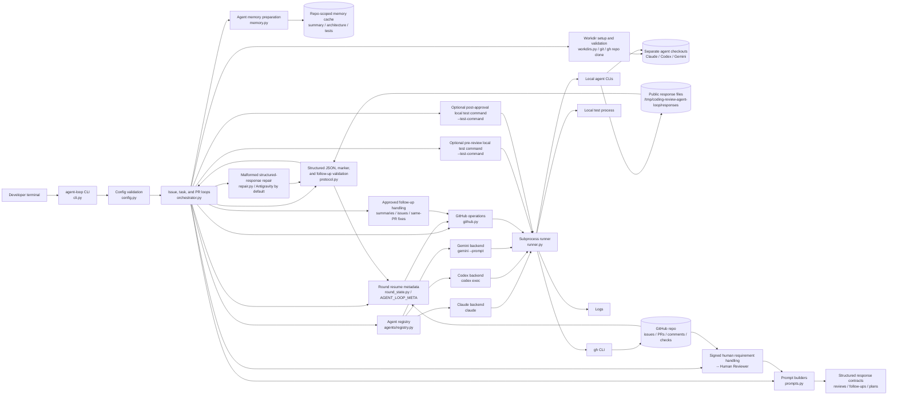
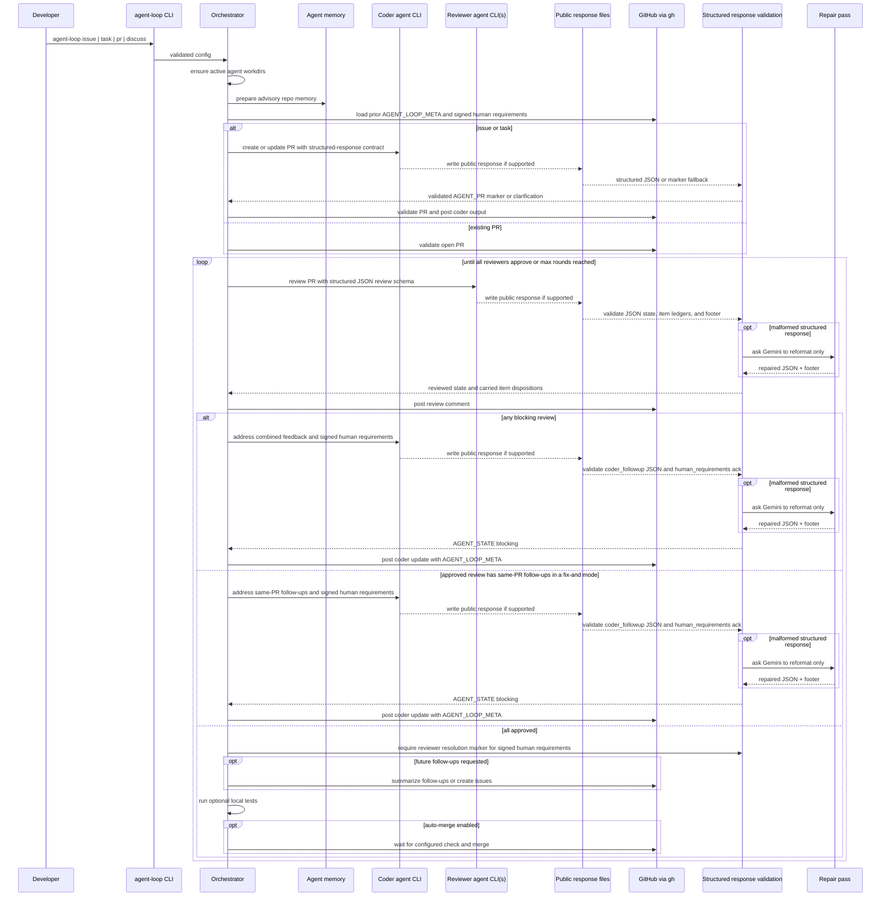

# Local Coding Review Agent Loop

`coding-review-agent-loop` is a local CLI that orchestrates coding agents through a GitHub pull request review loop. Its main advantage is account reuse: it shells out to locally authenticated `claude`, `codex`, `gemini`, and `gh` CLIs instead of calling model APIs directly. If your local agent CLIs are backed by existing AI subscriptions or authenticated developer accounts, the review loop can use those existing entitlements rather than requiring separate model API keys.

**Claude billing note:** Anthropic had announced that non-interactive `claude` usage — including `claude -p` as used by this tool — would move from your subscription's rate limits to a separate monthly Agent SDK credit. As of June 15, 2026 that change has been **postponed**: `claude -p` / Agent SDK usage continues to draw from your existing Claude subscription as before, with no separate credit, and Anthropic has said it will give advance notice before any future change. See [Anthropic's support article](https://support.claude.com/en/articles/15036540-use-the-claude-agent-sdk-with-your-claude-plan) for the latest.

The default flow is:

1. A coder agent creates or updates a PR.
2. One or more reviewer agents review the PR.
3. If any reviewer finds blockers, the coder fixes the PR.
4. The loop repeats until every reviewer approves in the same round or `--max-rounds` is reached.

The default coder is Claude and the default reviewer is Codex. Reverse the direction with `--coder codex --reviewer claude`, or use Gemini with `--coder gemini` / `--reviewer gemini`. Repeat `--reviewer` to require multiple reviewer approvals.

Gemini CLI consumer access (free / Google AI Pro / Ultra) is retiring on June 18, 2026; personal-account `gemini` users should migrate to the Antigravity CLI (`agy`) with `--coder antigravity` / `--reviewer antigravity` (pick the model via `--antigravity-model`, default `Gemini 3.1 Pro (High)`). Enterprise / API-key Gemini CLI paths may remain available for organizations that still have access, so the `gemini` backend is retained for those users. Direct Gemini CLI support is best-effort: maintainers without enterprise Gemini CLI access need reporter-provided `.agent-loop-logs/*gemini.log` output, response-file contents, CLI version, and any sharable account/access context to debug live `gemini` failures. Antigravity turns are single-shot (no cross-round session resume) and report estimated usage.

## Architecture

The tool is a local orchestrator. It does not call model APIs directly; it shells
out to locally authenticated agent and GitHub CLIs from separate checkouts. The
only durable state it creates is local: agent logs in the active coder checkout
and optional advisory memory in a repo-scoped cache directory.


```mermaid
flowchart LR
    User[Developer terminal] --> CLI[agent-loop CLI<br/>cli.py]
    CLI --> Config[Config validation<br/>config.py]
    Config --> Orchestrator[Issue, task, and PR loops<br/>orchestrator.py]

    Orchestrator --> Workdirs[Workdir setup and validation<br/>workdirs.py / git / gh repo clone]
    Orchestrator --> Memory[Agent memory preparation<br/>memory.py]

    Workdirs --> AgentDirs[(Separate agent checkouts<br/>Claude / Codex / Gemini)]
    Memory --> MemoryCache[(Repo-scoped memory cache<br/>summary / architecture / tests)]

    Orchestrator --> Prompts[Prompt builders<br/>prompts.py]
    Orchestrator --> Protocol[Structured JSON, marker,<br/>and follow-up validation<br/>protocol.py]
    Orchestrator --> Repair[Malformed structured-response repair<br/>repair.py / Antigravity by default]
    Orchestrator --> RoundState[Round resume metadata<br/>round_state.py / AGENT_LOOP_META]
    Orchestrator --> Registry[Agent registry<br/>agents/registry.py]
    Orchestrator --> GitHubOps[GitHub operations<br/>github.py]
    Orchestrator --> HumanReqs[Signed human requirement handling<br/>-- Human Reviewer]
    Orchestrator --> PreReviewTests[Optional pre-review local test command<br/>--test-command]
    Orchestrator --> OptionalTests[Optional post-approval local test command<br/>--test-command]
    Orchestrator --> Followups[Approved follow-up handling<br/>summaries / issues / same-PR fixes]
    Prompts --> StructuredContracts[Structured response contracts<br/>reviews / follow-ups / plans]
    HumanReqs --> Prompts
    Protocol --> RoundState
    Repair --> Protocol

    %% The orchestrator owns repair invocation: it catches validation failures,
    %% calls repair.py, then re-runs Protocol validation on the repaired output.

    Registry --> Claude[Claude backend<br/>claude]
    Registry --> Codex[Codex backend<br/>codex exec]
    Registry --> Gemini[Gemini backend<br/>gemini --prompt]

    Claude --> Runner[Subprocess runner<br/>runner.py]
    Codex --> Runner
    Gemini --> Runner
    GitHubOps --> Runner
    PreReviewTests --> Runner
    OptionalTests --> Runner

    Runner --> AgentCLIs[Local agent CLIs]
    Runner --> GhCLI[gh CLI]
    Runner --> TestCmd[Local test process]
    Runner --> Logs

    AgentCLIs --> AgentDirs
    AgentCLIs --> ResponseFiles[(Public response files<br/>/tmp/coding-review-agent-loop/responses)]
    ResponseFiles --> Protocol
    Protocol --> Orchestrator
    RoundState --> GitHubOps
    GhCLI --> GitHub[(GitHub repo<br/>issues / PRs / comments / checks)]
    GitHub --> HumanReqs
    GitHub --> RoundState
    Followups --> GitHubOps
```

The orchestrator owns the repair pass: it catches structured-response validation failures, invokes `repair.py`, and then sends the repaired output back through protocol validation before anything is posted.

At runtime, the orchestrator drives one of three entrypoints:


```mermaid
sequenceDiagram
    participant User as Developer
    participant CLI as agent-loop CLI
    participant Orch as Orchestrator
    participant Memory as Agent memory
    participant Coder as Coder agent CLI
    participant Reviewer as Reviewer agent CLI(s)
    participant Resp as Public response files
    participant GH as GitHub via gh
    participant Protocol as Structured response validation
    participant Repair as Repair pass

    User->>CLI: agent-loop issue | task | pr | discuss
    CLI->>Orch: validated config
    Orch->>Orch: ensure active agent workdirs
    Orch->>Memory: prepare advisory repo memory
    Orch->>GH: load prior AGENT_LOOP_META and signed human requirements
    alt issue or task
        Orch->>Coder: create or update PR with structured-response contract
        Coder-->>Resp: write public response if supported
        Resp-->>Protocol: structured JSON or marker fallback
        Protocol-->>Orch: validated AGENT_PR marker or clarification
        Orch->>GH: validate PR and post coder output
    else existing PR
        Orch->>GH: validate open PR
    end

    loop until all reviewers approve or max rounds reached
        Orch->>Reviewer: review PR with structured JSON review schema
        Reviewer-->>Resp: write public response if supported
        Resp-->>Protocol: validate JSON state, item ledgers, and footer
        opt malformed structured response
            Protocol->>Repair: ask Gemini to reformat only
            Repair-->>Protocol: repaired JSON + footer
        end
        Protocol-->>Orch: reviewed state and carried item dispositions
        Orch->>GH: post review comment
        alt any blocking review
            Orch->>Coder: address combined feedback and signed human requirements
            Coder-->>Resp: write public response if supported
            Resp-->>Protocol: validate coder_followup JSON and human_requirements ack
            opt malformed structured response
                Protocol->>Repair: ask Gemini to reformat only
                Repair-->>Protocol: repaired JSON + footer
            end
            Protocol-->>Orch: AGENT_STATE blocking
            Orch->>GH: post coder update with AGENT_LOOP_META
        else approved review has same-PR follow-ups in a fix-and mode
            Orch->>Coder: address same-PR follow-ups and signed human requirements
            Coder-->>Resp: write public response if supported
            Resp-->>Protocol: validate coder_followup JSON and human_requirements ack
            opt malformed structured response
                Protocol->>Repair: ask Gemini to reformat only
                Repair-->>Protocol: repaired JSON + footer
            end
            Protocol-->>Orch: AGENT_STATE blocking
            Orch->>GH: post coder update with AGENT_LOOP_META
        else all approved
            Orch->>Protocol: require reviewer resolution marker for signed human requirements
            opt future follow-ups requested
                Orch->>GH: summarize follow-ups or create issues
            end
            Orch->>Orch: run optional local tests
            opt auto-merge enabled
                Orch->>GH: wait for configured check and merge
            end
        end
    end
```

## Agent Backends

Currently supported local agent CLIs:

- Claude Code via `claude`
- OpenAI Codex CLI via `codex`
- Gemini CLI via `gemini` (best-effort support for users whose organization or API-key setup still has access)

## Prerequisites

- `gh` is installed and authenticated for the target GitHub repository.
- `claude` is installed and authenticated if either side uses Claude.
- `codex` is installed and authenticated if either side uses Codex.
- `gemini` is installed and authenticated if either side uses Gemini. For individual Google accounts after the consumer cutoff, prefer `agy`; direct Gemini CLI support is best-effort for enterprise/API-key users who can provide logs when issues are not locally reproducible.
- Use separate clones or worktrees for each active agent to avoid local file conflicts. If you omit `--claude-dir`, `--codex-dir`, or `--gemini-dir` for an active agent, the tool uses a repo-scoped temporary checkout under `/tmp/coding-review-agent-loop/OWNER-REPO/{agent}/repo`.

## Usage

Fix a GitHub issue:

```bash
agent-loop issue 56 --repo OWNER/REPO
```

Issue mode includes the issue title, body, and comments in the coder prompt and
issue-origin review prompts. Comments are ordered oldest to newest so later
discussion can refine or supersede the original body.

Run issue mode as plan-first discussion before implementation:

```bash
agent-loop issue 56 --repo OWNER/REPO --plan-first
```

With `--plan-first`, the coder writes an implementation plan without editing
code, pushing a branch, or opening a PR. Reviewers critique that plan on the
issue using `AGENT_PLAN_STATE` markers until every reviewer approves in the
same planning round. Plan reviews use explicit sections:

```md
### Blocking plan issues
### Same-plan follow-ups
### Future follow-ups
```

If earlier blocking or same-plan items are still open, reviewers encode prior
item dispositions in the JSON `prior_plan_item_dispositions` array using
`"resolved"`, `"blocking"`, `"same-plan"`, or `"future"` (with a `"note"`).
The orchestrator renders a `### Prior unresolved plan item dispositions` section
in the public GitHub comment; reviewers do not add that section themselves. Use
`"same-plan"` for required current-plan refinements; `"future"` is accepted only
in approved plan reviews and the approved future follow-ups are reconciled with
the final approved plan instead of reopening planning. In `--approved-followups=issue` and `fix-and-issue` modes,
when implementation will continue after approval, plan-stage future follow-ups
are filed as separate issues before implementation starts. If implementation
continues but issue filing is disabled, they are summarized inline with a note
that they are not carried into PR review. Planning `item-*` IDs visible in issue
history are not PR prior review items unless they appear in the active PR
unresolved-item ledger. By default the loop posts an approved consensus summary
to the issue and stops without filing follow-up issues. Add
`--implement-after-approval` to continue into the normal
implementation and PR review loop using the approved plan:

```bash
agent-loop issue 56 --repo OWNER/REPO --plan-first --implement-after-approval
```

For larger plans, choose the post-approval behavior explicitly with
`--plan-execution-mode`:

```bash
agent-loop issue 56 --repo OWNER/REPO --plan-first --plan-execution-mode plan-only
agent-loop issue 56 --repo OWNER/REPO --plan-first --plan-execution-mode decompose-only
agent-loop issue 56 --repo OWNER/REPO --plan-first --plan-execution-mode implement-one-shot
agent-loop issue 56 --repo OWNER/REPO --plan-first --plan-execution-mode implement-by-phase
```

The modes are:

- `plan-only`: post the approved plan summary and stop. This is the default.
- `decompose-only`: ask the coder to decompose the approved plan, validate the
  structured JSON response, create one GitHub child issue per phase, post a
  parent summary, and stop. The summary table is not a substitute for child
  issues.
- `implement-one-shot`: keep the existing post-approval implementation handoff.
  This is also what `--implement-after-approval` selects for compatibility.
- `implement-by-phase`: create/link every phase issue, implement only the first
  `agent-pr` child issue, then stop after that PR review loop. The parent issue
  records a one-time handoff before child implementation starts; parent reruns
  after that handoff do not re-run the child and should be resumed directly with
  `agent-loop issue <child>`. Older decomposition summaries without this marker
  are treated as not yet handed off, so the first child handoff is recorded once.

Before invoking the coder for an approved-plan implementation, the
orchestrator also checks GitHub directly for an already-open PR that
references the target issue, independent of any handoff marker. This closes a
crash window that a marker-only check cannot cover: if implementation created
a PR but the run aborted afterward — before the `AGENT_PLAN_ONE_SHOT_IMPL`
handoff comment (or the first PR round-metadata comment) could be posted — a
rerun still resumes PR review on that PR instead of invoking the coder again
and creating a duplicate. If more than one open PR references the issue, the
orchestrator raises an error instead of guessing which one to resume; close or
merge the extra PR and rerun `agent-loop pr <number>` directly.

`--implement-after-approval` is a compatibility shortcut for
`--plan-execution-mode implement-one-shot`. It requires `--plan-first` and is
not compatible with any other explicit `--plan-execution-mode` value.

Approved-plan implementation can switch to a different coder after planning:

```bash
agent-loop issue 56 --repo OWNER/REPO --plan-first --implement-after-approval \
  --coder claude \
  --implementation-coder codex \
  --implementation-coder-model gpt-5.5 \
  --implementation-codex-reasoning-effort high
```

Planning and plan revisions always use `--coder`; the `--implementation-*`
flags apply only after reviewers approve the plan and the run enters
implementation. `--implementation-coder` accepts the same values as `--coder`.
`--implementation-coder-model` sets that implementation coder's model only for
the approved-plan implementation. When `--implementation-coder-model` is set
without `--implementation-coder`, implementation keeps using `--coder` but with
the implementation-only model. `--implementation-codex-reasoning-effort` can
only be used when the implementation coder is Codex, either explicitly via
`--implementation-coder codex` or implicitly via `--coder codex`; it also
requires `--implementation-coder-model` or `--codex-model` so the Codex
implementation signature can name the model reliably.

If the plan narrows scope (via `deferred_stages` or a prior discuss `split`
consensus), see [Split issue materialization](#split-issue-materialization)
below for how those follow-up stages are filed (or warned about) and how
`implement-one-shot` targets the correct stage instead of the whole parent.

Generated child issues are self-contained: each body includes the parent issue
link, the relevant approved parent-plan slice, constraints/invariants,
dependency notes, scope and non-goals, rollout risk, validation/soak
requirements, automation classification, and explicit instructions for either
`agent-loop issue <N>` execution or human remark/closure. Dependency links are
filled in after earlier child issue numbers or URLs are known.

Automation classification is required for every phase. `agent-pr` means the
phase is expected to be implemented through a child issue and PR.
`human-action` and `manual-close` phases are still created as child issues, but
their titles, bodies, and parent summary call out that a human must perform the
work or checkpoint, add the required remark/update, and close the issue. If
`implement-by-phase` sees a human-only first phase, it stops instead of
recording an implementation handoff.

Plan decomposition allows at most 8 phases. Over-cap responses are validation
failures and must be consolidated; phases are never silently truncated. This
limit is independent of `--approved-followups`, whose issue mode still caps
approved-review future follow-up issues separately. Decomposition also rejects
duplicate phase titles, invalid automation classes, unknown dependencies,
self-dependencies, and forward dependencies; `depends_on` may reference only
earlier phase titles. Parent decomposition metadata
(`AGENT_PLAN_DECOMPOSITION`) and phase handoff metadata
(`AGENT_PLAN_PHASE_IMPLEMENTATION`) make reruns idempotent. If a parent issue
has already handed off an `implement-by-phase` child, rerun the child issue
directly instead of expecting the parent to restart it.

Implement a free-form task:

```bash
agent-loop task "Add a /healthz endpoint that returns 200 OK." \
  --repo OWNER/REPO
```

Review an existing PR:

```bash
agent-loop pr 123 --repo OWNER/REPO
```

Evaluate a GitHub issue without writing any code:

```bash
agent-loop discuss 123 --repo OWNER/REPO
```

### Open-ended answer results

The legacy implementation-triage contract remains the default. For system and
design questions, use `--discuss-result-mode answer`:

```bash
agent-loop discuss 123 --repo OWNER/REPO \
  --reviewer codex --reviewer claude \
  --discuss-result-mode answer
```

Debaters return `kind: "discuss_answer"` with `position: "answer"` or
`"needs-human"`, plus `answer`, `rationale`, `confidence`, and
`unresolved_items`. Each item has exactly a non-empty `text` and a `status` of
`blocker`, `human-decision`, or `follow-up`. `position: "answer"` requires an
answer and may include any classification; for example, an otherwise useful
answer with a pricing `blocker` is valid but cannot conclude successfully.
`position: "needs-human"` omits `answer` and requires at least one
`human-decision` item.

The final complete round is authoritative: later rounds can clear or
reclassify earlier concerns. Final precedence is `human-decision` (Needs Human
Decision), then `blocker` (Deadlock), then answer convergence; follow-ups alone
remain non-blocking. Summaries list Blockers, Human decisions, and Non-blocking
follow-ups separately. Legacy persisted transcripts that use `open_questions`
are accepted only while resuming: old `needs-human` questions map to
`human-decision`, while old asserted-answer questions map conservatively to
`blocker`. New live responses must use `unresolved_items`.
Analyzer observations remain non-authoritative and cited research remains a
separate sourced-facts section. Repair and resume preserve the selected mode;
transcripts cannot mix answer and triage responses.

To enable semantic comparison for differently worded final answers, configure
an independent `--discuss-analyzer`. There is no reviewer fallback when it is
unset. The analyzer receives final-round answers only and is prohibited from
research or repository work; its output is advisory and recorded separately in
the summary. Equivalent answers may converge. Compatible answers receive one
bounded, budget-exempt confirmation phase: each original debater confirms the
canonical recommendation or supplies a refinement, and only exact normalized
agreement among those effective answers finalizes. Invalid comparator output,
comparison failure, failed confirmation, or material conflict safely remains a
deadlock. A successful debater-confirmed recommendation reuses the recorded
semantic comparison audit and does not invoke a second final-observations pass
over the same final answers; that advisory comparison remains distinct from the
authoritative debater confirmation. This makes resumed finalization idempotent
once a final summary is recorded.

Discuss mode sends the issue title, body, and comments to all configured
reviewers and asks each to return a `discuss_review` response with a single
outcome vote. Instead of collapsing a round into one orchestrator comment,
discuss mode posts a transcript to the issue, similar to how PR review mode
posts a comment per reviewer per round:

1. Each configured reviewer ("debater") posts its own issue comment with its
   structured vote and rationale, tagged with round metadata.
2. Once every reviewer has posted for the round, the orchestrator posts a
   separate round-summary comment identifying consensus or disagreement.
3. If the round is not the final one, the summary comment also lists the
   agenda for the next round (each reviewer's held position). Unresolved
   disagreement carries this agenda plus the prior round's comments into the
   next round's prompts, and requires each reviewer to include a non-empty
   `rebuttal` that engages the disagreement.
4. The final consensus/deadlock result is always its own round-summary
   comment, separate from the per-reviewer comments and from any interim
   round summaries.

A two-round debate transcript looks like:

```text
Round 1: Codex position
Round 1: Antigravity position
Round 1: Orchestrator summary (agenda for round 2)
Round 2: Codex rebuttal
Round 2: Antigravity rebuttal
Round 2: Orchestrator final consensus/deadlock
```

The four possible votes are:

| Vote | Meaning |
|------|---------|
| `implement` | Reviewer recommends proceeding with the issue as written. |
| `do-not-implement` | Reviewer recommends not implementing the issue. |
| `needs-human` | Reviewer cannot decide without more information from a human. |
| `split` | Reviewer recommends breaking the issue into smaller sub-issues and may include sub-issue proposals. |

After each round, the orchestrator checks for same-round unanimity. Agreement in
round 1 is marked `unanimous`; agreement after debate is marked `converged`.
By default, the orchestrator runs up to two debate rounds after round 1. Set
`--discuss-max-rounds 0` to post a human-needed deadlock immediately after an
initial disagreement, or increase the value to allow more debate.

If no consensus is reached after the configured debate rounds, the final
round-summary comment is a `deadlock` comment with the `needs-human` outcome,
each final reviewer position, and the core disagreement. `split` proposals
from multiple reviewers are merged in first-seen order only when all reviewers
in the same round agree on `split`. Discuss runs are idempotent and resumable:
the final round-summary comment includes an
`<!-- AGENT_DISCUSS_CONSENSUS: <subject-hash> -->` marker derived from the issue
title, body, and non-round comment bodies, and every posted comment carries an
`<!-- AGENT_LOOP_META: ... -->` marker the orchestrator decodes to reconstruct
completed rounds — including a round that only partially posted before a
crash — from the public comment thread on the next run, without relying on one
aggregate comment. A re-run on an unchanged issue with a final result posts no
second transcript; posting a new human comment on the issue invalidates the
cached result and triggers a fresh evaluation from round 1. If a resumed run's
next round would exceed a `--discuss-max-rounds` value that was lowered since
the prior run, the orchestrator immediately posts a final `deadlock` summary
from the last completed round instead of silently exiting without a result;
if no completed round exists to finalize from, it raises instead of exiting
silently.

Discuss mode accepts `--reviewer` the same way as PR mode — repeat the flag to
require multiple reviewers:

```bash
agent-loop discuss 123 --repo OWNER/REPO \
  --reviewer codex --reviewer antigravity \
  --discuss-max-rounds 2
```

### Optional analyzer-guided debate agenda

Pass `--discuss-analyzer <agent>` (`claude`, `codex`, `gemini`, or
`antigravity`; it may coincide with a `--reviewer`) to add an analyzer agent
borrowed from the analyzer/debater pattern:

```bash
agent-loop discuss 123 --repo OWNER/REPO \
  --reviewer codex --reviewer antigravity \
  --discuss-analyzer claude
```

After each non-final round, the analyzer receives the complete multi-round
vote history (every completed round's outcomes, rationales, rebuttals, and any
framing corrections, oldest first) plus its own previous agenda, and returns a
structured `discuss_agenda` response:

```json
{
  "schema_version": 1,
  "kind": "discuss_agenda",
  "consensus": ["The issue is well-motivated."],
  "disagreements": [
    {
      "topic": "Scope of the change",
      "positions": {"Codex": "Narrow enough.", "Antigravity": "Too broad; split it."},
      "question_for_next_round": "Would splitting the API boundary resolve the scope objection?"
    }
  ],
  "missing_facts": ["Whether the API boundary is already specified."]
}
```

In analyzer mode, the next debate round's prompt is agenda-focused: it renders
only the structured agenda plus the target debater's own prior position
verbatim. Other debaters' full rationales and rebuttals are omitted and reach
each debater only through the analyzer's summarized `positions`. Each debater
must concede, defend with evidence, refine its position, or set
`analyzer_framing: "misframed"` with a `framing_note` correcting the agenda;
framing corrections are rendered in the debater's public comment.

Guardrails — the analyzer is never authoritative:

- Consensus detection stays vote-only; the analyzer never decides the outcome.
  An agenda claiming consensus while the votes differ is forwarded, but the
  votes rule and the divergence stays visible in the summary.
- The agenda is rendered in the non-final round summary ("Agenda for round
  N+1 (analyzer: ...)"), so it is auditable on the issue.
- After the final debater responses arrive, the analyzer gets a separate
  best-effort pass over only those successful final-round responses. A valid
  result is rendered as "Final analyzer observations (not debater-confirmed)"
  after the authoritative debater vote table. It is rejected if it names a
  non-debater or asserts a position, topic, consensus, disagreement, or missing
  fact unsupported by the final-round text. The exception is a successful
  answer-mode compatible-answer confirmation: its semantic comparison already
  analyzed those final answers, so the recorded comparison is reused instead
  of making a duplicate advisory pass. Debater confirmation is still the
  authoritative finalization step.
- If an agenda from the preceding non-final round exists, the final summary
  renders it separately as "Agenda before final round." This is explicitly
  historical and is never presented as current disagreements. If final analysis
  fails validation, the observations are omitted while the answer/vote table
  and mechanical outcome remain available. For a partial round, any retained
  observations are grounded only in its successful final-round responses.
- If the analyzer invocation fails even after the malformed-response repair
  pass, the orchestrator logs a warning and falls back to the plain mechanical
  agenda for that round (and full prior positions in the next debate prompt)
  instead of aborting the run.

The raw agenda rides in the round summary's `AGENT_LOOP_META` metadata, so a
resumed run restores the structured agenda for the next debate round. Legacy
summaries without an analyzer payload resume in plain mode. With
`--discuss-max-rounds 0`, there is no non-final agenda pass, but a configured
analyzer still receives the final-only pass after the initial final round.
Omitting `--discuss-analyzer` keeps plain #465-style direct deliberation
unchanged.

### Discuss research policy

`--discuss-research none|required|auto` (default: `none`) controls whether
debaters may use current external facts:

```bash
agent-loop discuss 123 --repo OWNER/REPO \
  --reviewer codex --reviewer antigravity \
  --discuss-analyzer claude \
  --discuss-research auto
```

For design issues, round-one research focuses on the decision under debate
(solution design, prior art, cost/latency, feasibility, or guardrails), not just
verification of an illustrative incident. Example validation is appropriate
when the example is disputed or outcome-critical. Active research records a
target and concrete questions. Allowed targets are `example-validation`,
`solution-design`, `cost-latency`, `implementation-feasibility`, and
`policy/legal/current-facts`.
New active responses and research-required agendas should include these fields;
older transcripts may omit them and remain resumable as legacy, unclassified
research.

- `none`: prompts explicitly forbid online research; plain discuss mode and
  analyzer mode remain usable without network-dependent behavior. Best for
  internal design questions.
- `required`: every debater must research before answering. The structured
  `discuss_review` must include a `research` object; its `status` must be
  `sourced`, `unavailable`, or `inconclusive` (`not-needed` is rejected), and a
  `sourced` status requires non-empty `sourced_facts` of `{"fact", "source"}`
  pairs. Validation enforces this (with the malformed-response repair pass as
  fallback), so the user can force research instead of relying on automatic
  detection.
- `auto`: debaters self-decide using conservative triggers — current
  vendor/product behavior, pricing, quotas, model availability, laws/policies,
  dependency behavior, or market/tool comparisons — and report
  `status: "not-needed"` when no trigger applies.

With an analyzer and a non-`none` policy, the analyzer's `discuss_agenda` may
add a shared research brief:

```json
{
  "research_required": true,
  "research_questions": ["Is Gemini CLI still available for enterprise users?"],
  "research_question_targets": ["policy/legal/current-facts"]
}
```

The orchestrator forwards those questions and their aligned classifications to the next round's debater prompts
("Shared research brief") so parallel or repeated debater turns do not
duplicate work, and carries unresolved questions forward between rounds. In
`auto` mode the analyzer is told to set `research_required: true` only when a
conservative trigger applies, so it can decide research is unnecessary.

Rendering keeps sourced facts distinct from judgment:

- Each debater comment shows a `Research:` status line and a "Sourced facts"
  list (`fact — source`).
- The final summary adds a "Research" section with the policy, each debater's
  research status, and all cited sourced facts. Gap cases are explicit: it
  states when all debaters deemed research unnecessary, when a debater
  reported research `unavailable`/`inconclusive`, and when a debater reported
  no research status — in each case telling the reader to treat the related
  claims as judgment, not sourced fact.
- The research policy in effect also rides in each posted comment's
  `AGENT_LOOP_META` metadata. Resume decoding of already-posted votes is
  lenient, so rerunning a transcript that was started under a different
  research policy never fails on old comments; enforcement applies only to
  newly invoked debaters.

### Reconciled final evidence

New discuss responses include an `evidence` object with `claims` and `updates`
(both arrays may be empty). Claims use `verified`, `reported-but-unverified`,
or `missing`. A verified claim requires an agent attestation that it inspected
the exact supporting source: `external-source-inspected` with a non-empty
reference, or `checkout-inspected` with repository-relative `path:line`.
`missing` cannot carry a citation. Legacy `research.sourced_facts` are retained
as reported-but-unverified; citations alone never promote a claim.

For later rounds, prompts show stable observation IDs. Debaters retract or
replace an earlier claim only through `updates`, for example
`{"action":"supersede","target_observation_id":"issue-123-r1-Codex-c0","reason":"direct inspection disproved it","replacement_claim_index":0}`.
This works without `--discuss-analyzer`; exact normalized fact/source matches
combine attribution deterministically. Paraphrase grouping is optional
evidence-reconciler behavior and never changes a status, invents an unknown, or
revives an agenda. The existing #529 rule still applies: the final analyzer
gets final-round debater text only.

Final comments render separate Verified evidence, Reported but unverified,
Missing facts, and Retracted or superseded history sections. Reconciliation
input is bounded to 64 observations / 24,000 UTF-8 bytes (fact/reason fields
clip to 512 bytes and sources to 256); the final ledger is bounded to 50
entries / 16,000 bytes. Selection is newest-first within updates/targets,
final-round claims, verified, reported, missing, and old history. Omitted
counts and a digest point to the complete per-round comments and replay
metadata, which remain the audit trail.

A `checkout-inspected` claim's `path:line` is mechanically cross-checked
against the reviewer's assigned checkout: the path must resolve inside that
checkout (no absolute paths, `..` traversal, or symlink escapes), exist as a
file, and the line number must fall within its current line count, or the
loop raises and fails the turn/resume/recovery outright. This is a bounded,
structural guarantee only — it confirms the referenced line exists, not that
it actually supports the claimed fact. The check always runs against
whatever is on disk in the assigned checkout *right now*, at live, repair,
resume, and legacy split-proposal-recovery time alike; there is no persisted
historical snapshot to compare against, so a claim can stop resolving later
if the checkout's contents have since changed. A default (tool-managed)
reviewer checkout is kept at the current base-branch tip by the same
`ensure_agent_workdirs` sync used everywhere else, so it can drift past a
debater's persisted claim as the base branch advances. An explicit reviewer
checkout (e.g. `--codex-dir`) is only checked for cleanliness and remote by
`validate_explicit_workdir` when it happens to already be a Git work tree —
a non-Git explicit directory receives no such check and is used exactly as
the user left it — but its contents are still validated live against the
persisted claim like any other checkout.

### Parallel debater execution

`--discuss-parallel` runs same-round debaters concurrently instead of one
after another:

```bash
agent-loop discuss 123 --repo OWNER/REPO \
  --reviewer codex --reviewer antigravity --reviewer claude \
  --discuss-analyzer claude \
  --discuss-parallel \
  --discuss-debater-timeout 1800 \
  --discuss-on-debater-failure partial
```

Execution model:

- Every pending debater's prompt is built up front from shared pre-round state
  (issue context, prior-round votes, the analyzer agenda), then all pending
  turns are submitted to a thread pool. Debater comments are posted only after
  every turn settles — from the main thread, in configured `--reviewer`
  order — so same-round debaters never see each other's in-progress output.
- The analyzer, consensus detection, and the round summary run only after that
  debater synchronization point.
- Resume works unchanged: already-posted round votes are reused without
  re-invoking their debaters, and when every configured debater's vote resumes
  from comments, no thread pool is constructed at all.
- Log files are isolated per turn: debater logs end in
  `-<agent>-discuss-r<N>.log` and analyzer logs in
  `-<agent>-discuss-analyzer-r<N>.log`; response files already use a
  per-invocation UUID.
- Parallel mode requires a distinct workdir per debater and rejects the run
  otherwise — deliberately not bypassed by `--allow-shared-dir`, because
  concurrent git/tool activity in a single worktree can corrupt it. The
  analyzer (or the coder) may still share a debater's directory since it runs
  only after the synchronization point.
- Ctrl-C kills all in-flight debater process groups, waits for the workers to
  settle, and re-raises, so no agent subprocesses are orphaned.
- Sequential execution remains the default; prefer it when concurrent
  quota/API pressure across providers is a concern.

Two companion flags apply in both sequential and parallel discuss runs:

- `--discuss-debater-timeout SECONDS` (default: none) bounds each debater
  turn's wall-clock time. On expiry the agent's whole process group is killed
  (SIGTERM, then SIGKILL after a short grace); the turn is classified with
  failure category `timeout` and is never retried as transient, since a kill
  deadline is not a provider hiccup.
- `--discuss-on-debater-failure fail|partial` (default: `fail`) is the
  failure/timeout policy:
  - `fail` aborts the run after in-flight debaters settle. Successful votes
    are posted first so a rerun resumes them instead of re-invoking.
  - `partial` continues the round when at least two debaters produced votes
    (otherwise the run aborts as with `fail`). The failed debater appears in
    the round summary under "Debater failures" with its failure category, is
    recorded in the summary's `AGENT_LOOP_META` metadata (so resume treats the
    missing comment as accounted for and reconstructs an internal `failed`
    placeholder in the round history), and gets a fresh turn in the next
    round. A partial round never declares final consensus — the placeholder
    vote can never match real outcomes — so a partial final round ends in a
    `needs-human` deadlock, with the failures noted in the summary.

### Split issue materialization

By default, a discuss `split` consensus or a plan-first plan that narrows
scope leaves its proposed follow-up stages as text in issue comments — easy to
miss, especially when `--implement-after-approval` proceeds straight into
implementing one stage. Pass `--materialize-split-issues` (on `discuss` or
`issue`) to file each remaining stage as its own linked child GitHub issue
instead:

```bash
agent-loop discuss 467 --repo OWNER/REPO --materialize-split-issues
agent-loop issue 467 --repo OWNER/REPO --plan-first --implement-after-approval \
  --materialize-split-issues
```

Default is off. Whether or not the flag is set, the orchestrator always warns
explicitly when split follow-ups would otherwise go unfiled — in the discuss
final summary, the plan-approval summary, and the CLI log — so the gap can't
hide in a neutral listing.

Two structured signals drive materialization; free-form prose narrowing is
never enough to auto-create issues:

- **Discuss `split` proposals.** When every debater's final vote is `split`,
  the merged `split_proposals` from that round are the remaining stages (a
  discuss run implements nothing, so every proposal is unfiled/unimplemented).
- **Plan `deferred_stages`.** A coder's structured `plan_revision` or initial
  `plan_state` response may declare an optional `deferred_stages` array of
  `{"title", "summary"}` objects for scope the plan intentionally leaves out.
  Declared stages render into the canonical plan under a `### Deferred stages
  (not in this plan)` heading, so they carry into subject hashing, stored plan
  state, reviewer prompts, and resume. In `--plan-first` mode, the stage the
  approved plan actually covers is never filed as a child — only the
  `deferred_stages` (plus any not-yet-covered discuss split proposals from an
  earlier `discuss` run on the same issue) are remaining stages.
- If neither signal is present but the approved plan's text still looks like
  it narrows scope (mentions "stage 1 of", "first stage", "out of scope",
  "separate issue", or "follow-up issue"), the orchestrator posts a
  heuristic-only warning. It never files issues from this signal alone.

Each child issue is created with a deterministic title
(`[#<parent> stage] <proposal title>`), a `Part of #<parent>` first line, the
proposal text, the split rationale from the debaters who voted `split` (when
available), links to sibling stages already materialized, and execution
instructions to run `agent-loop issue <child>` and never use a closing keyword
against the parent. Every child body carries a durable
`AGENT_SPLIT_CHILD: parent=<N> key=<hash>` HTML-comment marker.

Materialization is idempotent and crash-safe:

- The parent issue accumulates a single `<!-- AGENT_DISCUSS_SPLIT: ... -->`
  marker recording every known child (title, key, issue number/URL, and
  whether it was `created` or `adopted`); a rerun that finds every current
  proposal already covered by that marker performs zero GitHub writes.
- If a prior run crashed after creating some child issues but before posting
  the marker, the next run searches existing issues
  (`gh issue list --search '"[#<parent> stage]" in:title'`) before creating
  anything, adopts any match into the metadata instead of duplicating it, and
  files only the remaining stages.
- Proposals are deduplicated by a normalized-title key across the whole
  parent, not just within one run, so subject-hash drift between a discuss
  consensus and a later plan-first run never refiles the same stage twice.
- Materialization is capped at 8 child issues per parent; over-cap stages are
  skipped with a logged note rather than silently dropped or endlessly
  retried.
- `--dry-run` previews `gh issue create`/`gh issue list --search` commands
  without writing any state.

When a parent's proposals were already fully materialized into child issues
(from an earlier `discuss` run, or a prior `--plan-first` run on the same
issue), a later `issue --plan-first --implement-after-approval` run on that
parent must resolve which child stage the approved plan implements before
handing off implementation — it never implements the parent as a monolith in
that case. Resolution is a unique normalized-title match between the plan and
a child's title, or an explicit `--split-stage <child-issue-number>` flag when
the match is ambiguous or missing:

```bash
agent-loop issue 467 --repo OWNER/REPO --plan-first --implement-after-approval \
  --split-stage 480
```

The resolution is recorded in an `<!-- AGENT_SPLIT_STAGE_HANDOFF: ... -->`
parent comment marker so reruns reuse it instead of re-resolving. The staged
implementation prompt then instructs the coder to use `Closes #<child>` plus
`Refs #<parent>` in the PR body — never a closing keyword against the parent —
and `validate_pr_body_does_not_close_issue` rejects a PR body that uses
`Fixes`/`Closes`/`Resolves` against the parent while other stages remain
unfiled or unimplemented, with an actionable error to edit the PR body and
rerun `agent-loop pr <n>`.

If `--repo` is omitted, the tool runs `gh repo view` from the current working
directory, or from `--codex-dir` when that flag is provided, and uses the
detected `OWNER/REPO`. Pass `--repo` explicitly when running outside the target
repository.

Reverse the direction so Codex creates/fixes and Claude reviews:

```bash
agent-loop task "Refactor the cache layer" \
  --repo OWNER/REPO \
  --coder codex \
  --reviewer claude
```

Use Gemini as the coder. Gemini is invoked in headless mode with `gemini --prompt`:

```bash
agent-loop task "Improve validation errors" \
  --repo OWNER/REPO \
  --coder gemini \
  --reviewer codex
```

Use Gemini as one reviewer:

```bash
agent-loop pr 123 \
  --repo OWNER/REPO \
  --reviewer codex \
  --reviewer gemini
```

Require both reviewers to approve. The coder may also be listed as a reviewer
when you want the same agent to work in separate coding and review passes:

```bash
agent-loop pr 123 \
  --repo OWNER/REPO \
  --reviewer codex \
  --reviewer claude
```

## Workdirs

Explicit `--claude-dir`, `--codex-dir`, and `--gemini-dir` values are used
exactly as provided. Missing explicit directories are still created for
backwards compatibility.

When an active agent directory is omitted, the default checkout path is scoped
by repo and agent:

```text
/tmp/coding-review-agent-loop/OWNER-REPO/claude/repo
/tmp/coding-review-agent-loop/OWNER-REPO/codex/repo
/tmp/coding-review-agent-loop/OWNER-REPO/gemini/repo
```

The tool prints the selected default workdirs. If a default checkout does not
exist, it runs `gh repo clone OWNER/REPO <path>`. If it already exists and is a
clean checkout for the requested repo, it fetches origin and fast-forwards the
resolved base branch. In `pr` mode the base defaults to the PR's base branch,
then the repository default branch; in `issue` and `task` modes it defaults to
the repository default branch. An explicit `--base` overrides these defaults.
Default checkouts are tool-owned and disposable; if one
is dirty, the tool logs the cleanup, runs `git reset --hard` and `git clean -fd`,
then syncs the configured base branch. If a default checkout points at another
repo or is not a git checkout, the command fails clearly instead of overwriting
local work.

Explicit workdirs remain conservative. A dirty explicit git checkout fails
clearly, and an explicit checkout whose origin does not match `--repo` is
rejected.

Coder prompts name the active assigned checkout as an absolute path and set
`AGENT_LOOP_WORKDIR` to that same path for the agent subprocess. Implementation,
inspection, tests, commits, and pushes are expected to stay in that checkout
unless the user explicitly authorizes another path. Coder prompts also ask the
agent to run `pwd` and `git status --branch --short` before tests or commits,
and to avoid sibling, home, deployment, or duplicate clones such as `~/REPO` or
`~/claude-code/REPO`.

The orchestrator validates coder-reported test commands before posting normal
coder progress. For `Tests:` reports and structured `tests_run` entries, it
checks shell tokens that explicitly carry location information, such as `cd
<path>`, `-C <path>`, `--directory <path>`, `--directory=<path>`, or a command
token that begins with `/`, `$HOME/`, or `~/`. Prose-only environment details,
including virtualenv notes or URL-like text, are not treated as test working
directories. If an explicit test location is outside the assigned checkout, the
loop fails with an `AgentLoopError` naming the offending command and assigned
checkout. When that failure happens after a PR was already created or detected,
the error also confirms the PR state and tells the user to continue with
`agent-loop pr <number>` instead of rerunning implementation and creating a
duplicate PR. For initial issue, task, and approved-plan implementations, the
loop also checks that the assigned checkout `HEAD` advanced when the coder
reports a PR; unchanged `HEAD` is rejected before the coder PR comment is
posted.

These temporary checkouts may disappear after reboot or `/tmp` cleanup. Large
projects and long-lived agent setups should use explicit persistent workdirs to
avoid repeated clone, dependency setup, and indexing costs.

## Agent Memory

Agent memory is enabled by default. Before an agent prompt is built, the loop
creates or refreshes advisory repo memory in a durable, repo-scoped user cache
directory. On Linux the default is:

```text
~/.cache/coding-review-agent-loop/repos/OWNER-REPO/memory
```

If `$XDG_CACHE_HOME` is set on Linux, the root is
`$XDG_CACHE_HOME/coding-review-agent-loop`. On macOS the default root is
`~/Library/Caches/coding-review-agent-loop`; on Windows it is
`%LOCALAPPDATA%/coding-review-agent-loop/Cache`.

The memory cache includes a repo summary, architecture map, module index,
execution/test profile, toolchain facts, and changed files since the previous
memory commit. This context is included in coder and reviewer prompts as
orientation only. The prompt explicitly tells agents that cached memory may be
stale and that correctness, security, and behavior claims must come from the
actual source files and PR diff. The cache is local-only, but it can contain
repo structure, local paths, test command notes, and advisory summaries.

Use these flags to control it:

```bash
agent-loop pr 123 --repo OWNER/REPO --no-agent-memory
agent-loop pr 123 --repo OWNER/REPO --refresh-agent-memory
agent-loop pr 123 --repo OWNER/REPO --refresh-test-profile
agent-loop pr 123 --repo OWNER/REPO --agent-memory-dir .cache/agent-loop-memory
```

Relative `--agent-memory-dir` values are resolved inside the active coder
checkout. Use `--no-agent-memory` or a custom short-lived
`--agent-memory-dir` for sensitive repositories where local cache retention is
undesirable. If a custom memory directory uses the repo-local `.agent-loop`
parent, that parent is ignored automatically so generated memory files are not
accidentally committed. If the previous memory commit cannot be diffed against
the current commit, the loop logs the git failure and treats all tracked files
as changed for that refresh.

## Real Example

This project uses `agent-loop` to improve itself. This command asked Codex to
review existing issue and PR feedback, with both Claude and Gemini reviewing
the result. The work became PR #13:
https://github.com/wwind123/coding-review-agent-loop/pull/13

```bash
~/tools/coding-review-agent-loop/.venv/bin/agent-loop task \
  "Please go over all issue and PR reviews again and see if any future follow-ups are still worth addressing but have not been addressed." \
  --repo wwind123/coding-review-agent-loop \
  --coder codex \
  --reviewer claude \
  --reviewer gemini \
  --dangerous-agent-permissions
```

Read a task from a file or stdin:

```bash
agent-loop task --task-file task.md --repo OWNER/REPO
cat task.md | agent-loop task --task-file - --repo OWNER/REPO
```

## Clarification

Task mode is non-interactive by default. If the coder agent decides the task is too ambiguous and emits `<!-- AGENT_CLARIFY -->`, the command exits with the agent's questions. You can add detail and rerun.

To allow interactive clarification:

```bash
agent-loop task "Add caching to the recent-debates endpoint." \
  --repo OWNER/REPO \
  --interactive \
  --max-clarification-rounds 3
```

In interactive mode, answer the questions on stdin. Finish with a single `.` line or Ctrl+D.

## Auto-Merge

Auto-merge is disabled by default. Enable it explicitly:

```bash
agent-loop pr 123 \
  --repo OWNER/REPO \
  --auto-merge \
  --ci-check-name test
```

When enabled, the tool waits for the configured GitHub check-run to pass before merging. Local `--test-command` is an additional local gate, not a replacement for CI. By default, `--test-command` also runs after coder-created or coder-updated changes before reviewer rounds, so reviewers are less likely to spend rounds on code that already fails the configured local test command. Use `--no-pre-review-tests` to keep `--test-command` as a post-approval gate only.

Failing GitHub checks always block approval and can route back to the coder. Pending or unavailable GitHub checks are treated as an external wait state rather than actionable coder feedback: if every reviewer approves the code and only GitHub checks are pending/unavailable, the loop posts a comment and stops with a clear message instead of erroring or starting another coder/reviewer round. If those checks later pass, manual merge is fine and rerunning is optional unless you want agent-loop to re-check or automate the final step. With `--auto-merge`, the loop instead keeps waiting for the configured check-run to resolve before merging, as before.

## Agent Permission Flags

By default, this standalone package does not pass permission-bypass flags to either agent. This is safer for open-source use, but some CLIs may prompt or fail in non-interactive mode unless you provide suitable flags.

For trusted local automation, opt into permission bypasses explicitly:

```bash
agent-loop issue 56 \
  --repo OWNER/REPO \
  --dangerous-agent-permissions
```

This applies:

| Agent | Flag |
|-------|------|
| `claude` | `--dangerously-skip-permissions` |
| `codex exec` | `--dangerously-bypass-approvals-and-sandbox` |
| `gemini` | `--yolo --skip-trust` |

Dangerous permissions do not relax the assigned-checkout rule. They make it
more important: the CLI may allow cross-checkout mutation, but the prompt and
response validation still require coder work to remain in `AGENT_LOOP_WORKDIR`.

You can also provide exact per-agent replacements. Repeat once per token:

```bash
agent-loop issue 56 \
  --repo OWNER/REPO \
  --claude-arg=--permission-mode --claude-arg=acceptEdits \
  --codex-arg=--sandbox --codex-arg=workspace-write --codex-arg=--ask-for-approval --codex-arg=never \
  --gemini-arg=--approval-mode --gemini-arg=auto_edit
```

Providing any `--claude-arg`, `--codex-arg`, or `--gemini-arg` replaces that agent's default entirely. Claude and Gemini prompts include a tool-owned response-file path under `/tmp/coding-review-agent-loop/responses/`; when the file exists and is non-empty, the loop validates and posts that file instead of stdout so CLI diagnostics and tool narration do not leak into GitHub comments. Gemini still supports stdout marker filtering as a fallback. If you pass `--gemini-arg=--output-format --gemini-arg=json`, the loop extracts the JSON `response` field before parsing markers when no response file was written. Fallback stdout is never posted unless the required protocol marker validates.

## Protocol

Agent responses are parsed using HTML comment markers:

```text
<!-- AGENT_PR: 123 -->
<!-- AGENT_STATE: approved -->
<!-- AGENT_STATE: blocking -->
<!-- AGENT_PLAN_STATE: approved -->
<!-- AGENT_PLAN_STATE: blocking -->
<!-- AGENT_CLARIFY -->
```

`AGENT_PR` is required after a coder creates a PR. Review/fix responses must
include a final `AGENT_STATE` marker. Plan-first coder/reviewer responses use
`AGENT_PLAN_STATE` instead. If a response quotes older markers, the final
matching marker is treated as authoritative.

Structured-response runs follow this fallback order:

1. Structured JSON payloads in agent output are authoritative when present.
2. `AGENT_LOOP_META` on orchestrator-posted comments is the canonical resume
   source for the active structured-response round. It carries the current
   ledger, reviewer dispositions, and item-number allocation.
3. Markdown parsing is a compatibility fallback for comments that do not have a
   structured payload or active-round metadata.

Mixed histories are normal during rollout. A thread may contain old raw
markdown comments, newer orchestrator-rendered comments, or both. When
`AGENT_LOOP_META` exists for the current PR head or plan subject, resume uses
that metadata-backed ledger and ignores stale visible item IDs from older heads,
superseded plans, or replayed rounds.
If the PR head advanced without a current-head coder metadata comment, resume
uses metadata-backed active `blocking` and `same-pr` items from the latest
recorded head and sends them to the coder for a structured follow-up before
reviewers run again.

Reviewer responses should use structured JSON first. A PR review starts with:

```json
{
  "schema_version": 1,
  "kind": "pr_review",
  "state": "approved",
  "summary": "short reviewer summary",
  "blocking_items": [],
  "same_pr_followups": [],
  "future_followups": ["future work after approval"],
  "prior_item_dispositions": [
    {"item_id": "item-1", "disposition": "resolved"}
  ]
}
```

A plan review uses `kind: "plan_review"`, `blocking_plan_issues`,
`same_plan_followups`, `future_followups`, and
`prior_plan_item_dispositions`. The JSON state must match the final
`AGENT_STATE` or `AGENT_PLAN_STATE` footer. Blocking reviews must not hide
current-round work in `future_followups`; approved reviews must not contain
active blocking, Same-PR, Same-plan, or carried-forward active items.

Coder follow-up and plan-revision rounds are structured too. A PR follow-up
response must classify every carried reviewer item exactly once:

```json
{
  "schema_version": 1,
  "kind": "coder_followup",
  "state": "blocking",
  "summary": "Implemented the requested fix.",
  "addressed_items": ["item-1"],
  "remaining_items": [],
  "addressed_item_notes": {"item-1": "Updated the parser and added regression coverage."},
  "remaining_item_notes": {},
  "human_requirements": {
    "addressed_ids": [],
    "checked_discussion_directly": false
  },
  "tests_run": ["python -m pytest tests/test_agent_loop.py -k followup"]
}
```

A plan revision uses:

```json
{
  "schema_version": 1,
  "kind": "plan_revision",
  "state": "blocking",
  "summary": "Updated the plan for the reviewer feedback.",
  "prior_plan_item_dispositions": [
    {"item_id": "item-3", "disposition": "resolved", "note": "Covered in step 2."}
  ],
  "plan_steps": ["Update the parser.", "Add focused tests."]
}
```

Structured payloads must be the first content in the response, not fenced in
markdown, and may not have prose between the JSON and the required footer. The
only trailing content after the footer is the standalone agent signature. Plan
revisions are rendered into canonical markdown for stored plan state, reviewer
prompts, subject hashing, and resume; public comments render human-readable
sections and omit raw JSON.

Signed human reviewer comments are requirements when the comment body ends with
a standalone `-- Human Reviewer` signature. Issue comments become signed
planning or implementation requirements; PR comments become signed PR-review
requirements. They override AI reviewer preferences unless they are unsafe,
impossible, or superseded by a later signed human instruction.

When signed requirements are present, coder markdown fallback responses must
include:

```md
<!-- HUMAN_REQUIREMENTS_ADDRESSED -->

### Human requirements
- Requirement 1: explain how it was addressed or why it cannot be satisfied safely.
```

Structured coder follow-ups carry the same acknowledgement in
`human_requirements.addressed_ids` and
`human_requirements.checked_discussion_directly`. If the prompt says detailed
requirements were omitted to stay bounded, the coder must check the GitHub
discussion directly and acknowledge that fact instead of listing requirement
IDs. The orchestrator injects a synthetic
`item-human-requirements-acknowledgement` item when coder acknowledgement is
missing or invalid, then reconciles that item after a valid structured or
markdown acknowledgement. Reviewers must include
`<!-- HUMAN_REQUIREMENTS_RESOLVED -->` in an approved review before the loop
treats signed requirements as resolved; otherwise the synthetic item is carried
into the next round even if the visible review says approved.

The loop validates required markers before posting agent output to GitHub. If
an agent exits or returns only diagnostics, empty output, or normal prose
without the required marker, the loop fails locally with `AgentLoopError` and
the attempt log path instead of posting that raw output as a review.

For structured plan reviews, plan revisions, PR reviews, and coder follow-ups,
a present but malformed structured response may get a repair pass before the
local failure is raised. By default the repair pass calls Antigravity through
the existing PTY backend with the default model `Gemini 3.5 Flash (Medium)`;
explicit repair models are followed by the configured coder/reviewer chain. It uses a fresh temporary
workdir, empty tool permissions, and repair-only instructions forbidding file
inspection, tests, mutation, background work, and subagents. The format-repair
prompt asks it to preserve the agent's intent while emitting
only the required JSON object, matching footer marker, and standalone
signature. Repaired output is accepted only after it passes the same schema,
state, footer, follow-up, prior-item, and human-requirement validation as an
original response. If the repair CLI fails, returns empty output, or produces
invalid output, the original validation failure remains local and nothing is
posted to GitHub.

Known transient agent/model failures are retried before local failure. The
default is two retries with bounded backoff; tune this with
`--agent-max-retries` and `--agent-retry-backoff-seconds`. Retry matching is
narrow and intended for stream/tool-call failures, empty responses, network
timeouts/resets, and provider 5xx errors. Auth, credit, quota, dirty workdir,
and normal missing-marker responses are not retried.

Unsupported model/provider-auth compatibility errors are reported separately
with failure category `unsupported_model`. These diagnostics name the agent and
requested model when available and suggest choosing a compatible model or
provider/auth mode instead of treating the failure as a deterministic protocol
or code issue.

When `--approved-followups` is set to `summarize`, `issue`, or a `fix-and-*`
mode, approved reviewer responses may also include optional future-work items
under a dedicated heading:

```md
### Future follow-ups
- Add a follow-up test.
```

Reviewers should use this section only for substantial work that is better
handled in a separate issue or PR. The legacy heading
`### Non-blocking follow-ups` is still accepted as future work for
compatibility.

When `--approved-followups` is set to a `fix-and-*` mode, approved reviewers
can request small, localized, low-risk cleanup that should land in the current
PR by returning a blocking review and putting those items under:

```md
### Same-PR follow-ups
- Rename a helper before merge.
```

Same-PR follow-ups are sent back to the coder in the existing PR and require a
new review round before approval can finalize. They should stay narrowly scoped
to files already touched by the PR or directly adjacent code; larger redesigns
and independent work belong under Future follow-ups. Approved reviews may not
include Same-PR follow-ups, blocking items, or carried-forward items that remain
`blocking` or `same-pr`. Approved future follow-ups remain in the
round-to-round ledger so later reviewers can explicitly confirm they are still
future work, resolved, or should be promoted back to same-PR or blocking
status. The final summary or issue creation uses the remaining future items
from that ledger. Without a `fix-and-*` mode, reviewers should mark same-PR
cleanup blocking instead.

By default, `--approved-followups=ignore` asks reviewers not to include these
sections. Reviewers should mark the review blocking instead when cleanup should
be fixed before merge.

`--approved-followups` accepts:

- `ignore`: ignore approved follow-up sections. This is the default.
- `summarize`: post future follow-ups as a grouped PR comment.
- `issue`: create GitHub issues for up to three future follow-ups, then comment with the created issue links.
- `fix-and-summarize`: send same-PR follow-ups to the coder for another review round, then summarize future follow-ups after final approval.
- `fix-and-issue`: send same-PR follow-ups to the coder for another review round, then create issues for future follow-ups after final approval and comment with the created issue links.

For plan-first runs that continue into implementation, issue-filing modes apply
twice at different lifecycle points: planning-stage future follow-ups are filed
before implementation begins, while PR-stage approved-review future follow-ups
are filed only after final PR approval.

Bullets and prose paragraphs inside the `Same-PR follow-ups`, `Future follow-ups`,
and legacy `Non-blocking follow-ups` sections are parsed; each section ends at
the next heading, HTML marker, or agent signature. The same parsing is used
when creating follow-up issues. The issue cap keeps one approved review from
creating a large batch of low-value issues.

The remaining legacy compatibility surface is intentionally narrow:

- Markdown plan/review parsing stays enabled for agents that do not emit
  structured JSON.
- The legacy heading `### Non-blocking follow-ups` is still treated as future
  work.
- Marker-only markdown paths are still parsed where supported, but structured
  JSON is the documented format for new reviewer, coder follow-up, and plan
  revision responses.
- Resume reconstruction should rely on `AGENT_LOOP_META` instead of reparsing
  old prose whenever metadata exists for the active round.

## Logs

Agent stdout/stderr is written to `.agent-loop-logs/` under the active coder
checkout by default. If that coder directory was omitted, the relative default
log path is also under the repo-scoped temporary checkout and may disappear
with `/tmp` cleanup. The CLI prints heartbeat messages with the log path while
agents run:

```text
[agent-loop 12:00:31] Claude still running (30s); log: /path/to/.agent-loop-logs/20260425-120001-claude.log
```

Use `tail -f` on the displayed path to see live output. Logs are diagnostic
output and may include CLI status text or tool narration. For Claude and
Gemini, prompts also include a public response-file path under
`/tmp/coding-review-agent-loop/responses/`; when that file exists and is
non-empty, the loop validates and posts the file contents to GitHub instead of
stdout. Codex also receives a response-file instruction, and separately uses
`--output-last-message` so the loop can fall back to the last Codex message
instead of raw JSON event logs. Gemini response files live inside Gemini's git
directory because Gemini can only write trusted workspace paths; Gemini stdout
also supports the `=== AGENT_LOOP_PUBLIC_RESPONSE_BELOW ===` marker and, when
`--output-format json` is used, extraction of the JSON `response` field.
Fallback stdout is still validated before posting. The log directory gets its
own `.gitignore` on first use.

When an agent appears stuck, inspect the heartbeat log path first and then the
printed response-file path. The log shows CLI narration, tool output, provider
diagnostics, and whether the subprocess is still making progress; the response
file is the public answer the orchestrator will validate and post. Empty
response files, missing markers, or diagnostics-only stdout fail locally instead
of being posted to GitHub.

When a mutating coder implementation run reaches a terminal failure with a
non-empty tracked diff, the orchestrator writes local salvage artifacts under
`<log_dir>/salvage/<run>-<agent>-<scope>/`. That directory contains
`partial.patch`, `changed-files.txt`, `diff-stat.txt`, best-effort
`diff-check.txt`, `salvage-summary.md`, and `metadata.json`. The run log and
local error point to the artifact directory. These artifacts are incomplete
failure diagnostics only: they are not posted as a successful response, and a
later rerun injects only the latest matching salvage summary into the coder
prompt so the next attempt can cherry-pick or ignore it selectively. The
orchestrator never auto-applies the patch.

For `issue-implementation` and `approved-plan-implementation` scopes (the two
whose rerun prompts consume a salvage summary), the orchestrator also posts a
best-effort GitHub issue comment with a hidden `<!-- AGENT_SALVAGE: ... -->`
marker alongside the local artifacts. This makes salvage durable across a
different coder, workdir, or machine: a rerun with an empty local `--log-dir`
can still discover the latest matching comment (filtered by repo, issue,
scope, and approved-plan hash) and inject it into the coder prompt, noting
that the referenced local artifact paths may not exist on this machine. Local
and remote salvage are merged deterministically by timestamp, with ties
preferring the local copy. The partial patch is embedded in the comment only
when it is under `--salvage-comment-patch-max-bytes` (default 20000), has no
`GIT binary patch` section, and does not match a conservative secret scan
(private keys, AWS key ids, `ghp_`/`github_pat_` tokens, bearer/authorization
headers, `password=`/`secret=`-style assignments); otherwise the comment notes
the patch is local-only. `AGENT_SALVAGE` breadcrumb comments are excluded from
the raw issue-comment context sent to the coder (they are consumed only
through the parsed salvage summary above) so they cannot bloat or displace
real discussion when the issue-context prompt is truncated. Posting failures
are logged and never mask the
original agent failure. Use `--no-salvage-comments` to keep salvage entirely
local (matching prior behavior).

If strict structured-response validation fails, the log may show a repair pass:
`schema validation failed ... attempting repair pass`, followed by either
`repair pass recovered malformed response` or `repair pass produced invalid
output`. A recovered response is still revalidated before posting; a failed
repair leaves the run in local failure just like any other protocol error.

Use `--repair-backend`, repeatable `--repair-model`, and
`--repair-timeout-seconds` to configure this path. The repair chain is the explicit
prefix followed by `antigravity_models`, with duplicates removed. It queries `agy
models` once through the same PTY-safe runner as `agy --print`, rejects stale names
with available-choice guidance, and attempts candidates directly when discovery is
unavailable. `--repair-backend gemini` retains the legacy CLI for
enterprise/API-key/Vertex authentication; personal OAuth may require an
interactive authorization and is not the default. Normal diagnostics include
backend, model, return code, a sanitized bounded combined-PTY diagnostic, log
path, and whether another configured model will run. Usage summaries record
estimated prompt/output usage plus repair outcome and validation status for
every attempt, including failed attempts, so repair consumes visible quota.

Long reset or quota responses can exit early with guidance to rerun after the
reset or switch keys/models. Narrower transient stream, tool-call, network
reset, timeout, empty-response, provider 5xx, and first-attempt marker
near-miss failures retry according to `--agent-max-retries` and
`--agent-retry-backoff-seconds`. Authentication, billing, dirty workdirs, and
normal missing-marker responses are treated as non-retryable configuration or
protocol failures.

Each top-level run also writes `<run-id>-usage-summary.json` in the same
directory. That sidecar aggregates usage by call, by agent, and for the full
run, including retries and marker-near-miss attempts. Backend-provided token
counts are normalized as `exact` when the counters are complete or `partial`
when only some counters are available. When a backend exposes no usable usage
data, the orchestrator records an `estimated` fallback based on prompt and
public-response size, along with raw character and byte counts. `--dry-run`
does not invent token usage records.
